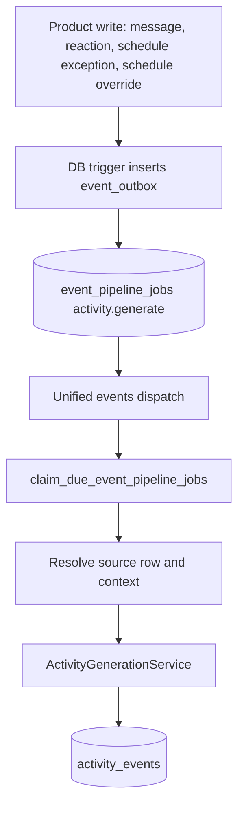
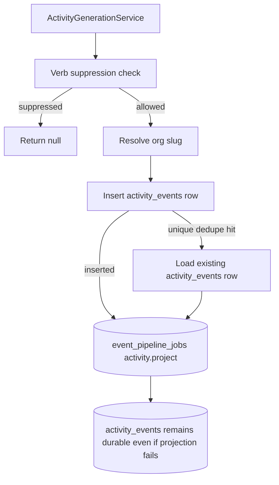
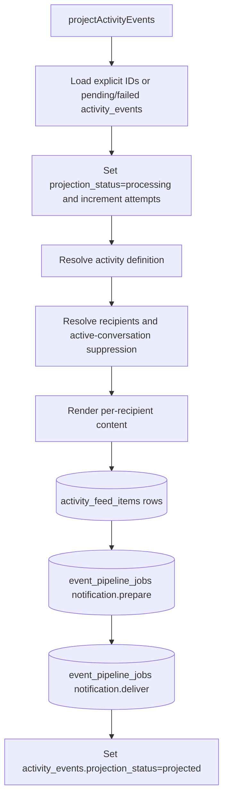
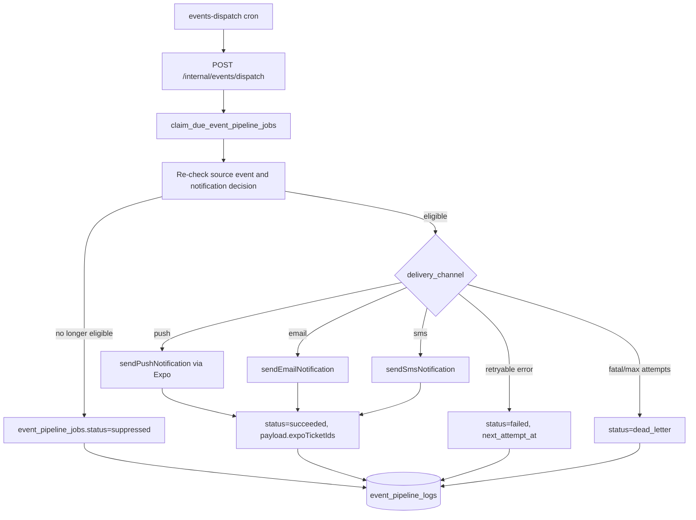

# Activity Feed Architecture Contract

## Contract

All feed entries must flow through the event pipeline:

1. Product writes enqueue canonical signals into `event_outbox`.
2. `event_pipeline_jobs` drive activity generation, projection, notification preparation, and delivery.
3. Generated activities are stored in `activity_events`, then projected into `activity_feed_items`.

Direct feature-level inserts/upserts into `activity_feed_items` are not allowed.

Web and mobile do not create activity events or notification jobs directly.
Activity generation is an API-owned worker concern. Product actions write their
primary data and either API command code or DB triggers enqueue durable pipeline
work.

## End-to-End Flow

## Activity Emission Inventory

| Source                                                                       | Event type                                             | Conditions                                                                                                                                                                              | Scope and audience                                                                            | Dedupe                                                                |
| ---------------------------------------------------------------------------- | ------------------------------------------------------ | --------------------------------------------------------------------------------------------------------------------------------------------------------------------------------------- | --------------------------------------------------------------------------------------------- | --------------------------------------------------------------------- |
| `messages` insert trigger -> `event_outbox.event_kind='message'`             | Worker emits downstream message events                 | Trigger skips deleted rows and message types `event-reminder`, `payment-reminder`, `feedback-request`, `session-booking`, `session-complete`, `session-summary`, and `progress-update`. | Worker resolves channel context, message visibility, content, and mentions.                   | Source job `message:<messageId>`.                                     |
| Mention message                                                              | `message.mentioned`                                    | Message has mentioned profiles that are channel members, not sender, and allowed by visibility.                                                                                         | One user-scoped event per mentioned profile with `users_only`.                                | `message.mention:<messageId>:<recipientProfileId>`.                   |
| Channel or class message                                                     | `message.posted`                                       | Not suppressed by message visibility; non-DM top-level message.                                                                                                                         | Channel or learning-space scope from channel context; visibility audience rules when present. | `message.posted:<messageId>`.                                         |
| DM message                                                                   | `message.posted`                                       | DM route and at least one eligible recipient after read-recency and visibility filtering.                                                                                               | DM/channel context scope with `users_only` recipients.                                        | `message.posted:<messageId>`.                                         |
| Thread reply                                                                 | `message.thread_reply.posted`                          | Message has `threadId` and `threadReply`; participants are loaded from `thread_participants`.                                                                                           | One user-scoped event per thread participant, excluding sender and mentioned recipients.      | `message.thread-reply:<messageId>:<recipientProfileId>`.              |
| File message                                                                 | `file.uploaded`, `image.uploaded`, or `audio.uploaded` | File activity is not suppressed by visibility; DM requires eligible recipients.                                                                                                         | Channel/class/DM context; payload includes file/image/audio metadata.                         | `<eventType>:<messageId>`.                                            |
| `message_reactions` insert trigger -> `event_outbox.event_kind='reaction'`   | `reaction.added`                                       | Reaction row exists; message context exists; non-DM skips self-reactions by emitting only when actor differs from message sender.                                                       | DM recipients or message sender user scope.                                                   | Source job `reaction:<reactionId>`; event has no explicit dedupe key. |
| `class_schedule_recurrence_exceptions` insert trigger -> `session_cancel`    | `class.session.canceled`                               | Exception row exists and schedule/learning-space context resolves.                                                                                                                      | Learning-space scope and target ref; payload includes cancel reason and invited members.      | `session.canceled:<exceptionId>`.                                     |
| `class_schedule_recurrence_overrides` insert trigger -> `session_reschedule` | `class.session.rescheduled`                            | Override row exists and schedule/learning-space context resolves.                                                                                                                       | Learning-space scope and target ref; payload includes from/to occurrence and invited members. | `session.rescheduled:<overrideId>`.                                   |
| Due `reminder_jobs`                                                          | `session.reminder.sent`                                | Claimed reminder job is due, not archived past cutoff, and job type is `session.reminder`.                                                                                              | Learning-space or channel scope from reminder payload.                                        | `<reminderJob.dedupe_key>:activity`.                                  |
| Due `reminder_jobs`                                                          | `session.feedback_request.sent`                        | Claimed reminder job is due, not archived past cutoff, and job type is `session.feedback_request`.                                                                                      | Learning-space or channel scope from reminder payload.                                        | `<reminderJob.dedupe_key>:activity`.                                  |

Activity generation and projection are worker-owned. Web and mobile product
flows must not call internal activity publish/project endpoints, and feature code
must not insert `activity_events`, `activity_feed_items`, or notification jobs
directly.

## Projector Execution Details

`projectActivityEvents` is the only writer for projected feed rows.

1. Load events from `activity_events`:
   - If `eventIds` are supplied, load those rows.
   - Otherwise load `projection_status in ('pending', 'failed')`.
   - All loads ignore deleted rows, order by `occurred_at`, limit the batch, and require `projection_attempts < 10`.
2. For each event, set `projection_status='processing'`, increment `projection_attempts`, clear `last_projection_error`, and update `updated_at`.
3. Resolve the `ActivityEventDefinition` by `event_type`. Unsupported types fail that event.
4. Resolve recipients through the definition's `resolveRecipients`, then apply active-conversation suppression.
5. Load recipient profiles to attach `viewerTimezone`, `viewerRole`, and `viewerIsActor` into the per-recipient render payload.
6. Render the feed content from the activity definition.
7. Upsert one `activity_feed_items` row per recipient:
   - Uses `recipient_profile_id,dedupe_key` when a dedupe key exists.
   - Otherwise uses `recipient_profile_id,source_event_id`.
   - Marks actor-recipient rows read immediately.
8. Enqueue `notification.prepare` in `event_pipeline_jobs` with the event and final recipient list.
9. Mark the event `projected`; on any event-level error mark it `failed` and store `last_projection_error`.

## Notification Queue Handoff

Projection enqueues `notification.prepare` after feed rows are written. For each recipient, the notification decision engine resolves:

- preference key and scoped preferences
- delivery channels (`push`, `email`, `sms`)
- delivery timing and `run_at`
- scope kind/id and reason codes
- personalized session reminder/feedback copy when member metadata is present

Eligible channels are idempotently upserted into `event_pipeline_jobs` as
`notification.deliver` rows keyed by event, recipient, channel, and attempt bucket.

## Allowed `activity_feed_items` Writes

- Projector-managed writes in `project-activity-events.ts` for per-recipient projection.
- Recipient read-state updates (`is_read` / `read_at`) in `api/activity-feed/read/route.ts`.

## Why

- Keeps feed behavior event-sourced and deterministic.
- Preserves dedupe and recipient resolution in one place.
- Prevents partial or schema-divergent feed writes from feature code.
- Lets primary product actions succeed even when activity/notification side effects are temporarily unavailable.
