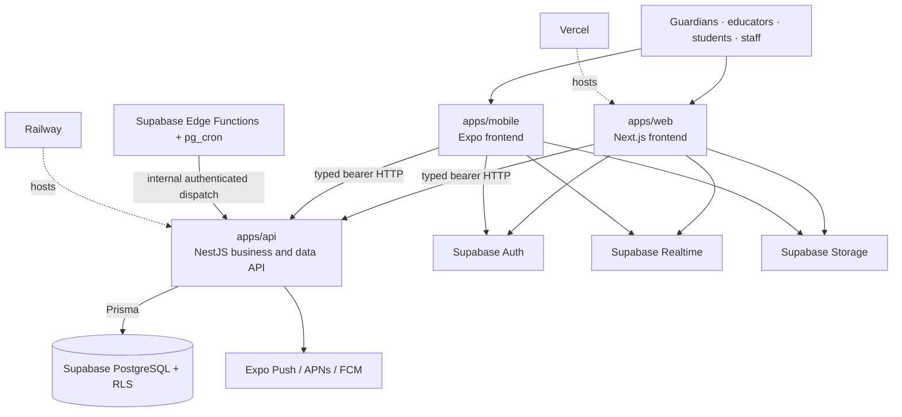
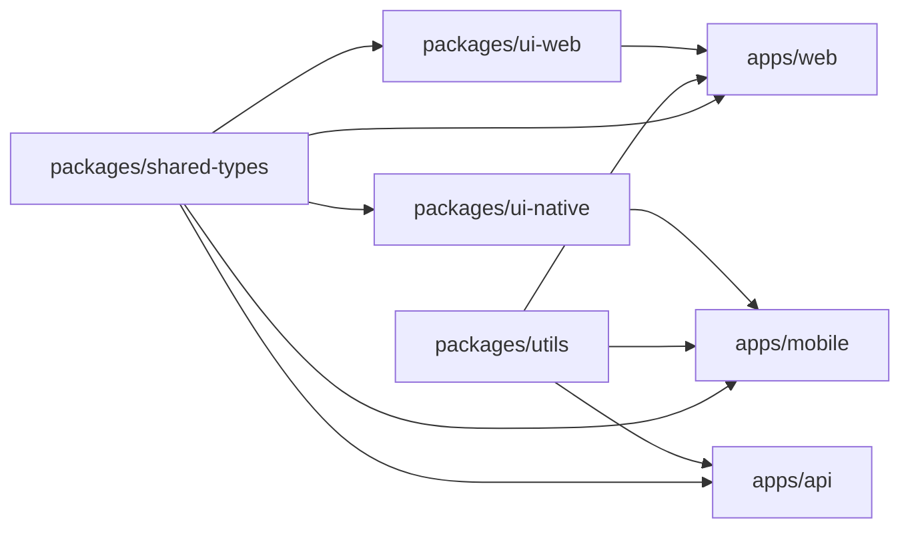
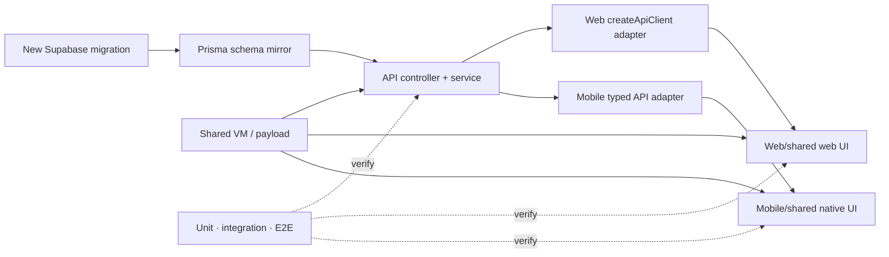
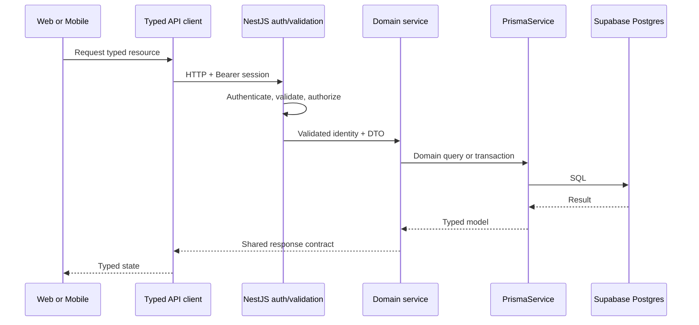
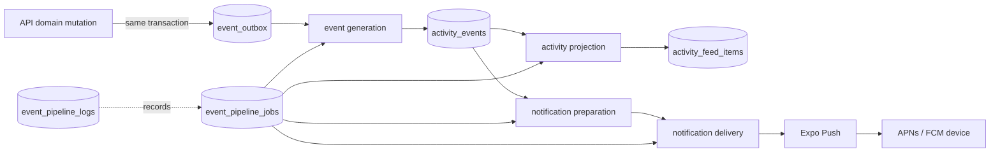
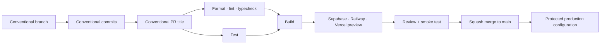

# Architecture Diagrams

## Purpose

Provide a compact, current visual index of repository topology and ownership boundaries.

## Intended Audience

Engineers onboarding to the system or reviewing cross-cutting changes.

## Last Updated

2026-08-14

## Related Docs

- [Architecture Overview](overview.md)
- [Control Flows](swimlanes.md)
- [Feature Diagrams](feature-diagrams.md)
- [Event Pipeline Scalability](event-pipeline-scalability.md)

## System Context

Frontend direct access to Supabase is restricted to Auth, Realtime, and Storage. All table reads and writes go through `apps/api`.

## Workspace Dependencies

No app imports another app. A reusable cross-app contract moves downward into a package; it is not copied or imported across app boundaries.

## Data-Backed Feature Slice

Not every feature touches every node. The sequence shows ownership when a node is needed.

## Request Lifecycle

## Event And Notification Pipeline

See the [activity feed contract](activity-feed.md) and [event pipeline scalability assessment](event-pipeline-scalability.md) before changing producers, jobs, retries, or dispatchers.

## Pull Request Delivery Path

The exact checks and preview behavior live in the [development workflow](../getting-started/development-workflow.md) and [deployment guide](../operations/deployment.md).

## Diagram Maintenance

- Keep architecture boundaries here; keep detailed product-domain models in [feature-diagrams.md](feature-diagrams.md).
- Update a diagram in the same PR that changes the represented behavior.
- Prefer one responsibility per diagram and link to code or runbooks for operational detail.
- Treat these diagrams as explanatory; migrations, source code, and workflow configuration remain the exact source of truth.
