# IconicEdu Monorepo — Architecture Diagrams

Comprehensive architecture reference for the IconicEdu platform. Covers system context, data model, package graph, route trees, component hierarchy, class diagrams, and all major control flows as standard Mermaid diagrams.

---

## Table of Contents

1. [System Context Overview](#1-system-context-overview)
2. [Monorepo Package Dependency Graph](#2-monorepo-package-dependency-graph)
3. [ER Diagram — Database Schema](#3-er-diagram--database-schema)
4. [Web App Route Tree](#4-web-app-route-tree)
5. [Mobile App Route Tree](#5-mobile-app-route-tree)
6. [NestJS API — Module & Class Diagram](#6-nestjs-api--module--class-diagram)
7. [Shared Types — User & Account Domain](#7-shared-types--user--account-domain)
8. [Shared Types — Messaging & Content Domain](#8-shared-types--messaging--content-domain)
9. [Mobile — Provider, Hook & Data Layer](#9-mobile--provider-hook--data-layer)
10. [Web — Auth, Builder & Mapper Stack](#10-web--auth-builder--mapper-stack)
11. [Component Architecture — ui-web](#11-component-architecture--ui-web)
12. [Component Architecture — ui-native](#12-component-architecture--ui-native)
13. [Swimlane — Web Auth Flow](#13-swimlane--web-auth-flow)
14. [Swimlane — Mobile Auth & Onboarding](#14-swimlane--mobile-auth--onboarding)
15. [Swimlane — Web Protected Route (SSR Read)](#15-swimlane--web-protected-route-ssr-read)
16. [Swimlane — Web Mutation via Server Action](#16-swimlane--web-mutation-via-server-action)
17. [Swimlane — NestJS API Request Lifecycle](#17-swimlane--nestjs-api-request-lifecycle)
18. [Swimlane — Mobile Data Fetch & Realtime](#18-swimlane--mobile-data-fetch--realtime)
19. [Swimlane — Cross-Client Realtime Messaging](#19-swimlane--cross-client-realtime-messaging)
20. [Data Contract: Row → ViewModel Pipeline](#20-data-contract-row--viewmodel-pipeline)

---

## 1. System Context Overview

High-level view of all actors, client apps, backend services, and shared packages.

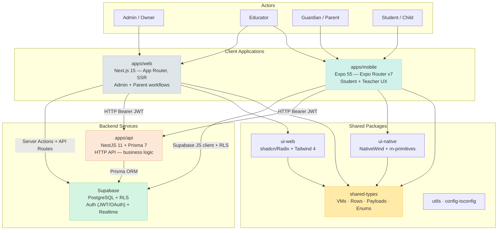
```mermaid
graph TD
    subgraph Actors["Actors"]
        ADMIN["Admin / Owner"]
        EDUCATOR["Educator"]
        GUARDIAN["Guardian / Parent"]
        STUDENT["Student / Child"]
    end

    subgraph Clients["Client Applications"]
        WEB["apps/web\nNext.js 15 — App Router, SSR\nAdmin + Parent workflows"]
        MOBILE["apps/mobile\nExpo 55 — Expo Router v7\nStudent + Teacher UX"]
    end

    subgraph Backend["Backend Services"]
        API["apps/api\nNestJS 11 + Prisma 7\nHTTP API — business logic"]
        SUPA["Supabase\nPostgreSQL + RLS\nAuth (JWT/OAuth) + Realtime"]
    end

    subgraph SharedPkgs["Shared Packages"]
        SHARED["shared-types\nVMs · Rows · Payloads · Enums"]
        UIWEB["ui-web\nshadcn/Radix + Tailwind 4"]
        UINATIVE["ui-native\nNativeWind + rn-primitives"]
        UTILS["utils · config-tsconfig"]
    end

    ADMIN & EDUCATOR --> WEB
    GUARDIAN & STUDENT --> MOBILE
    EDUCATOR --> MOBILE

    WEB -->|Server Actions + API Routes| SUPA
    WEB -->|HTTP Bearer JWT| API
    MOBILE -->|Supabase JS client + RLS| SUPA
    MOBILE -->|HTTP Bearer JWT| API
    API -->|Prisma ORM| SUPA

    WEB --> UIWEB
    WEB --> SHARED
    MOBILE --> UINATIVE
    MOBILE --> SHARED
    UIWEB --> SHARED
    UINATIVE --> SHARED

    style SHARED fill:#ffeaa7,stroke:#fdcb6e
    style SUPA fill:#d5f5e3,stroke:#82e0aa
    style API fill:#fde8d8,stroke:#f0b27a
    style WEB fill:#dfe6e9,stroke:#b2bec3
    style MOBILE fill:#d1f2eb,stroke:#a3e4d7
```

---

## 2. Monorepo Package Dependency Graph

All inter-package and external ecosystem dependencies in the pnpm + Turborepo monorepo.

```mermaid
graph TD
    subgraph Apps
        WEB["apps/web"]
        MOBILE["apps/mobile"]
        API["apps/api"]
    end

    subgraph InternalPkgs["Internal Packages"]
        SHARED["shared-types\nVMs · Rows · Payloads · Enums"]
        UIWEB["ui-web\nshadcn/ui + Radix + Tailwind 4"]
        UINATIVE["ui-native\nNativeWind + rn-primitives"]
        UTILS["utils\nformatDateTime()"]
        TSCONFIG["config-tsconfig\nShared tsconfig bases"]
    end

    subgraph ExtWeb["Web Ecosystem"]
        NEXTJS["Next.js 15\nApp Router · Server Actions"]
        SUPAJSSSR["@supabase/ssr\nCookie-based SSR sessions"]
        RADIX["Radix UI\nHeadless components"]
        TW4["Tailwind CSS 4.x"]
        RHF["react-hook-form + zod"]
    end

    subgraph ExtMobile["Mobile Ecosystem"]
        EXPO55["Expo SDK 55\nExpo Router v7 · SecureStore"]
        NATIVEWIND["NativeWind 4.x\nTailwind for RN"]
        RNPRIM["rn-primitives\nHeadless RN components"]
        TANSTACK["TanStack Query\nServer state + cache"]
        RN["React Native 0.83.2"]
        REANIMATED["Reanimated 4.x\nAnimations"]
    end

    subgraph ExtAPI["API Ecosystem"]
        NEST["NestJS 11\nDI · Guards · Pipes · Swagger"]
        PRISMA["Prisma 7\nORM + migrations"]
        JWT_LIB["jsonwebtoken\nJWT decode"]
    end

    WEB --> SHARED & UIWEB & UTILS & TSCONFIG
    WEB --> NEXTJS & SUPAJSSSR

    MOBILE --> SHARED & UINATIVE & UTILS & TSCONFIG
    MOBILE --> EXPO55 & TANSTACK & RN & REANIMATED

    API --> PRISMA & NEST & JWT_LIB & TSCONFIG

    UIWEB --> SHARED & RADIX & TW4 & RHF & TSCONFIG
    UINATIVE --> SHARED & RNPRIM & NATIVEWIND & TSCONFIG
    UTILS --> TSCONFIG

    style SHARED fill:#ffeaa7,stroke:#fdcb6e
```

---

## 3. ER Diagram — Database Schema

Full entity-relationship model covering both Prisma-managed tables and Supabase-native tables inferred from query patterns across web and mobile clients.

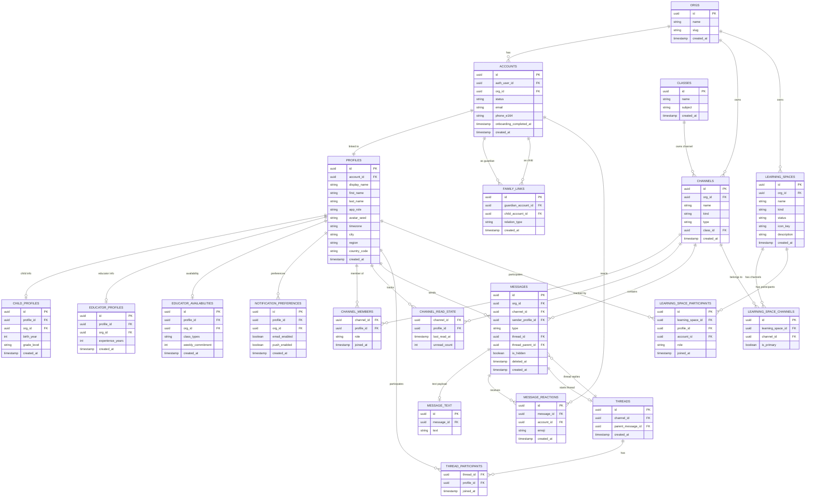
```mermaid
erDiagram
    ORGS {
        uuid id PK
        string name
        string slug
        timestamp created_at
    }
    ACCOUNTS {
        uuid id PK
        uuid auth_user_id FK
        uuid org_id FK
        string status
        string email
        string phone_e164
        timestamp onboarding_completed_at
        timestamp created_at
    }
    PROFILES {
        uuid id PK
        uuid account_id FK
        string display_name
        string first_name
        string last_name
        string app_role
        string avatar_seed
        string timezone
        string city
        string region
        string country_code
        timestamp created_at
    }
    CHILD_PROFILES {
        uuid id PK
        uuid profile_id FK
        uuid org_id FK
        int birth_year
        string grade_level
        timestamp created_at
    }
    EDUCATOR_PROFILES {
        uuid id PK
        uuid profile_id FK
        uuid org_id FK
        int experience_years
        timestamp created_at
    }
    EDUCATOR_AVAILABILITIES {
        uuid id PK
        uuid profile_id FK
        uuid org_id FK
        string class_types
        int weekly_commitment
        timestamp created_at
    }
    FAMILY_LINKS {
        uuid id PK
        uuid guardian_account_id FK
        uuid child_account_id FK
        string relation_type
        timestamp created_at
    }
    CLASSES {
        uuid id PK
        string name
        string subject
        timestamp created_at
    }
    CHANNELS {
        uuid id PK
        uuid org_id FK
        string name
        string kind
        string type
        uuid class_id FK
        timestamp created_at
    }
    CHANNEL_MEMBERS {
        uuid channel_id FK
        uuid profile_id FK
        string role
        timestamp joined_at
    }
    CHANNEL_READ_STATE {
        uuid channel_id FK
        uuid profile_id FK
        timestamp last_read_at
        int unread_count
    }
    MESSAGES {
        uuid id PK
        uuid org_id FK
        uuid channel_id FK
        uuid sender_profile_id FK
        string type
        uuid thread_id FK
        uuid thread_parent_id FK
        boolean is_hidden
        timestamp deleted_at
        timestamp created_at
    }
    MESSAGE_TEXT {
        uuid id PK
        uuid message_id FK
        string text
    }
    MESSAGE_REACTIONS {
        uuid id PK
        uuid message_id FK
        uuid account_id FK
        string emoji
        timestamp created_at
    }
    THREADS {
        uuid id PK
        uuid channel_id FK
        uuid parent_message_id FK
        timestamp created_at
    }
    THREAD_PARTICIPANTS {
        uuid thread_id FK
        uuid profile_id FK
        timestamp joined_at
    }
    LEARNING_SPACES {
        uuid id PK
        uuid org_id FK
        string name
        string kind
        string status
        string icon_key
        string description
        timestamp created_at
    }
    LEARNING_SPACE_CHANNELS {
        uuid id PK
        uuid learning_space_id FK
        uuid channel_id FK
        boolean is_primary
    }
    LEARNING_SPACE_PARTICIPANTS {
        uuid id PK
        uuid learning_space_id FK
        uuid profile_id FK
        uuid account_id FK
        string role
        timestamp joined_at
    }
    NOTIFICATION_PREFERENCES {
        uuid id PK
        uuid profile_id FK
        uuid org_id FK
        boolean email_enabled
        boolean push_enabled
        timestamp created_at
    }

    ORGS ||--o{ ACCOUNTS : "has"
    ACCOUNTS ||--|| PROFILES : "linked to"
    ACCOUNTS ||--o{ FAMILY_LINKS : "as guardian"
    ACCOUNTS ||--o{ FAMILY_LINKS : "as child"
    PROFILES ||--o| CHILD_PROFILES : "child info"
    PROFILES ||--o| EDUCATOR_PROFILES : "educator info"
    PROFILES ||--o| EDUCATOR_AVAILABILITIES : "availability"
    PROFILES ||--o{ NOTIFICATION_PREFERENCES : "preferences"
    CLASSES ||--o{ CHANNELS : "owns channel"
    ORGS ||--o{ CHANNELS : "owns"
    CHANNELS ||--o{ CHANNEL_MEMBERS : "has members"
    PROFILES ||--o{ CHANNEL_MEMBERS : "member of"
    CHANNELS ||--o{ CHANNEL_READ_STATE : "tracked by"
    PROFILES ||--o{ CHANNEL_READ_STATE : "tracks"
    CHANNELS ||--o{ MESSAGES : "contains"
    PROFILES ||--o{ MESSAGES : "sends"
    MESSAGES ||--o| MESSAGE_TEXT : "text payload"
    MESSAGES ||--o{ MESSAGE_REACTIONS : "receives"
    ACCOUNTS ||--o{ MESSAGE_REACTIONS : "reacts"
    MESSAGES ||--o| THREADS : "starts thread"
    THREADS ||--o{ MESSAGES : "thread replies"
    THREADS ||--o{ THREAD_PARTICIPANTS : "has"
    PROFILES ||--o{ THREAD_PARTICIPANTS : "participates"
    ORGS ||--o{ LEARNING_SPACES : "owns"
    LEARNING_SPACES ||--o{ LEARNING_SPACE_CHANNELS : "has channels"
    CHANNELS ||--o{ LEARNING_SPACE_CHANNELS : "belongs to"
    LEARNING_SPACES ||--o{ LEARNING_SPACE_PARTICIPANTS : "has participants"
    PROFILES ||--o{ LEARNING_SPACE_PARTICIPANTS : "participates"
```

---

## 4. Web App Route Tree

Complete Next.js 15 App Router route structure with all groups, dynamic segments, and what data each page loads.

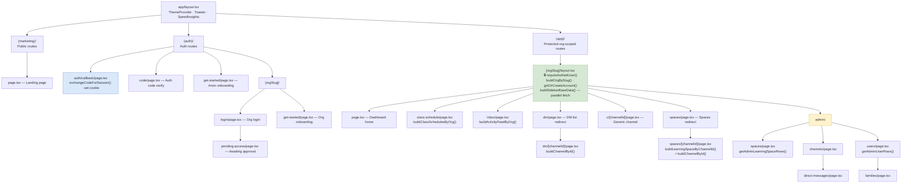
```mermaid
graph TD
    ROOT["app/layout.tsx\nThemeProvider · Toaster · SpeedInsights"]

    ROOT --> MKT["(marketing)/\nPublic routes"]
    ROOT --> AUTH["(auth)/\nAuth routes"]
    ROOT --> APP["(app)/\nProtected org-scoped routes"]

    MKT --> MHOME["page.tsx — Landing page"]

    AUTH --> CALLBACK["auth/callback/page.tsx\nexchangeCodeForSession() · set cookie"]
    AUTH --> CODE["code/page.tsx — Auth code verify"]
    AUTH --> GETSTARTED["get-started/page.tsx — Anon onboarding"]
    AUTH --> ORGAUTH["[orgSlug]/"]
    ORGAUTH --> LOGIN["login/page.tsx — Org login"]
    LOGIN --> PENDING["pending-access/page.tsx — Awaiting approval"]
    ORGAUTH --> ORGSTART["get-started/page.tsx — Org onboarding"]

    APP --> ORGLAYOUT["[orgSlug]/layout.tsx\n🔒 requireAuthedUser()\nbuildOrgBySlug() · getOrCreateAccount()\nbuildSidebarBaseData() — parallel fetch"]
    ORGLAYOUT --> DASH["page.tsx — Dashboard home"]
    ORGLAYOUT --> SCHED["class-schedule/page.tsx\nbuildClassSchedulesByOrg()"]
    ORGLAYOUT --> INBOX["inbox/page.tsx\nbuildActivityFeedByOrg()"]
    ORGLAYOUT --> DML["dm/page.tsx — DM list redirect"]
    DML --> DMCH["dm/[channelId]/page.tsx\nbuildChannelById()"]
    ORGLAYOUT --> CGEN["c/[channelId]/page.tsx — Generic channel"]
    ORGLAYOUT --> SPL["spaces/page.tsx — Spaces redirect"]
    SPL --> SPACE["spaces/[channelId]/page.tsx\nbuildLearningSpaceByChannelId()\n+ buildChannelById()"]
    ORGLAYOUT --> ADMINR["admin/"]
    ADMINR --> ASPACES["spaces/page.tsx\ngetAdminLearningSpaceRows()"]
    ADMINR --> ACHANNELS["channels/page.tsx"]
    ACHANNELS --> ADMS["direct-messages/page.tsx"]
    ADMINR --> AUSERS["users/page.tsx\ngetAdminUserRows()"]
    AUSERS --> AFAMS["families/page.tsx"]

    style ORGLAYOUT fill:#d5e8d4,stroke:#82b366
    style ADMINR fill:#fff2cc,stroke:#d6b656
    style CALLBACK fill:#dae8fc,stroke:#6c8ebf
```

---

## 5. Mobile App Route Tree

Complete Expo Router file-based route structure with navigation groups, guards, and screen descriptions.

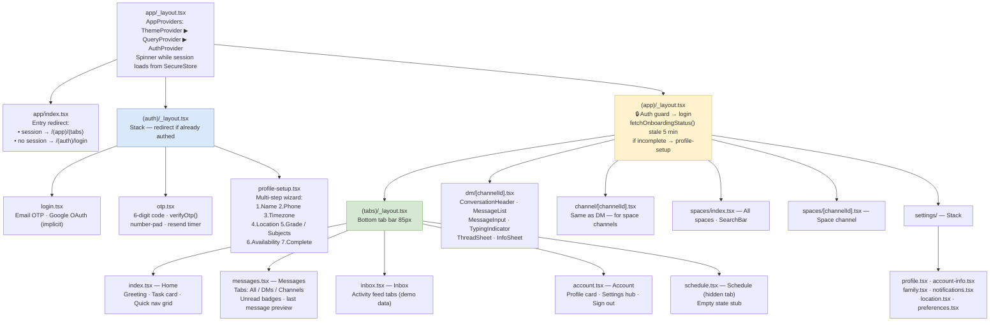
```mermaid
graph TD
    ROOTL["app/_layout.tsx\nAppProviders: ThemeProvider ▶ QueryProvider ▶ AuthProvider\nSpinner while session loads from SecureStore"]

    ROOTL --> INDEX["app/index.tsx\nEntry redirect:\n• session → /(app)/(tabs)\n• no session → /(auth)/login"]

    ROOTL --> AUTHL["(auth)/_layout.tsx\nStack — redirect if already authed"]
    AUTHL --> LOGINS["login.tsx\nEmail OTP · Google OAuth (implicit)"]
    AUTHL --> OTPS["otp.tsx\n6-digit code · verifyOtp()\nnumber-pad · resend timer"]
    AUTHL --> SETUP["profile-setup.tsx\nMulti-step wizard:\n1.Name 2.Phone 3.Timezone\n4.Location 5.Grade / Subjects\n6.Availability 7.Complete"]

    ROOTL --> APPL["(app)/_layout.tsx\n🔒 Auth guard → login\nfetchOnboardingStatus() stale 5 min\nif incomplete → profile-setup"]
    APPL --> TABL["(tabs)/_layout.tsx\nBottom tab bar 85px"]

    TABL --> HOME["index.tsx — Home\nGreeting · Task card · Quick nav grid"]
    TABL --> MSGS["messages.tsx — Messages\nTabs: All / DMs / Channels\nUnread badges · last message preview"]
    TABL --> INBOXM["inbox.tsx — Inbox\nActivity feed tabs (demo data)"]
    TABL --> ACCT["account.tsx — Account\nProfile card · Settings hub · Sign out"]
    TABL --> SCHEDM["schedule.tsx — Schedule (hidden tab)\nEmpty state stub"]

    APPL --> DMSCR["dm/[channelId].tsx\nConversationHeader · MessageList\nMessageInput · TypingIndicator\nThreadSheet · InfoSheet"]
    APPL --> CHANSCR["channel/[channelId].tsx\nSame as DM — for space channels"]
    APPL --> SPACELIST["spaces/index.tsx — All spaces · SearchBar"]
    APPL --> SPACECHAN["spaces/[channelId].tsx — Space channel"]
    APPL --> SETNAV["settings/ — Stack"]
    SETNAV --> SP["profile.tsx · account-info.tsx\nfamily.tsx · notifications.tsx\nlocation.tsx · preferences.tsx"]

    style TABL fill:#d5e8d4,stroke:#82b366
    style AUTHL fill:#dae8fc,stroke:#6c8ebf
    style APPL fill:#fff2cc,stroke:#d6b656
```

---

## 6. NestJS API — Module & Class Diagram

Full NestJS dependency-injection graph: modules, controllers, services, guards, and Prisma models.

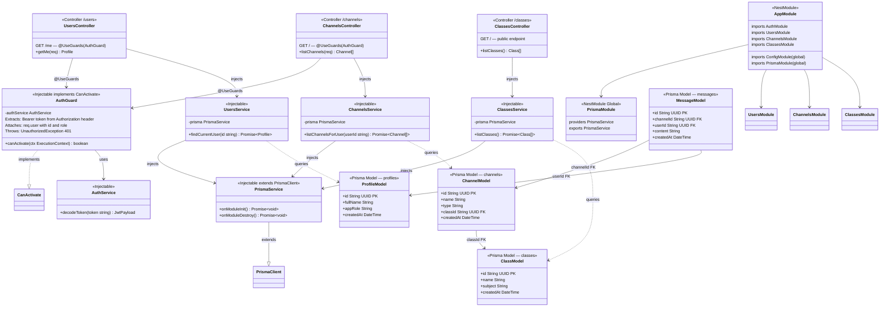
```mermaid
classDiagram
    class AppModule {
        <<NestModule>>
        imports ConfigModule (global)
        imports PrismaModule (global)
        imports AuthModule
        imports UsersModule
        imports ChannelsModule
        imports ClassesModule
    }

    class PrismaModule {
        <<NestModule Global>>
        providers PrismaService
        exports PrismaService
    }

    class PrismaService {
        <<Injectable extends PrismaClient>>
        +onModuleInit() Promise~void~
        +onModuleDestroy() Promise~void~
    }
    PrismaService --|> PrismaClient : extends

    class AuthService {
        <<Injectable>>
        +decodeToken(token string) JwtPayload
    }

    class AuthGuard {
        <<Injectable implements CanActivate>>
        -authService AuthService
        +canActivate(ctx ExecutionContext) boolean
        Extracts: Bearer token from Authorization header
        Attaches: req.user with id and role
        Throws: UnauthorizedException 401
    }
    AuthGuard ..|> CanActivate : implements
    AuthGuard --> AuthService : uses

    class UsersController {
        <<Controller /users>>
        GET /me — @UseGuards(AuthGuard)
        +getMe(req) Profile
    }
    class UsersService {
        <<Injectable>>
        -prisma PrismaService
        +findCurrentUser(id string) Promise~Profile~
    }
    UsersController --> AuthGuard : @UseGuards
    UsersController --> UsersService : injects
    UsersService --> PrismaService : injects

    class ChannelsController {
        <<Controller /channels>>
        GET / — @UseGuards(AuthGuard)
        +listChannels(req) Channel[]
    }
    class ChannelsService {
        <<Injectable>>
        -prisma PrismaService
        +listChannelsForUser(userId string) Promise~Channel[]~
    }
    ChannelsController --> AuthGuard : @UseGuards
    ChannelsController --> ChannelsService : injects
    ChannelsService --> PrismaService : injects

    class ClassesController {
        <<Controller /classes>>
        GET / — public endpoint
        +listClasses() Class[]
    }
    class ClassesService {
        <<Injectable>>
        -prisma PrismaService
        +listClasses() Promise~Class[]~
    }
    ClassesController --> ClassesService : injects
    ClassesService --> PrismaService : injects

    class ProfileModel {
        <<Prisma Model — profiles>>
        +id String UUID PK
        +fullName String
        +appRole String
        +createdAt DateTime
    }
    class ChannelModel {
        <<Prisma Model — channels>>
        +id String UUID PK
        +name String
        +type String
        +classId String UUID FK
        +createdAt DateTime
    }
    class MessageModel {
        <<Prisma Model — messages>>
        +id String UUID PK
        +channelId String UUID FK
        +userId String UUID FK
        +content String
        +createdAt DateTime
    }
    class ClassModel {
        <<Prisma Model — classes>>
        +id String UUID PK
        +name String
        +subject String
        +createdAt DateTime
    }

    ChannelModel --> ClassModel : classId FK
    MessageModel --> ChannelModel : channelId FK
    MessageModel --> ProfileModel : userId FK
    UsersService ..> ProfileModel : queries
    ChannelsService ..> ChannelModel : queries
    ClassesService ..> ClassModel : queries
    AppModule --> PrismaModule
    AppModule --> UsersModule
    AppModule --> ChannelsModule
    AppModule --> ClassesModule
```

---

## 7. Shared Types — User & Account Domain

`UserProfileVM` inheritance hierarchy, account lifecycle types, family links, and roles from `packages/shared-types`.

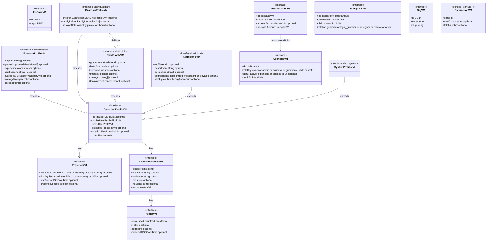
```mermaid
classDiagram
    class IdsBaseVM {
        <<interface>>
        +id UUID
        +orgId UUID
    }

    class AvatarVM {
        <<interface>>
        +source seed or upload or external
        +url string optional
        +seed string optional
        +updatedAt ISODateTime optional
    }

    class PresenceVM {
        <<interface>>
        +liveStatus online or in_class or teaching or busy or away or offline
        +displayStatus online or idle or busy or away or offline optional
        +lastSeenAt ISODateTime optional
        +presenceLoaded boolean optional
    }

    class UserProfileBlockVM {
        <<interface>>
        +displayName string
        +firstName string optional
        +lastName string optional
        +bio string optional
        +headline string optional
        +avatar AvatarVM
    }
    UserProfileBlockVM --> AvatarVM : has

    class BaseUserProfileVM {
        <<interface>>
        +ids IdsBaseVM plus accountId
        +profile UserProfileBlockVM
        +prefs UserPrefsVM
        +presence PresenceVM optional
        +location UserLocationVM optional
        +meta UserMetaVM
    }
    BaseUserProfileVM --> UserProfileBlockVM : has
    BaseUserProfileVM --> PresenceVM : has

    class EducatorProfileVM {
        <<interface kind=educator>>
        +subjects string[] optional
        +gradesSupported GradeLevel[] optional
        +experienceYears number optional
        +certifications string[] optional
        +availability EducatorAvailabilityVM optional
        +averageRating number optional
        +badges string[] optional
    }
    EducatorProfileVM --|> BaseUserProfileVM : extends

    class GuardianProfileVM {
        <<interface kind=guardian>>
        +children ConnectionVM~ChildProfileVM~ optional
        +familyInvites FamilyLinkInviteVM[] optional
        +sessionNotesVisibility private or shared optional
    }
    GuardianProfileVM --|> BaseUserProfileVM : extends
    GuardianProfileVM "1" --> "0..*" ChildProfileVM : children

    class ChildProfileVM {
        <<interface kind=child>>
        +gradeLevel GradeLevel optional
        +birthYear number optional
        +schoolName string optional
        +interests string[] optional
        +strengths string[] optional
        +learningPreferences string[] optional
    }
    ChildProfileVM --|> BaseUserProfileVM : extends

    class StaffProfileVM {
        <<interface kind=staff>>
        +jobTitle string optional
        +department string optional
        +specialties string[] optional
        +permissionsScope limited or standard or elevated optional
        +weeklyAvailability DayAvailability optional
    }
    StaffProfileVM --|> BaseUserProfileVM : extends

    class SystemProfileVM {
        <<interface kind=system>>
    }
    SystemProfileVM --|> BaseUserProfileVM : extends

    class UserAccountVM {
        <<interface>>
        +ids IdsBaseVM
        +contacts UserContactVM
        +access AccountAccessVM optional
        +lifecycle AccountLifecycleVM
    }

    class UserRoleVM {
        <<interface>>
        +ids IdsBaseVM
        +roleKey owner or admin or educator or guardian or child or staff
        +status active or pending or blocked or unassigned
        +audit RoleAuditVM
    }
    UserAccountVM --> UserRoleVM : access.userRoles

    class FamilyLinkVM {
        <<interface>>
        +ids IdsBaseVM plus familyId
        +guardianAccountId UUID
        +childAccountId UUID
        +relation guardian or legal_guardian or caregiver or relative or other
    }

    class OrgVM {
        <<interface>>
        +id UUID
        +name string
        +slug string
    }

    class ConnectionVM {
        <<generic interface T>>
        +items T[]
        +nextCursor string optional
        +total number optional
    }
```

---

## 8. Shared Types — Messaging & Content Domain

`MessageVM` discriminated union (15 variants), attachment hierarchy, `ChannelVM`, `LearningSpaceVM`, and sidebar/feed structures.

```mermaid
classDiagram
    class BaseAttachmentVM {
        <<interface>>
        +type image or file or design-file
        +url string
        +name string
    }
    class ImageAttachmentVM {
        +type image
        +width number optional
        +height number optional
    }
    class FileAttachmentVM {
        +type file
        +size number optional
        +mimeType string optional
    }
    class DesignFileAttachmentVM {
        +type design-file
        +tool figma or sketch or adobe-xd or canva or other
        +thumbnail string optional
    }
    ImageAttachmentVM --|> BaseAttachmentVM
    FileAttachmentVM --|> BaseAttachmentVM
    DesignFileAttachmentVM --|> BaseAttachmentVM

    class ReactionVM {
        <<interface>>
        +emoji string
        +count number
        +reactedByMe boolean optional
        +sampleUserIds UUID[] optional
    }

    class ThreadVM {
        <<interface>>
        +ids IdsBaseVM
        +parentMessageId UUID
        +parentSnippet string optional
        +messageCount number
        +lastReplyAt ISODateTime optional
        +participants UserProfileBlockVM[]
        +readState ThreadReadStateVM optional
    }

    class BaseMessageVM {
        <<interface — discriminated union on core.type>>
        +ids IdsBaseVM plus channelId
        +core MessageCoreVM
        +sender UserProfileBlockVM
        +social MessageSocialVM
        +state MessageStateVM optional
    }
    BaseMessageVM --> ReactionVM : social.reactions
    BaseMessageVM --> ThreadVM : social.thread

    class TextMessageVM {
        +core.type text
        +content.text string
    }
    class ImageMessageVM {
        +core.type image
        +attachment ImageAttachmentVM
    }
    class FileMessageVM {
        +core.type file
        +attachment FileAttachmentVM
    }
    class AudioRecordingMessageVM {
        +core.type audio-recording
        +recording.url string
        +recording.duration number
    }
    class PaymentReminderMessageVM {
        +core.type payment-reminder
        +payment.amount number
        +payment.currency string
        +payment.dueAt ISODateTime
        +payment.status pending or paid or overdue
    }
    class SessionSummaryMessageVM {
        +core.type session-summary
        +session.title string
        +session.summary string
        +session.highlights string[]
        +session.nextSteps string[]
    }
    class LessonAssignmentMessageVM {
        +core.type lesson-assignment
        +assignment.title string
        +assignment.dueAt ISODateTime optional
        +assignment.attachments AttachmentVM[]
    }
    class HomeworkSubmissionMessageVM {
        +core.type homework-submission
        +submission.title string
        +submission.attachments AttachmentVM[]
        +submission.status submitted or reviewed
    }
    class ProgressUpdateMessageVM {
        +core.type progress-update
        +progress.metrics ProgressMetricVM[]
    }
    class SessionBookingMessageVM {
        +core.type session-booking
        +booking.startAt ISODateTime
        +booking.endAt ISODateTime
        +booking.status pending or confirmed or cancelled
    }

    TextMessageVM --|> BaseMessageVM
    ImageMessageVM --|> BaseMessageVM
    FileMessageVM --|> BaseMessageVM
    AudioRecordingMessageVM --|> BaseMessageVM
    PaymentReminderMessageVM --|> BaseMessageVM
    SessionSummaryMessageVM --|> BaseMessageVM
    LessonAssignmentMessageVM --|> BaseMessageVM
    HomeworkSubmissionMessageVM --|> BaseMessageVM
    ProgressUpdateMessageVM --|> BaseMessageVM
    SessionBookingMessageVM --|> BaseMessageVM

    note for BaseMessageVM "Union also includes:\nDesignFileUpdateMessageVM\nEventReminderMessageVM\nFeedbackRequestMessageVM\nSessionCompleteMessageVM\nLinkPreviewMessageVM"

    class ChannelVM {
        <<interface>>
        +ids IdsBaseVM
        +basics ChannelBasicsVM
        +lifecycle ChannelLifecycleVM
        +postingPolicy ChannelPostingPolicyVM
        +collections ChannelCollectionsVM
        +capabilities ChannelCapabilityVM[] optional
        +ui ChannelUiDefaultsVM optional
        +dm ChannelDmVM optional
    }
    ChannelVM "1" --> "0..*" BaseMessageVM : collections.messages
    ChannelVM --> ThreadVM : via messages

    class LearningSpaceVM {
        <<interface>>
        +ids IdsBaseVM
        +basics LearningSpaceBasicsVM
        +channels LearningSpaceChannelsVM
        +schedule LearningSpaceScheduleVM optional
        +resources LearningSpaceResourcesVM optional
        +lifecycle LearningSpaceLifecycleVM
        +participants UserProfileVM[]
    }
    LearningSpaceVM "1" --> "1..*" ChannelVM : primary + related channels

    class ClassScheduleVM {
        <<interface>>
        +ids IdsBaseVM
        +title string
        +startAt ISODateTime
        +endAt ISODateTime
        +status scheduled or cancelled or completed or rescheduled
        +recurrence RecurrenceRuleVM optional
        +participants ClassScheduleParticipantVM[]
    }
    LearningSpaceVM --> ClassScheduleVM : schedule series

    class SidebarLeftDataVM {
        <<interface>>
        +user SidebarUserVM
        +navigation SidebarPrimaryNavVM
        +collections SidebarCollectionsVM
        +organizations OrgSwitcherItemVM[] optional
    }
    SidebarLeftDataVM "1" --> "0..*" LearningSpaceVM : collections.learningSpaces
    SidebarLeftDataVM "1" --> "0..*" ChannelVM : collections.directMessages

    class ActivityFeedVM {
        <<interface>>
        +activeTab all or classes or payment or system
        +tabs ActivityFeedTabVM[]
        +sections ActivityFeedSectionVM[]
        +unreadCount number optional
    }
```

---

## 9. Mobile — Provider, Hook & Data Layer

Provider composition tree, React Query hook dependency chain, and how hooks connect to the Supabase client.

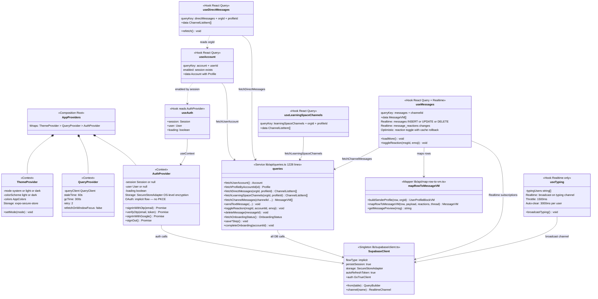
```mermaid
classDiagram
    class AppProviders {
        <<Composition Root>>
        Wraps: ThemeProvider > QueryProvider > AuthProvider
    }

    class ThemeProvider {
        <<Context>>
        -mode system or light or dark
        -colorScheme light or dark
        -colors AppColors
        +setMode(mode) void
        Storage: expo-secure-store
    }

    class QueryProvider {
        <<Context>>
        -queryClient QueryClient
        staleTime: 60s
        gcTime: 300s
        retry: 2
        refetchOnWindowFocus: false
    }

    class AuthProvider {
        <<Context>>
        -session Session or null
        -user User or null
        -loading boolean
        +signInWithOtp(email) Promise
        +verifyOtp(email, token) Promise
        +signInWithGoogle() Promise
        +signOut() Promise
        Storage: SecureStoreAdapter OS-level encryption
        OAuth: implicit flow — no PKCE
    }

    AppProviders *-- ThemeProvider
    AppProviders *-- QueryProvider
    AppProviders *-- AuthProvider

    class SupabaseClient {
        <<Singleton lib/supabase/client.ts>>
        flowType: implicit
        persistSession: true
        storage: SecureStoreAdapter
        autoRefreshToken: true
        +auth GoTrueClient
        +from(table) QueryBuilder
        +channel(name) RealtimeChannel
    }

    AuthProvider --> SupabaseClient : auth calls

    class queries {
        <<Service lib/api/queries.ts 1228 lines>>
        +fetchUserAccount() Account
        +fetchProfileByAccountId(id) Profile
        +fetchDirectMessages(orgId, profileId) ChannelListItem[]
        +fetchLearningSpaceChannels(orgId, profileId) ChannelListItem[]
        +fetchChannelMessages(channelId ...) MessageVM[]
        +sendTextMessage(...) void
        +toggleReaction(msgId, accountId, emoji) void
        +deleteMessage(messageId) void
        +fetchOnboardingStatus() OnboardingStatus
        +save*Step() void
        +completeOnboarding(accountId) void
    }
    queries --> SupabaseClient : all DB calls

    class mapRowToMessageVM {
        <<Mapper lib/api/map-row-to-vm.ts>>
        +buildSenderProfile(row, orgId) UserProfileBlockVM
        +mapRowToMessageVM(row, payload, reactions, thread) MessageVM
        +getMessagePreview(msg) string
    }

    class useAuth {
        <<Hook reads AuthProvider>>
        +session: Session
        +user: User
        +loading: boolean
    }
    useAuth --> AuthProvider : useContext

    class useAccount {
        <<Hook React Query>>
        queryKey: account + userId
        enabled: session exists
        +data Account with Profile
    }
    useAccount ..> useAuth : enabled by session
    useAccount --> queries : fetchUserAccount

    class useDirectMessages {
        <<Hook React Query>>
        queryKey: directMessages + orgId + profileId
        +data ChannelListItem[]
        +refetch() void
    }
    useDirectMessages ..> useAccount : reads orgId
    useDirectMessages --> queries : fetchDirectMessages

    class useLearningSpaceChannels {
        <<Hook React Query>>
        queryKey: learningSpaceChannels + orgId + profileId
        +data ChannelListItem[]
    }
    useLearningSpaceChannels --> queries : fetchLearningSpaceChannels

    class useMessages {
        <<Hook React Query + Realtime>>
        queryKey: messages + channelId
        +data MessageVM[]
        +loadMore() void
        +toggleReaction(msgId, emoji) void
        Realtime: messages INSERT or UPDATE or DELETE
        Realtime: message_reactions changes
        Optimistic: reaction toggle with cache rollback
    }
    useMessages --> queries : fetchChannelMessages
    useMessages --> mapRowToMessageVM : maps rows
    useMessages --> SupabaseClient : Realtime subscriptions

    class useTyping {
        <<Hook Realtime only>>
        -typingUsers string[]
        +broadcastTyping() void
        Realtime: broadcast on typing channel
        Throttle: 1500ms
        Auto-clear: 3000ms per user
    }
    useTyping --> SupabaseClient : broadcast channel
```

---

## 10. Web — Auth, Builder & Mapper Stack

Three Supabase client factories, `AuthAdminService`, auth guards, and the layered query/mapper/builder pattern for server-side data fetching.

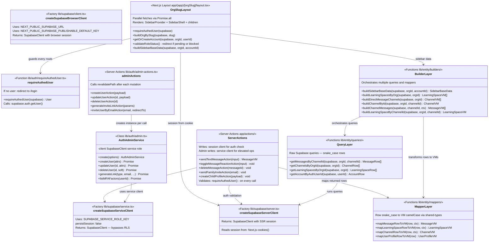
```mermaid
classDiagram
    class createSupabaseBrowserClient {
        <<Factory lib/supabase/client.ts>>
        Uses: NEXT_PUBLIC_SUPABASE_URL
        Uses: NEXT_PUBLIC_SUPABASE_PUBLISHABLE_DEFAULT_KEY
        Returns: SupabaseClient with browser session
    }

    class createSupabaseServerClient {
        <<Factory lib/supabase/server.ts>>
        Reads session from: Next.js cookies()
        Returns: SupabaseClient with SSR session
    }

    class createSupabaseServiceClient {
        <<Factory lib/supabase/service.ts>>
        Uses: SUPABASE_SERVICE_ROLE_KEY
        persistSession: false
        Returns: SupabaseClient — bypasses RLS
    }

    class AuthAdminService {
        <<Class lib/auth/admin.ts>>
        -client SupabaseClient service role
        +create(options) AuthAdminService
        +createUser(attrs) Promise
        +updateUser(id, attrs) Promise
        +deleteUser(id, soft) Promise
        +generateLink(type, email, ...) Promise
        +listMFAFactors(userId) Promise
    }
    AuthAdminService --> createSupabaseServiceClient : uses service client

    class requireAuthedUser {
        <<Function lib/auth/requireAuthedUser.ts>>
        +requireAuthedUser(supabase) User
        Calls: supabase.auth.getUser()
        If no user: redirect to /login
    }

    class adminActions {
        <<Server Actions lib/auth/admin-actions.ts>>
        +createUserAction(payload)
        +updateUserAction(id, payload)
        +deleteUserAction(id)
        +generateInviteLinkAction(params)
        +inviteUserByEmailAction(email, redirectTo)
        Calls revalidatePath after each mutation
    }
    adminActions --> AuthAdminService : creates instance per call

    class QueryLayer {
        <<Functions lib/entity/queries/>>
        +getMessagesByChannelId(supabase, orgId, channelId) MessageRow[]
        +getChannelsByOrgId(supabase, orgId) ChannelRow[]
        +getLearningSpacesByOrgId(supabase, orgId) LearningSpaceRow[]
        +getAccountByAuthUserId(supabase, userId) AccountRow
        Raw Supabase queries — snake_case rows
    }
    QueryLayer --> createSupabaseServerClient : runs queries

    class MapperLayer {
        <<Functions lib/entity/mappers/>>
        +mapMessageRowToVM(row, ctx) MessageVM
        +mapLearningSpaceRowToVM(row, ctx) LearningSpaceVM
        +mapChannelRowToVM(row, ctx) ChannelVM
        +mapUserProfileRowToVM(row) UserProfileVM
        Row snake_case to VM camelCase via shared-types
    }

    class BuilderLayer {
        <<Functions lib/entity/builders/>>
        +buildSidebarBaseData(supabase, orgId, accountId) SidebarBaseData
        +buildLearningSpacesByOrg(supabase, orgId) LearningSpaceVM[]
        +buildDirectMessageChannels(supabase, orgId) ChannelVM[]
        +buildChannelById(supabase, orgId, channelId) ChannelVM
        +buildChannelMessages(supabase, channelId, ctx) MessageVM[]
        +buildLearningSpaceByChannelId(supabase, orgId, channelId) LearningSpaceVM
        Orchestrates multiple queries and mappers
    }
    BuilderLayer --> QueryLayer : orchestrates queries
    BuilderLayer --> MapperLayer : transforms rows to VMs

    class ServerActions {
        <<Server Actions app/actions/>>
        +sendTextMessageAction(input) MessageVM
        +toggleMessageReactionAction(input) void
        +deleteMessageAction(messageId) void
        +sendFamilyInviteAction(email) void
        +createChildProfileAction(payload) void
        Validates: requireAuthedUser() on every call
        Writes: session client for auth check
        Admin writes: service client for elevated ops
    }
    ServerActions --> createSupabaseServerClient : auth validation
    ServerActions --> createSupabaseServiceClient : admin writes
    ServerActions --> MapperLayer : maps returned rows

    class OrgSlugLayout {
        <<Next.js Layout app/(app)/[orgSlug]/layout.tsx>>
        +requireAuthedUser(supabase)
        +buildOrgBySlug(supabase, slug)
        +getOrCreateAccount(supabase, orgId, userId)
        +validateRoleStatus() redirect if pending or blocked
        +buildSidebarBaseData(supabase, orgId, accountId)
        Parallel fetches via Promise.all
        Renders: SidebarProvider + SidebarShell + children
    }
    OrgSlugLayout --> requireAuthedUser : guards every route
    OrgSlugLayout --> BuilderLayer : sidebar data
    OrgSlugLayout --> createSupabaseServerClient : session from cookie
```

---

## 11. Component Architecture — `packages/ui-web`

Layered view from Radix primitives up to domain-specific complex components.

```mermaid
graph TD
    subgraph Foundation["Foundation"]
        RADIX["Radix UI Primitives\nDialog · Select · Tabs · Dropdown\nPopover · Accordion · etc."]
        TW["Tailwind CSS 4.x\n+ class-variance-authority\n+ tailwind-merge"]
        ICONS["lucide-react\n@tabler/icons-react"]
        EXTRAS["recharts · sonner\nembla-carousel\n@tanstack/react-table"]
    end

    subgraph Base["Base Components — ui/"]
        BUTTON["Button\nvariants + sizes"]
        INPUTS["Input · Textarea · InputOTP\nInputGroup"]
        OVERLAYS["Dialog · AlertDialog\nSheet · Drawer"]
        SELECTS["Select · Combobox · Command"]
        FEEDBACK["Badge · Alert · Toast(Sonner)\nSkeleton · Empty"]
        LAYOUT["Card · Separator\nScrollArea · Resizable"]
        NAVCOMP["Tabs · Breadcrumb\nAccordion · Toggle · ToggleGroup"]
        DATA["Table · Calendar\nCarousel · ButtonGroup"]
        FORMS["Checkbox · RadioGroup\nSwitch · Slider · Label"]
        AVATAR["Avatar with fallback"]
    end

    subgraph Complex["Complex Components — components/"]
        SIDEBAR_C["Sidebar\nSidebarLeft · NavMain · NavSecondary\nNavLearningSpaces · NavUser · NavAdmin"]
        MSG_C["Messages\nMessagesContainer · MessagesShell\nEmojiPicker · ProfileActions\nMediaFilesPanel · SavedPanel"]
        MSG_T["Message Renderers (15 types)\nTextMessage · ImageMessage · FileMessage\nPaymentReminder · SessionSummary\nLessonAssignment · HomeworkSubmission\nProgressUpdate · SessionBooking\nAudioMessage + 5 more"]
        SCHED_C["ClassSchedule\nWeekView · DayView · EventCard\nEventDetails · MiniClassSchedule"]
        PROFILE_C["UserSettings Tabs\nEducatorAvailability · EducatorProfile\nStudentProfile · StaffProfile\nNotifications"]
        SHARED_C["Shared\nAvailabilityScheduler · ResponsiveDialog\nThemedIcon · DashboardHeader\nRecurrenceScheduler · Inbox\nParticipantSelector\nResourceLinksEditor"]
    end

    RADIX --> Base
    TW --> Base
    ICONS --> Base
    EXTRAS --> DATA
    EXTRAS --> MSG_T
    Base --> Complex
```

---

## 12. Component Architecture — `packages/ui-native`

React Native component library built on NativeWind and rn-primitives.

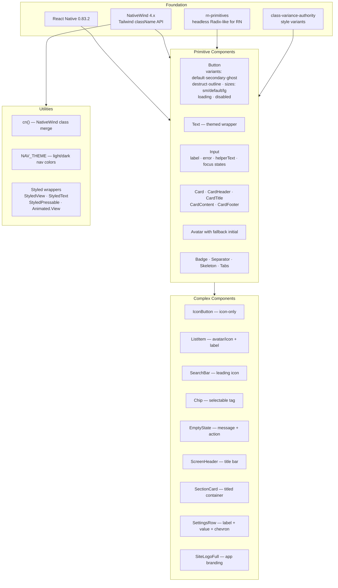
```mermaid
graph TD
    subgraph Foundation["Foundation"]
        RN["React Native 0.83.2"]
        NW["NativeWind 4.x\nTailwind className API"]
        RNP["rn-primitives\nheadless Radix-like for RN"]
        CVA["class-variance-authority\nstyle variants"]
    end

    subgraph Primitives["Primitive Components"]
        BTN["Button\nvariants: default·secondary·ghost\ndestruct·outline · sizes: sm/default/lg\nloading · disabled"]
        TXT["Text — themed wrapper"]
        INP["Input\nlabel · error · helperText · focus states"]
        CARD["Card · CardHeader · CardTitle\nCardContent · CardFooter"]
        AV["Avatar with fallback initial"]
        MISC["Badge · Separator · Skeleton · Tabs"]
    end

    subgraph Complex["Complex Components"]
        ICONBTN["IconButton — icon-only"]
        LISTITEM["ListItem — avatar/icon + label"]
        SEARCH["SearchBar — leading icon"]
        CHIP["Chip — selectable tag"]
        EMPTY["EmptyState — message + action"]
        SCREENHEAD["ScreenHeader — title bar"]
        SECTCARD["SectionCard — titled container"]
        SETROW["SettingsRow — label + value + chevron"]
        LOGO["SiteLogoFull — app branding"]
    end

    subgraph Utils["Utilities"]
        CN["cn() — NativeWind class merge"]
        NAV_T["NAV_THEME — light/dark nav colors"]
        STYLED["Styled wrappers\nStyledView · StyledText\nStyledPressable · Animated.View"]
    end

    RN --> Primitives
    NW --> Primitives
    RNP --> Primitives
    CVA --> Primitives
    Primitives --> Complex
    NW --> Utils
```

---

## 13. Swimlane — Web Auth Flow

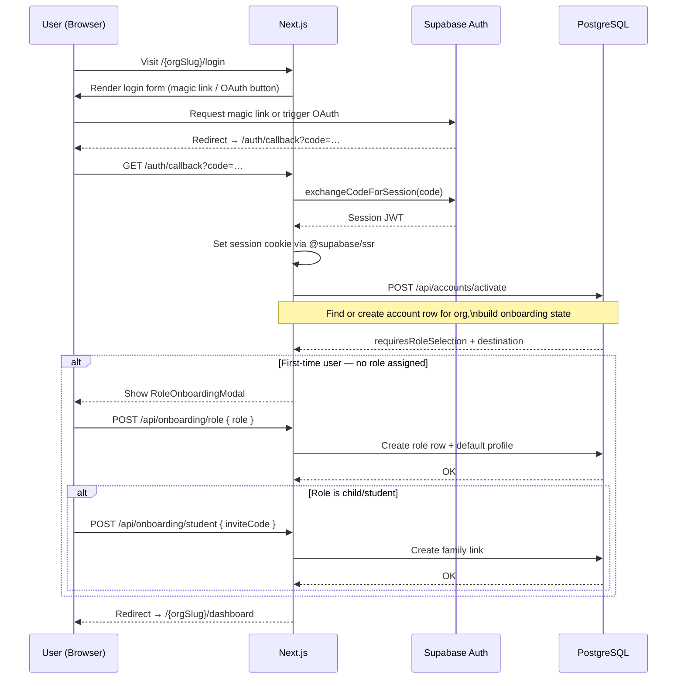
```mermaid
sequenceDiagram
    participant U as User (Browser)
    participant NX as Next.js
    participant SBA as Supabase Auth
    participant DB as PostgreSQL

    U->>NX: Visit /{orgSlug}/login
    NX->>U: Render login form (magic link / OAuth button)
    U->>SBA: Request magic link or trigger OAuth
    SBA-->>U: Redirect → /auth/callback?code=…

    U->>NX: GET /auth/callback?code=…
    NX->>SBA: exchangeCodeForSession(code)
    SBA-->>NX: Session JWT
    NX->>NX: Set session cookie via @supabase/ssr

    NX->>DB: POST /api/accounts/activate
    Note over NX,DB: Find or create account row for org,\nbuild onboarding state

    DB-->>NX: requiresRoleSelection + destination

    alt First-time user — no role assigned
        NX-->>U: Show RoleOnboardingModal
        U->>NX: POST /api/onboarding/role { role }
        NX->>DB: Create role row + default profile
        DB-->>NX: OK

        alt Role is child/student
            U->>NX: POST /api/onboarding/student { inviteCode }
            NX->>DB: Create family link
            DB-->>NX: OK
        end
    end

    NX-->>U: Redirect → /{orgSlug}/dashboard
```

---

## 14. Swimlane — Mobile Auth & Onboarding

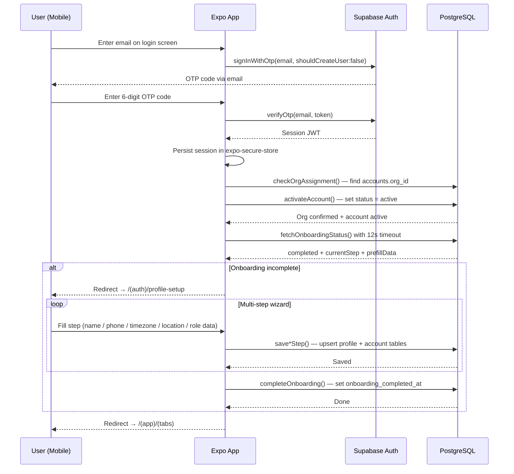
```mermaid
sequenceDiagram
    participant U as User (Mobile)
    participant EX as Expo App
    participant SBA as Supabase Auth
    participant DB as PostgreSQL

    U->>EX: Enter email on login screen
    EX->>SBA: signInWithOtp(email, shouldCreateUser:false)
    SBA-->>U: OTP code via email

    U->>EX: Enter 6-digit OTP code
    EX->>SBA: verifyOtp(email, token)
    SBA-->>EX: Session JWT

    EX->>EX: Persist session in expo-secure-store
    EX->>DB: checkOrgAssignment() — find accounts.org_id
    EX->>DB: activateAccount() — set status = active
    DB-->>EX: Org confirmed + account active

    EX->>DB: fetchOnboardingStatus() with 12s timeout
    DB-->>EX: completed + currentStep + prefillData

    alt Onboarding incomplete
        EX-->>U: Redirect → /(auth)/profile-setup
        loop Multi-step wizard
            U->>EX: Fill step (name / phone / timezone / location / role data)
            EX->>DB: save*Step() — upsert profile + account tables
            DB-->>EX: Saved
        end
        EX->>DB: completeOnboarding() — set onboarding_completed_at
        DB-->>EX: Done
    end

    EX-->>U: Redirect → /(app)/(tabs)
```

---

## 15. Swimlane — Web Protected Route (SSR Read)

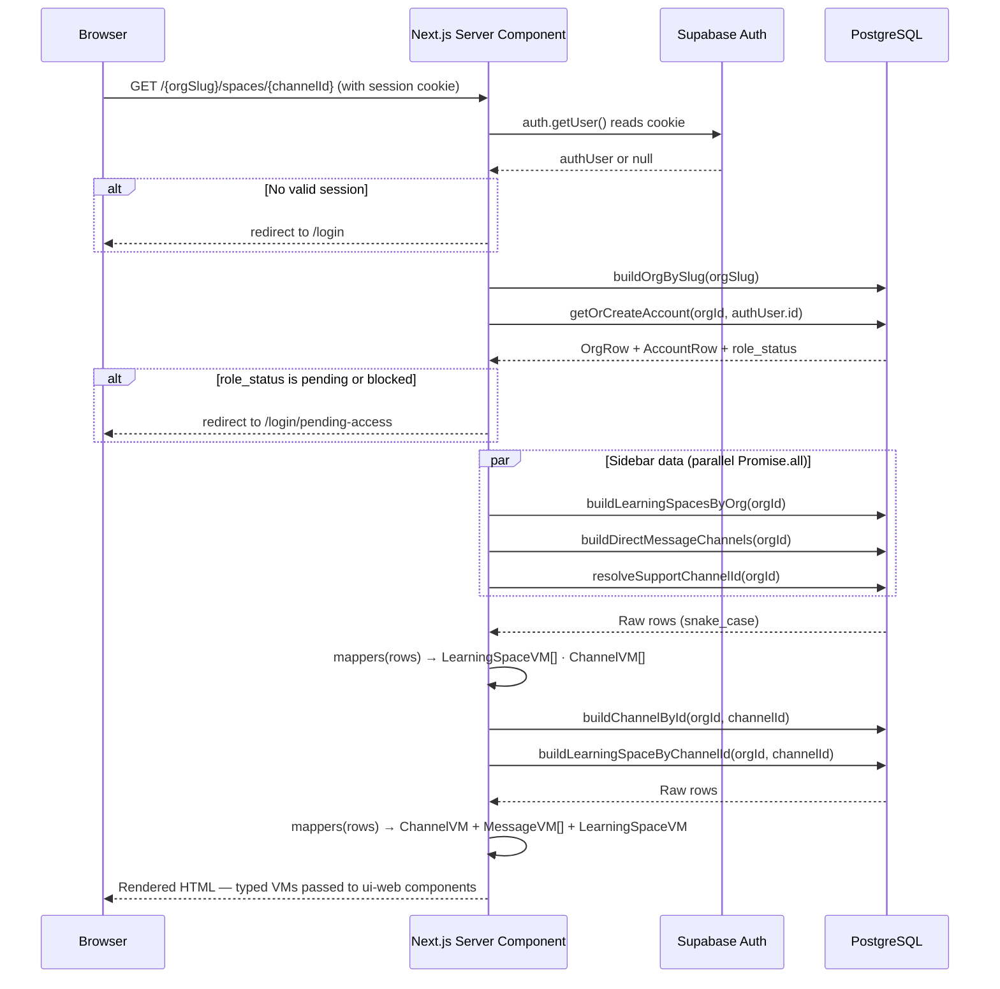
```mermaid
sequenceDiagram
    participant U as Browser
    participant NX as Next.js Server Component
    participant SBA as Supabase Auth
    participant DB as PostgreSQL

    U->>NX: GET /{orgSlug}/spaces/{channelId} (with session cookie)

    NX->>SBA: auth.getUser() reads cookie
    SBA-->>NX: authUser or null

    alt No valid session
        NX-->>U: redirect to /login
    end

    NX->>DB: buildOrgBySlug(orgSlug)
    NX->>DB: getOrCreateAccount(orgId, authUser.id)
    DB-->>NX: OrgRow + AccountRow + role_status

    alt role_status is pending or blocked
        NX-->>U: redirect to /login/pending-access
    end

    par Sidebar data (parallel Promise.all)
        NX->>DB: buildLearningSpacesByOrg(orgId)
        NX->>DB: buildDirectMessageChannels(orgId)
        NX->>DB: resolveSupportChannelId(orgId)
    end
    DB-->>NX: Raw rows (snake_case)
    NX->>NX: mappers(rows) → LearningSpaceVM[] · ChannelVM[]

    NX->>DB: buildChannelById(orgId, channelId)
    NX->>DB: buildLearningSpaceByChannelId(orgId, channelId)
    DB-->>NX: Raw rows
    NX->>NX: mappers(rows) → ChannelVM + MessageVM[] + LearningSpaceVM

    NX-->>U: Rendered HTML — typed VMs passed to ui-web components
```

---

## 16. Swimlane — Web Mutation via Server Action

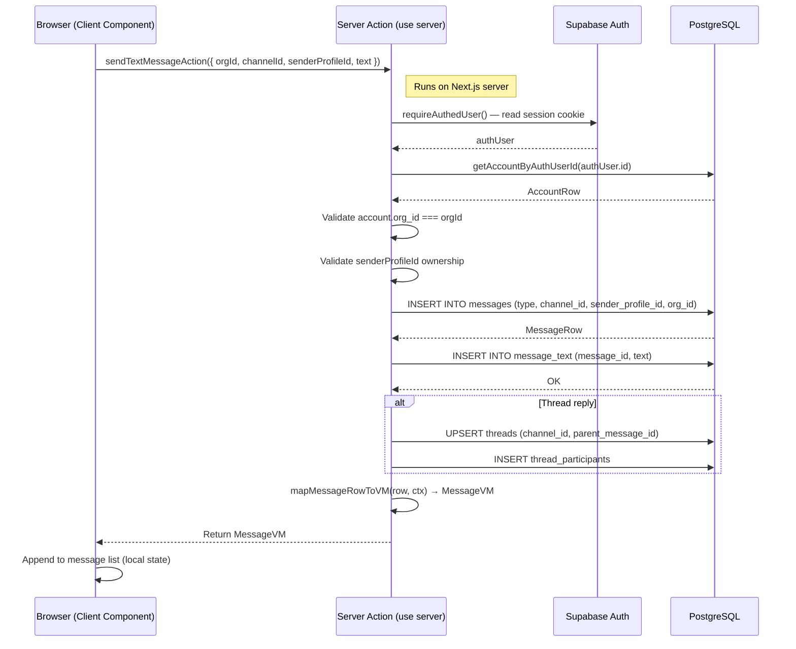
```mermaid
sequenceDiagram
    participant U as Browser (Client Component)
    participant SA as Server Action (use server)
    participant SBA as Supabase Auth
    participant DB as PostgreSQL

    U->>SA: sendTextMessageAction({ orgId, channelId, senderProfileId, text })
    Note right of SA: Runs on Next.js server

    SA->>SBA: requireAuthedUser() — read session cookie
    SBA-->>SA: authUser

    SA->>DB: getAccountByAuthUserId(authUser.id)
    DB-->>SA: AccountRow

    SA->>SA: Validate account.org_id === orgId
    SA->>SA: Validate senderProfileId ownership

    SA->>DB: INSERT INTO messages (type, channel_id, sender_profile_id, org_id)
    DB-->>SA: MessageRow

    SA->>DB: INSERT INTO message_text (message_id, text)
    DB-->>SA: OK

    alt Thread reply
        SA->>DB: UPSERT threads (channel_id, parent_message_id)
        SA->>DB: INSERT thread_participants
    end

    SA->>SA: mapMessageRowToVM(row, ctx) → MessageVM
    SA-->>U: Return MessageVM
    U->>U: Append to message list (local state)
```

---

## 17. Swimlane — NestJS API Request Lifecycle

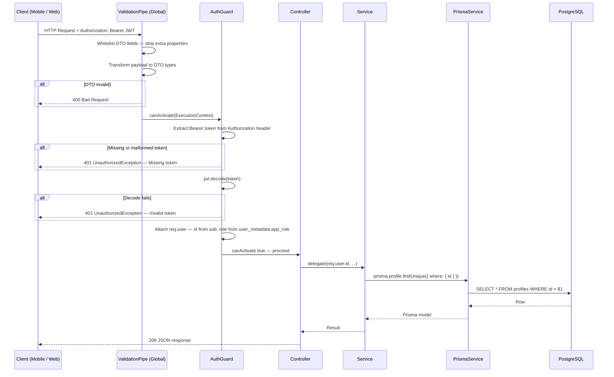
```mermaid
sequenceDiagram
    participant C as Client (Mobile / Web)
    participant VP as ValidationPipe (Global)
    participant AG as AuthGuard
    participant CTRL as Controller
    participant SVC as Service
    participant PS as PrismaService
    participant DB as PostgreSQL

    C->>VP: HTTP Request + Authorization: Bearer JWT

    VP->>VP: Whitelist DTO fields — strip extra properties
    VP->>VP: Transform payload to DTO types

    alt DTO invalid
        VP-->>C: 400 Bad Request
    end

    VP->>AG: canActivate(ExecutionContext)
    AG->>AG: Extract Bearer token from Authorization header

    alt Missing or malformed token
        AG-->>C: 401 UnauthorizedException — Missing token
    end

    AG->>AG: jwt.decode(token)

    alt Decode fails
        AG-->>C: 401 UnauthorizedException — Invalid token
    end

    AG->>AG: Attach req.user — id from sub, role from user_metadata.app_role
    AG->>CTRL: canActivate true — proceed

    CTRL->>SVC: delegate(req.user.id, ...)
    SVC->>PS: prisma.profile.findUnique({ where: { id } })
    PS->>DB: SELECT * FROM profiles WHERE id = $1
    DB-->>PS: Row
    PS-->>SVC: Prisma model
    SVC-->>CTRL: Result
    CTRL-->>C: 200 JSON response
```

---

## 18. Swimlane — Mobile Data Fetch & Realtime

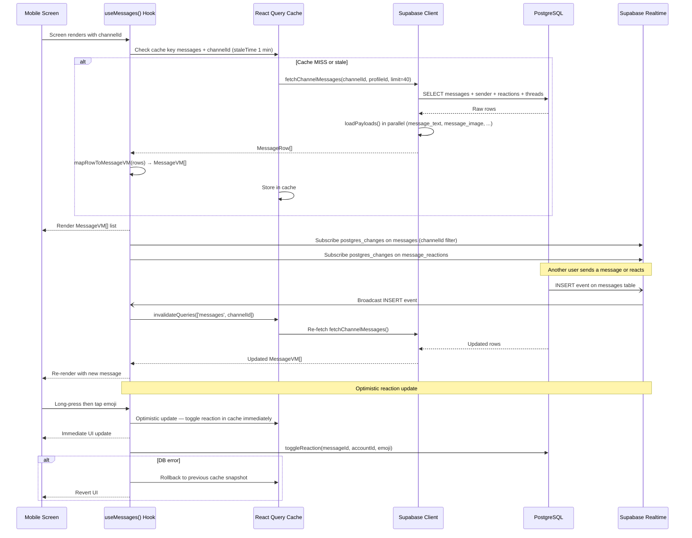
```mermaid
sequenceDiagram
    participant U as Mobile Screen
    participant HOOK as useMessages() Hook
    participant QC as React Query Cache
    participant SUPA as Supabase Client
    participant DB as PostgreSQL
    participant RT as Supabase Realtime

    U->>HOOK: Screen renders with channelId
    HOOK->>QC: Check cache key messages + channelId (staleTime 1 min)

    alt Cache MISS or stale
        QC->>SUPA: fetchChannelMessages(channelId, profileId, limit=40)
        SUPA->>DB: SELECT messages + sender + reactions + threads
        DB-->>SUPA: Raw rows
        SUPA->>SUPA: loadPayloads() in parallel (message_text, message_image, ...)
        SUPA-->>HOOK: MessageRow[]
        HOOK->>HOOK: mapRowToMessageVM(rows) → MessageVM[]
        QC->>QC: Store in cache
    end

    HOOK-->>U: Render MessageVM[] list

    HOOK->>RT: Subscribe postgres_changes on messages (channelId filter)
    HOOK->>RT: Subscribe postgres_changes on message_reactions

    Note over DB,RT: Another user sends a message or reacts

    DB-)RT: INSERT event on messages table
    RT-)HOOK: Broadcast INSERT event
    HOOK->>QC: invalidateQueries(['messages', channelId])
    QC->>SUPA: Re-fetch fetchChannelMessages()
    DB-->>SUPA: Updated rows
    SUPA-->>HOOK: Updated MessageVM[]
    HOOK-->>U: Re-render with new message

    Note over HOOK,RT: Optimistic reaction update
    U->>HOOK: Long-press then tap emoji
    HOOK->>QC: Optimistic update — toggle reaction in cache immediately
    HOOK-->>U: Immediate UI update
    HOOK->>DB: toggleReaction(messageId, accountId, emoji)

    alt DB error
        HOOK->>QC: Rollback to previous cache snapshot
        HOOK-->>U: Revert UI
    end
```

---

## 19. Swimlane — Cross-Client Realtime Messaging

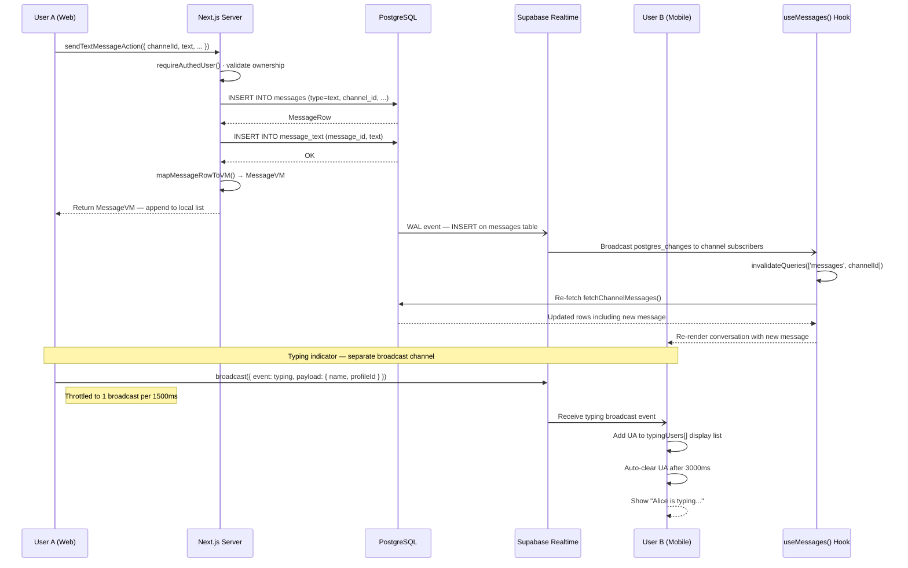
```mermaid
sequenceDiagram
    participant UA as User A (Web)
    participant NX as Next.js Server
    participant DB as PostgreSQL
    participant RT as Supabase Realtime
    participant MB as User B (Mobile)
    participant MBHOOK as useMessages() Hook

    UA->>NX: sendTextMessageAction({ channelId, text, ... })
    NX->>NX: requireAuthedUser() · validate ownership
    NX->>DB: INSERT INTO messages (type=text, channel_id, ...)
    DB-->>NX: MessageRow
    NX->>DB: INSERT INTO message_text (message_id, text)
    DB-->>NX: OK
    NX->>NX: mapMessageRowToVM() → MessageVM
    NX-->>UA: Return MessageVM — append to local list

    DB-)RT: WAL event — INSERT on messages table
    RT-)MBHOOK: Broadcast postgres_changes to channel subscribers
    MBHOOK->>MBHOOK: invalidateQueries(['messages', channelId])
    MBHOOK->>DB: Re-fetch fetchChannelMessages()
    DB-->>MBHOOK: Updated rows including new message
    MBHOOK-->>MB: Re-render conversation with new message

    Note over UA,MB: Typing indicator — separate broadcast channel
    UA->>RT: broadcast({ event: typing, payload: { name, profileId } })
    Note right of UA: Throttled to 1 broadcast per 1500ms
    RT-)MB: Receive typing broadcast event
    MB->>MB: Add UA to typingUsers[] display list
    MB->>MB: Auto-clear UA after 3000ms
    MB-->>MB: Show "Alice is typing..."
```

---

## 20. Data Contract: Row → ViewModel Pipeline

End-to-end journey of a PostgreSQL row through each app's transformation stack to a rendered UI component. The `packages/shared-types` ViewModel shapes are the single shared contract.

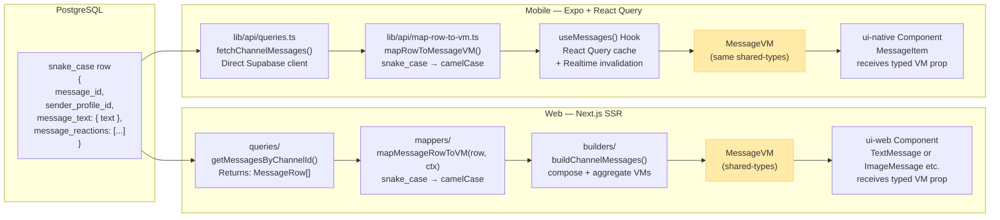
```mermaid
graph LR
    subgraph DB["PostgreSQL"]
        PG["snake_case row\n{\n  message_id,\n  sender_profile_id,\n  message_text: { text },\n  message_reactions: [...]\n}"]
    end

    subgraph WEB["Web — Next.js SSR"]
        WQ["queries/\ngetMessagesByChannelId()\nReturns: MessageRow[]"]
        WM["mappers/\nmapMessageRowToVM(row, ctx)\nsnake_case → camelCase"]
        WB["builders/\nbuildChannelMessages()\ncompose + aggregate VMs"]
        WVM["MessageVM\n(shared-types)"]
        WCOMP["ui-web Component\nTextMessage or ImageMessage etc.\nreceives typed VM prop"]
    end

    subgraph MOB["Mobile — Expo + React Query"]
        MQ["lib/api/queries.ts\nfetchChannelMessages()\nDirect Supabase client"]
        MM["lib/api/map-row-to-vm.ts\nmapRowToMessageVM()\nsnake_case → camelCase"]
        MHK["useMessages() Hook\nReact Query cache\n+ Realtime invalidation"]
        MVM["MessageVM\n(same shared-types)"]
        MCOMP["ui-native Component\nMessageItem\nreceives typed VM prop"]
    end

    PG --> WQ
    WQ --> WM
    WM --> WB
    WB --> WVM
    WVM --> WCOMP

    PG --> MQ
    MQ --> MM
    MM --> MHK
    MHK --> MVM
    MVM --> MCOMP

    style WVM fill:#ffeaa7,stroke:#fdcb6e
    style MVM fill:#ffeaa7,stroke:#fdcb6e
```

**Key principle:** `packages/shared-types` is the single source of truth for all ViewModel shapes. Both `apps/web` (via `lib/*/mappers/`) and `apps/mobile` (via `lib/api/map-row-to-vm.ts`) produce the same typed VMs, which are consumed by `packages/ui-web` and `packages/ui-native` respectively. Raw Row types and API Payloads are kept separate from VMs.

---

_Generated from codebase exploration — `iconicedu-monorepo`. Last updated: 2026-05-05._
