# IconicEdu — Feature Architecture Diagrams

Detailed design and architecture diagrams for the four core feature domains: Users & Roles, Channels & Messaging, Classrooms, and Activity Feed.

---

## Table of Contents

1. [Users & Roles](#1-users--roles)
   - [1.1 Account & Role ER Diagram](#11-account--role-er-diagram)
   - [1.2 Profile Type Hierarchy](#12-profile-type-hierarchy)
   - [1.3 Family Relationship Model](#13-family-relationship-model)
   - [1.4 Role Permission Matrix](#14-role-permission-matrix)
   - [1.5 Auth & Onboarding Flow](#15-auth--onboarding-flow)
   - [1.6 Presence State Machine](#16-presence-state-machine)
2. [Channels & Messaging](#2-channels--messaging)
   - [2.1 Channel Type Taxonomy](#21-channel-type-taxonomy)
   - [2.2 Channel Entity ER Diagram](#22-channel-entity-er-diagram)
   - [2.3 Message Type Hierarchy](#23-message-type-hierarchy)
   - [2.4 Realtime Messaging Flow](#24-realtime-messaging-flow)
   - [2.5 Thread Architecture](#25-thread-architecture)
   - [2.6 Live Session Lifecycle](#26-live-session-lifecycle)
   - [2.7 Channel Access Control](#27-channel-access-control)
   - [2.8 Read State & Unread Tracking](#28-read-state--unread-tracking)
3. [Classrooms (Learning Spaces)](#3-classrooms-learning-spaces)
   - [3.1 Learning Space ER Diagram](#31-learning-space-er-diagram)
   - [3.2 Classroom vs Channel Relationship](#32-classroom-vs-channel-relationship)
   - [3.3 Class Schedule & Recurrence Model](#33-class-schedule--recurrence-model)
   - [3.4 Session Lifecycle State Machine](#34-session-lifecycle-state-machine)
   - [3.5 Scheduling & Reminder Workflow](#35-scheduling--reminder-workflow)
   - [3.6 Attendance Tracking Flow](#36-attendance-tracking-flow)
4. [Activity Feed](#4-activity-feed)
   - [4.1 Event Pipeline Architecture](#41-event-pipeline-architecture)
   - [4.2 Activity Event ER Diagram](#42-activity-event-er-diagram)
   - [4.3 Realtime vs Batch vs Cron Paths](#43-realtime-vs-batch-vs-cron-paths)
   - [4.4 Notification Decision & Dispatch](#44-notification-decision--dispatch)
   - [4.5 Feed Projection & Grouping](#45-feed-projection--grouping)
   - [4.6 Notification Dispatch Job State Machine](#46-notification-dispatch-job-state-machine)

---

## 1. Users & Roles

### 1.1 Account & Role ER Diagram

Core account, role, and profile entities with their relationships.

```mermaid
erDiagram
    OrgRow {
        uuid id PK
        string name
        string slug
    }

    AccountRow {
        uuid id PK
        uuid org_id FK
        uuid auth_user_id
        string email
        string phone_e164
        string status "active|invited|suspended|deleted"
        string primary_role "owner|admin|educator|guardian|child|staff"
        string role_status "unassigned|active|pending|blocked"
        uuid active_profile_id FK
        timestamp onboarding_completed_at
    }

    UserRoleRow {
        uuid id PK
        uuid org_id FK
        uuid account_id FK
        string role_key "owner|admin|educator|guardian|child|staff"
        uuid assigned_by
        timestamp assigned_at
    }

    ProfileRow {
        uuid id PK
        uuid org_id FK
        uuid account_id FK
        string kind "educator|guardian|child|staff|system"
        string display_name
        string first_name
        string last_name
        string avatar_source "seed|upload|external"
        string status
        string timezone
        string ui_theme_key
    }

    EducatorProfileRow {
        uuid profile_id PK_FK
        string headline
        int experience_years
        string identity_verification_status
        float average_rating
        int total_reviews
    }

    ChildProfileRow {
        uuid profile_id PK_FK
        int birth_year
        string school_name
        string school_year
        string confidence_level
    }

    GuardianProfileRow {
        uuid profile_id PK_FK
        string session_notes_visibility "private|shared"
        timestamp joined_date
    }

    StaffProfileRow {
        uuid profile_id PK_FK
        string department
        string job_title
        string permissions_scope "limited|standard|elevated"
        uuid manager_staff_id FK
    }

    ProfilePresenceRow {
        uuid id PK
        uuid profile_id FK
        string live_status "online|in_class|teaching|reviewing_work|busy|away|offline"
        string display_status "online|idle|busy|away|offline"
        string state_text
        string state_emoji
        timestamp last_seen_at
    }

    OrgRow ||--o{ AccountRow : "has"
    AccountRow ||--o{ UserRoleRow : "has"
    AccountRow ||--o{ ProfileRow : "has"
    ProfileRow ||--o| EducatorProfileRow : "extends"
    ProfileRow ||--o| ChildProfileRow : "extends"
    ProfileRow ||--o| GuardianProfileRow : "extends"
    ProfileRow ||--o| StaffProfileRow : "extends"
    ProfileRow ||--o| ProfilePresenceRow : "has"
```

---

### 1.2 Profile Type Hierarchy

How account roles map to profile kinds and their extensions.

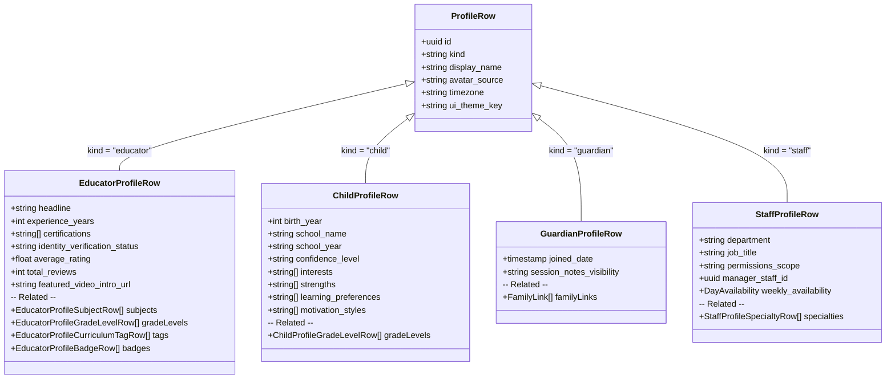

---

### 1.3 Family Relationship Model

How guardians and children are linked through the family system.

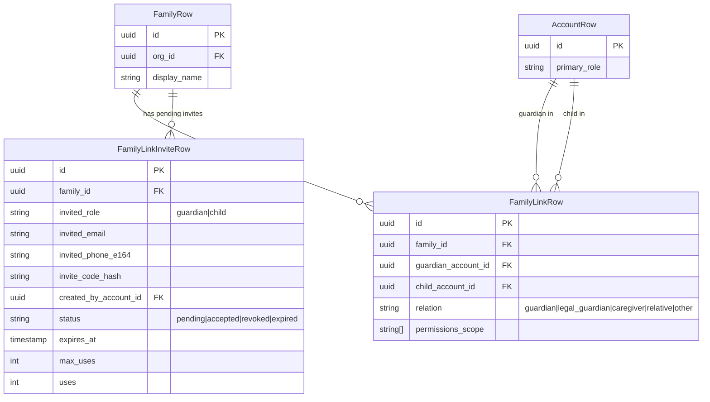

---

### 1.4 Role Permission Matrix

What each role can access across the platform.

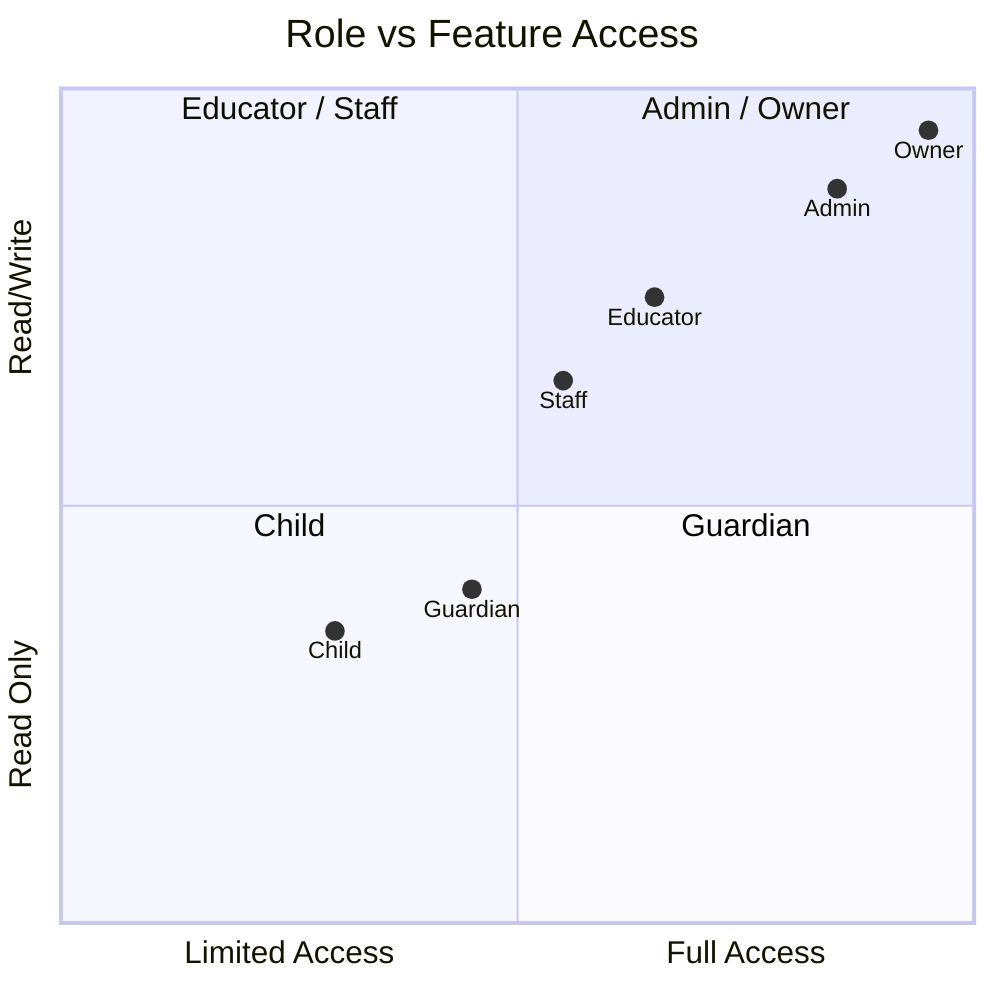

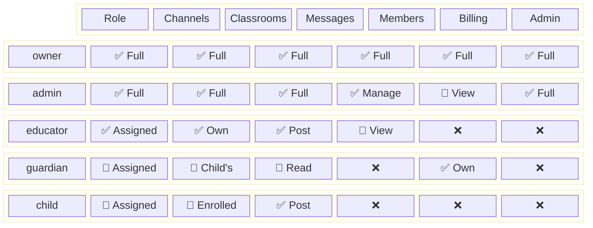

---

### 1.5 Auth & Onboarding Flow

Full user registration, authentication, and onboarding step sequence.

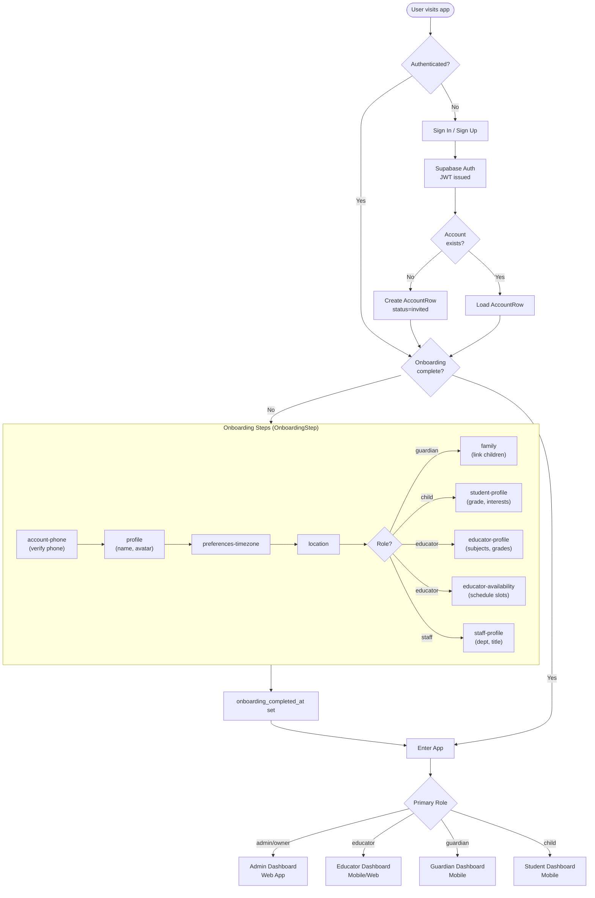

---

### 1.6 Presence State Machine

How a user's live_status transitions.

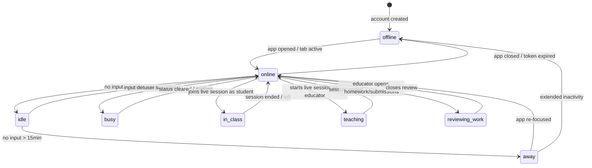

---

## 2. Channels & Messaging

### 2.1 Channel Type Taxonomy

How channels are categorized by kind, purpose, and capabilities.

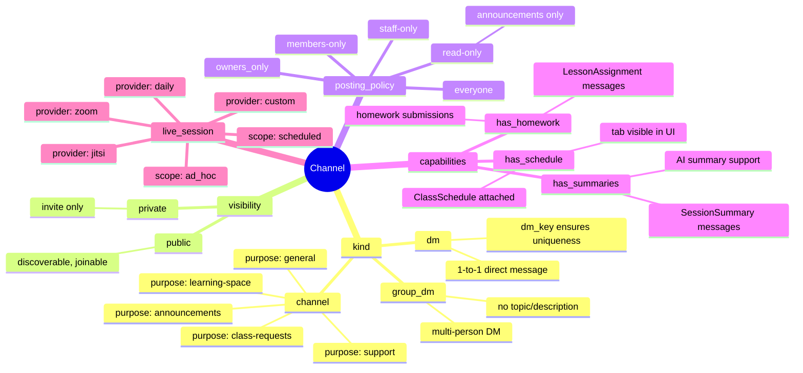

---

### 2.2 Channel Entity ER Diagram

Full channel data model including members, capabilities, and live sessions.

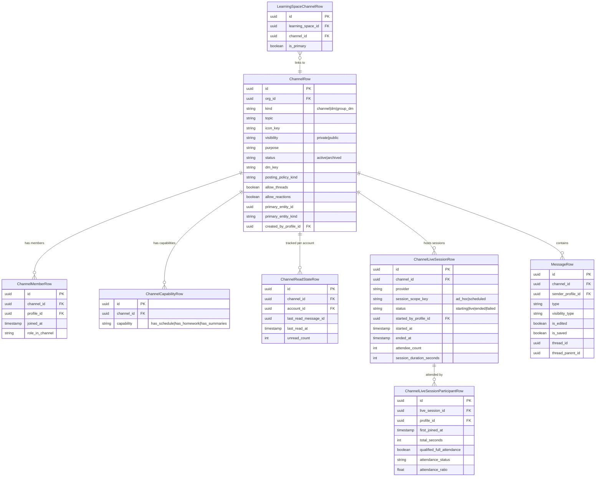

---

### 2.3 Message Type Hierarchy

All 16 message types and their payload structures.

```mermaid
classDiagram
    class MessageVM {
        +MessageTypeVM type
        +UserProfileVM sender
        +ISODateTime createdAt
        +MessageVisibilityVM visibility
        +ReactionVM[] reactions
        +ThreadVM thread
        +boolean isEdited
        +boolean isSaved
    }

    class TextMessageVM {
        +string text
        +MentionVM[] mentions
    }

    class ImageMessageVM {
        +ImageAttachmentVM attachment
        +ImageAttachmentVM[] attachments
    }

    class FileMessageVM {
        +FileAttachmentVM attachment
        +FileAttachmentVM[] attachments
    }

    class DesignFileUpdateMessageVM {
        +DesignFileAttachmentVM attachment
        +DesignFileDiffVM diff
        +string tool "figma|sketch|canva|adobe-xd"
    }

    class LiveSessionStartedMessageVM {
        +string sessionId
        +string provider
        +string title
        +string joinUrl
        +string status
        +string occurrenceKey
        +string occurrenceLabel
    }

    class EventReminderMessageVM {
        +string status
        +string title
        +ISODateTime startAt
        +ISODateTime endAt
        +string timezone
        +string location
        +string meetingLink
        +AttendeeVM[] attendees
    }

    class SessionSummaryMessageVM {
        +string title
        +ISODateTime startAt
        +int durationMinutes
        +string summary
        +string[] highlights
        +string[] nextSteps
    }

    class LessonAssignmentMessageVM {
        +string kind
        +string title
        +string description
        +ISODateTime dueAt
        +string subject
        +string difficulty
        +int estimatedDuration
        +AttachmentVM[] attachments
    }

    class HomeworkSubmissionMessageVM {
        +string assignmentTitle
        +ISODateTime submittedAt
        +AttachmentVM[] attachments
        +string status
        +string grade
        +string feedback
    }

    class FeedbackRequestMessageVM {
        +string prompt
        +string sessionTitle
        +string classSessionId
        +ISODateTime occurrenceStart
        +ISODateTime submittedAt
        +int rating
        +string comment
    }

    class PaymentReminderMessageVM {
        +number amount
        +string currency
        +ISODateTime dueAt
        +string status
        +string invoiceId
    }

    class AudioRecordingMessageVM {
        +string url
        +int durationSeconds
        +number[] waveform
        +int fileSize
        +string mimeType
    }

    class ProgressUpdateMessageVM {
        +string subject
        +string metric
        +string previousValue
        +string currentValue
        +string targetValue
        +string improvement
        +string summary
    }

    class SessionBookingMessageVM {
        +string title
        +string subject
        +ISODateTime startAt
        +ISODateTime endAt
        +string timezone
        +int durationMinutes
        +string status
        +string[] topics
    }

    MessageVM <|-- TextMessageVM : type=text
    MessageVM <|-- ImageMessageVM : type=image
    MessageVM <|-- FileMessageVM : type=file
    MessageVM <|-- DesignFileUpdateMessageVM : type=design-file-update
    MessageVM <|-- LiveSessionStartedMessageVM : type=live-session-started
    MessageVM <|-- EventReminderMessageVM : type=event-reminder
    MessageVM <|-- SessionSummaryMessageVM : type=session-summary
    MessageVM <|-- LessonAssignmentMessageVM : type=lesson-assignment
    MessageVM <|-- HomeworkSubmissionMessageVM : type=homework-submission
    MessageVM <|-- FeedbackRequestMessageVM : type=feedback-request
    MessageVM <|-- PaymentReminderMessageVM : type=payment-reminder
    MessageVM <|-- AudioRecordingMessageVM : type=audio-recording
    MessageVM <|-- ProgressUpdateMessageVM : type=progress-update
    MessageVM <|-- SessionBookingMessageVM : type=session-booking
```

---

### 2.4 Realtime Messaging Flow

How messages flow from sender to all channel subscribers in real time.

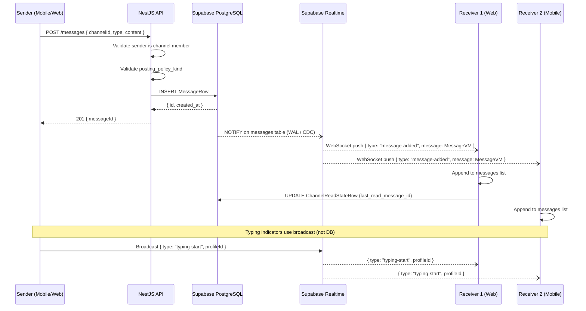

---

### 2.5 Thread Architecture

How threaded replies work within a channel message.

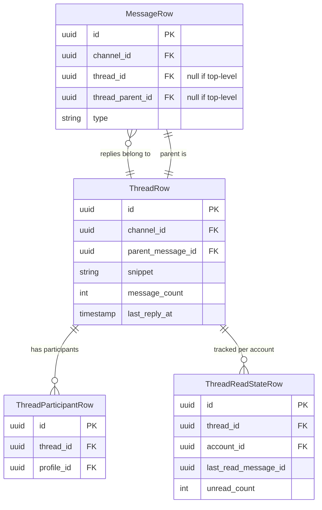

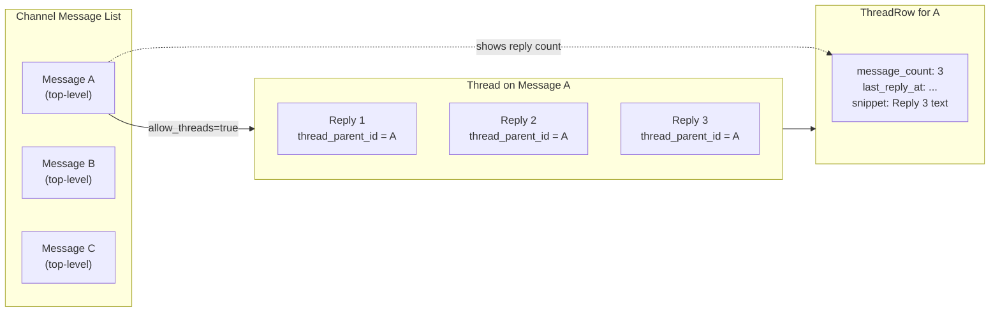

---

### 2.6 Live Session Lifecycle

State machine and event flow for a live video/audio session within a channel.

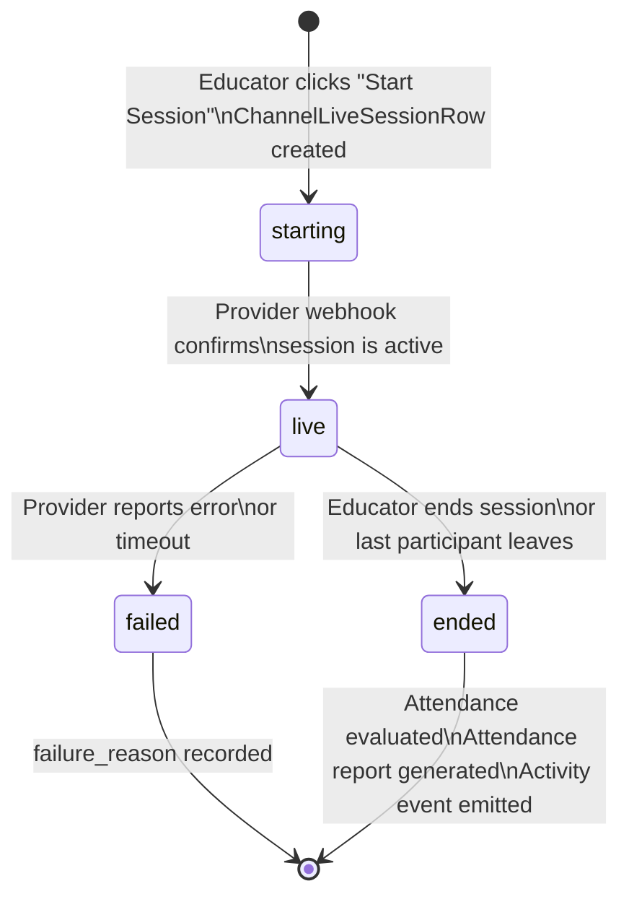

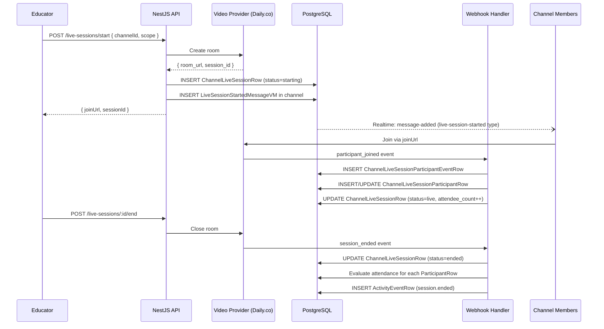

---

### 2.7 Channel Access Control

How posting policy and membership determine what users can do.

```mermaid
flowchart TD
    REQUEST["User action in channel\n(send message, react, etc.)"] --> IS_MEMBER{Is channel\nmember?}

    IS_MEMBER -->|No| CHECK_PUBLIC{Channel\nvisibility = public?}
    CHECK_PUBLIC -->|No| DENY["❌ Denied\n(not a member)"]
    CHECK_PUBLIC -->|Yes| AUTO_JOIN[Auto-join channel]
    AUTO_JOIN --> CHECK_POLICY

    IS_MEMBER -->|Yes| CHECK_POLICY{posting_policy_kind?}

    CHECK_POLICY -->|everyone| ALLOW["✅ Allowed"]
    CHECK_POLICY -->|members-only| IS_ORG_MEMBER{Is org member\n(not guest)?}
    IS_ORG_MEMBER -->|Yes| ALLOW
    IS_ORG_MEMBER -->|No| DENY

    CHECK_POLICY -->|staff-only| IS_STAFF{Role =\nstaff/admin/owner?}
    IS_STAFF -->|Yes| ALLOW
    IS_STAFF -->|No| READ_ONLY["👀 Read Only"]

    CHECK_POLICY -->|read-only| READ_ONLY
    CHECK_POLICY -->|owners_only| IS_OWNER{Role = owner?}
    IS_OWNER -->|Yes| ALLOW
    IS_OWNER -->|No| READ_ONLY
```

---

### 2.8 Read State & Unread Tracking

How unread counts are maintained for channels and threads.

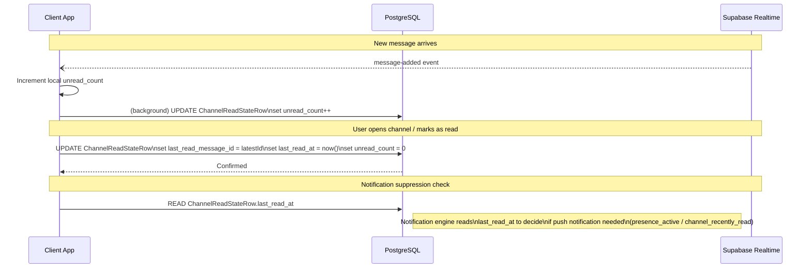

---

## 3. Classrooms (Learning Spaces)

### 3.1 Learning Space ER Diagram

Full data model for classrooms, their channels, participants, and scheduling.

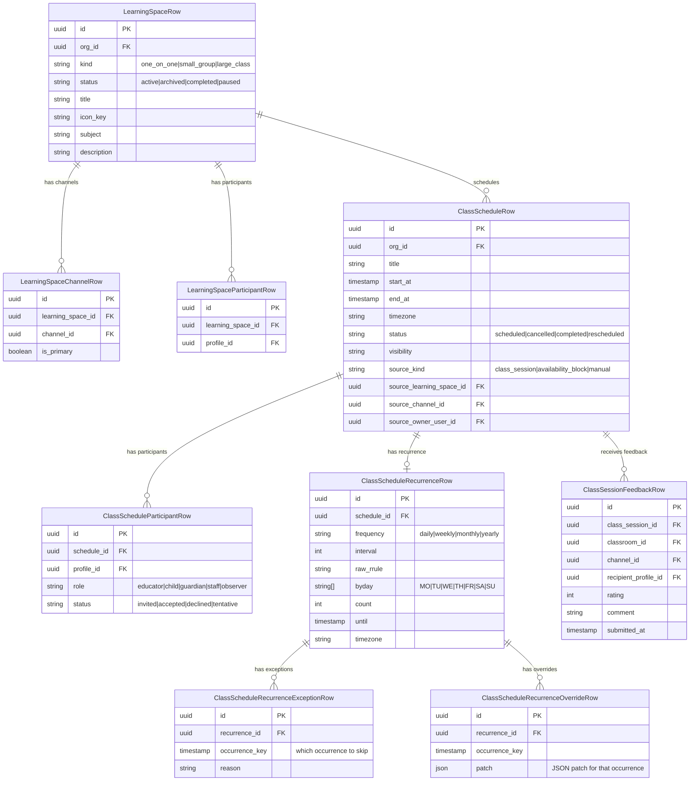

---

### 3.2 Classroom vs Channel Relationship

How classrooms (Learning Spaces) relate to channels and how they differ from plain channels.

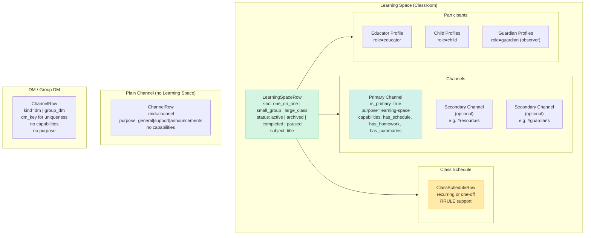

---

### 3.3 Class Schedule & Recurrence Model

How recurring classes are modeled and how exceptions/overrides work.

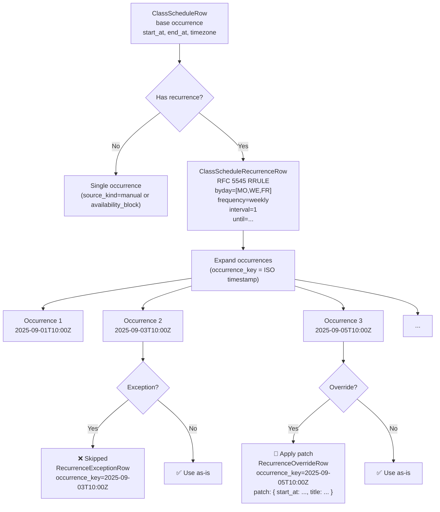

---

### 3.4 Session Lifecycle State Machine

State transitions for a class session from scheduling to completion.

```mermaid
stateDiagram-v2
    [*] --> scheduled : Educator creates schedule\n(ClassScheduleRow created)

    scheduled --> live : Educator starts live session\n(ChannelLiveSessionRow created)

    scheduled --> rescheduled : Admin/Educator reschedules\n(status updated, reminder re-queued)

    scheduled --> cancelled : Admin/Educator cancels\n(ReminderJobs cancelled)

    rescheduled --> live : Rescheduled time reached\nEducator starts session

    rescheduled --> cancelled : Cancelled after rescheduling

    live --> completed : Session ended\nattendance evaluated\nfeedback_request sent

    completed --> [*] : SessionSummaryMessage posted\nActivityEvent emitted

    cancelled --> [*] : Cancellation ActivityEvent emitted\nMembers notified
```

---

### 3.5 Scheduling & Reminder Workflow

How class scheduling creates reminder jobs and sends notifications.

```mermaid
sequenceDiagram
    participant ADMIN as Admin/Educator
    participant API as NestJS API
    participant DB as PostgreSQL
    participant WORKER as Reminder Worker
    participant CHANNEL as Channel
    participant MEMBER as Class Members

    ADMIN->>API: POST /classes/:id/schedule\n{ start_at, recurrence, participants }
    API->>DB: INSERT ClassScheduleRow
    API->>DB: INSERT ClassScheduleParticipantRow[] (all members)
    API->>DB: INSERT ReminderJobRow (session.reminder)\n run_at = start_at - 30min
    API->>DB: INSERT ReminderJobRow (session.reminder)\n run_at = start_at - 5min
    API-->>ADMIN: 201 OK

    Note over WORKER,DB: At run_at time (cron tick every minute)
    WORKER->>DB: SELECT pending ReminderJobRows\nWHERE run_at <= now() AND status=pending
    DB-->>WORKER: [{ job_type: session.reminder, ... }]
    WORKER->>DB: UPDATE status=leased, lease_owner, lease_until
    WORKER->>CHANNEL: POST message (type=event-reminder)\nEventReminderMessageVM
    WORKER->>DB: INSERT ActivityEventRow (session.reminder.sent)
    WORKER->>DB: UPDATE ReminderJobRow status=succeeded
    WORKER->>DB: INSERT ReminderDispatchLogRow

    DB--)MEMBER: Realtime: message-added (event-reminder)
    DB--)MEMBER: ActivityFeedItem created via projection
    MEMBER->>MEMBER: Push notification via\nNotificationDispatchJob
```

---

### 3.6 Attendance Tracking Flow

How live session attendance is evaluated and recorded.

```mermaid
flowchart TD
    SESSION_END["Session Ended\n(status=ended)"] --> GET_EXPECTED["Load ChannelLiveSessionExpectedParticipantRow[]\n(who was expected to attend)"]

    GET_EXPECTED --> GET_ACTUAL["Load ChannelLiveSessionParticipantRow[]\n(who actually attended)"]

    GET_ACTUAL --> FOR_EACH["For each expected participant"]

    FOR_EACH --> ATTENDED{In actual\nparticipants?}

    ATTENDED -->|No| NO_SHOW["attendance_status = no_show\nqualified_full_attendance = false"]

    ATTENDED -->|Yes| CALC_RATIO["Calculate attendance_ratio\n= total_seconds / session_duration_seconds"]

    CALC_RATIO --> FULL_CHECK{attendance_ratio\n>= threshold?}

    FULL_CHECK -->|Yes| FULL_ATTEND["qualified_full_attendance = true\nattendance_status = attended"]

    FULL_CHECK -->|No| PARTIAL["qualified_full_attendance = false\nattendance_status = partial"]

    NO_SHOW --> UPDATE_DB["UPDATE ChannelLiveSessionParticipantRow"]
    FULL_ATTEND --> UPDATE_DB
    PARTIAL --> UPDATE_DB

    UPDATE_DB --> UPDATE_SESSION["UPDATE ChannelLiveSessionRow\nattendee_count\nfull_attendance_count\npartial_attendance_count\nno_show_count\nreport_generated_at"]

    UPDATE_SESSION --> EMIT_EVENT["INSERT ActivityEventRow\nverb=session.ended\npayload includes attendance summary"]
```

---

## 4. Activity Feed

### 4.1 Event Pipeline Architecture

The complete event-sourced pipeline from raw event to user inbox.

```mermaid
flowchart TD
    subgraph SOURCES["Event Sources"]
        MSG_SVC["Message Service\n(new messages, reactions)"]
        SCHED_SVC["Scheduler / Reminder Worker\n(class events, feedback requests)"]
        SESSION_SVC["Live Session Service\n(session.started, session.ended)"]
        WEBHOOK["Provider Webhooks\n(payment, video provider)"]
        SYSTEM["System Events\n(member.joined)"]
    end

    subgraph PIPELINE["Event Pipeline"]
        PUBLISH["publishActivityEvent()\nINSERT ActivityEventRow\nprojection_status=pending"]

        PROJECTOR["projectActivityEvents()\n(worker / cron)\nReads pending events"]

        RESOLVE["Resolve Recipients\nFrom audience_rules\n(who sees this event?)"]

        SUPPRESS["Check Suppression Rules\nActivityEventSuppressionRuleRow\n(is this event suppressed for org/actor?)"]

        BUILD["Build ActivityFeedItemVM\n- Determine tab_key\n- Set importance\n- Build content, preview, action_button\n- Determine group_key, group_type\n- Dedupe by dedupe_key"]

        INSERT_FEED["INSERT ActivityFeedItemRow\nper recipient profile"]

        NOTIF["INSERT NotificationDispatchJobRow\nper delivery channel\n(push, email, sms)"]
    end

    subgraph DELIVERY["Delivery"]
        INBOX["User Inbox\n(ActivityFeedVM)\ntabs: all | classes | payment | system"]
        PUSH["Push Notification\n(expo-notifications / FCM / APNs)"]
        EMAIL["Email Notification\n(SMTP / SendGrid)"]
        SMS["SMS Notification\n(Twilio / etc.)"]
    end

    SOURCES --> PUBLISH
    PUBLISH --> PROJECTOR
    PROJECTOR --> RESOLVE
    RESOLVE --> SUPPRESS
    SUPPRESS -->|Not suppressed| BUILD
    SUPPRESS -->|Suppressed| SKIP["Skip — no feed item\nno notification"]
    BUILD --> INSERT_FEED
    BUILD --> NOTIF
    INSERT_FEED --> INBOX
    NOTIF --> PUSH & EMAIL & SMS

    style PIPELINE fill:#f8f9fa,stroke:#dee2e6
    style DELIVERY fill:#d1f2eb,stroke:#a3e4d7
```

---

### 4.2 Activity Event ER Diagram

Data model for the event pipeline tables.

```mermaid
erDiagram
    ActivityEventRow {
        uuid id PK
        uuid org_id FK
        string event_type "see ActivityVerbVM"
        timestamp occurred_at
        string source_kind "profile|system|integration|provider_webhook"
        uuid actor_profile_id FK
        json scope "org|channel|learning_space context"
        json object_ref "what the event is about"
        json target_ref "optional secondary entity"
        json payload "event data"
        json audience_rules "who should see this"
        string dedupe_key
        string projection_status "pending|succeeded|failed"
        int projection_attempts
        string last_projection_error
    }

    ActivityFeedItemRow {
        uuid id PK
        uuid org_id FK
        uuid recipient_profile_id FK
        uuid source_event_id FK
        string kind
        timestamp occurred_at
        string tab_key "all|classes|payment|system"
        string verb "ActivityVerbVM"
        uuid actor_profile_id FK
        json refs "entity references"
        string group_key
        string group_type "homework|message|class|reminder|etc."
        boolean is_collapsed
        int sub_activity_count
        json content "leading, headline, summary, preview"
        json action_button
        string importance "normal|important|urgent"
        boolean is_read
        timestamp read_at
        string dedupe_key
    }

    ActivityEventSuppressionRuleRow {
        uuid id PK
        uuid org_id FK
        string event_type
        uuid actor_profile_id FK "null = org-wide"
        boolean is_enabled
    }

    NotificationDispatchJobRow {
        uuid id PK
        uuid org_id FK
        uuid activity_event_id FK
        uuid recipient_profile_id FK
        string pref_key
        string delivery_channel "push|email|sms"
        string delivery_timing "immediate|delayed|digest"
        string attempt_bucket
        timestamp run_at
        json payload
        string status "pending|leased|succeeded|suppressed|failed|dead_letter"
        int attempt_count
        int max_attempts
        string lease_owner
        timestamp lease_until
        timestamp next_attempt_at
    }

    ActivityEventRow ||--o{ ActivityFeedItemRow : "projected into"
    ActivityEventRow ||--o{ NotificationDispatchJobRow : "triggers"
    ActivityEventSuppressionRuleRow }o--|| ActivityEventRow : "may suppress"
```

---

### 4.3 Realtime vs Batch vs Cron Paths

How different activity types flow through the system.

```mermaid
flowchart LR
    subgraph RT["Realtime Path\n(< 100ms)"]
        MSG_POST["Message posted\nor reaction added"]
        RT_EVENT["ActivityEventRow\nprojection_status=pending"]
        RT_PROJECT["Immediate projection\n(triggered by DB trigger\nor inline call)"]
        RT_FEED["ActivityFeedItemRow\n(recipient sees instantly)"]
        RT_PUSH["Supabase Realtime\n→ client WebSocket push"]

        MSG_POST --> RT_EVENT --> RT_PROJECT --> RT_FEED --> RT_PUSH
    end

    subgraph BATCH["Batch Path\n(seconds to minutes)"]
        SESSION_END2["Session ended\nor homework submitted"]
        BATCH_EVENT["ActivityEventRow\nprojection_status=pending"]
        BATCH_WORKER["Projection Worker\n(polls pending events\nevery N seconds)"]
        BATCH_FEED["ActivityFeedItemRow\n(grouped/collapsed if many)"]
        BATCH_NOTIF["NotificationDispatchJobRow\nrun_at = now() + delay"]

        SESSION_END2 --> BATCH_EVENT --> BATCH_WORKER --> BATCH_FEED --> BATCH_NOTIF
    end

    subgraph CRON["Cron / Scheduled Path\n(minutes to hours ahead)"]
        SCHED_CLASS["Class scheduled\n(e.g., tomorrow 10am)"]
        REMINDER_JOB["ReminderJobRow\nrun_at = class_time - 30min\nstatus=pending"]
        CRON_TICK["Cron worker ticks\nevery minute\nSELECT WHERE run_at <= now()"]
        REMINDER_MSG["EventReminderMessage\nposted to channel"]
        CRON_EVENT["ActivityEventRow\nsession.reminder.sent"]
        CRON_FEED["ActivityFeedItemRow"]

        SCHED_CLASS --> REMINDER_JOB --> CRON_TICK --> REMINDER_MSG --> CRON_EVENT --> CRON_FEED
    end

    style RT fill:#d5f5e3,stroke:#82e0aa
    style BATCH fill:#ffeaa7,stroke:#fdcb6e
    style CRON fill:#d6eaf8,stroke:#85c1e9
```

---

### 4.4 Notification Decision & Dispatch

How the notification engine decides whether, when, and how to deliver notifications.

```mermaid
flowchart TD
    EVENT["ActivityFeedItemRow created\nfor recipient_profile_id"] --> LOAD_PREFS["Load NotificationPreferenceRow[]\n(global and scoped preferences)"]

    LOAD_PREFS --> LOAD_PRESENCE["Load ProfilePresenceRow\n(is user online?)"]

    LOAD_PRESENCE --> DECISION_ENGINE["NotificationDecisionVM\n\nshouldWriteInbox ?\ndeliveryChannels: push|email|sms\ndeliveryTiming: immediate|delayed|digest\nrunAt: ISODateTime\nreasonCodes: []"]

    DECISION_ENGINE --> PUSH_CHECK{Push\nenabled?}
    DECISION_ENGINE --> EMAIL_CHECK{Email\nenabled?}
    DECISION_ENGINE --> SMS_CHECK{SMS\nenabled?}

    PUSH_CHECK -->|Yes| ONLINE_CHECK{User\nonline/recently\nactive?}
    ONLINE_CHECK -->|Yes| SUPPRESS_PUSH["suppress push\n(reason: presence_active)"]
    ONLINE_CHECK -->|No| READ_CHECK{Channel\nrecently read?}
    READ_CHECK -->|Yes| SUPPRESS_PUSH2["suppress push\n(reason: channel_recently_read)"]
    READ_CHECK -->|No| QUEUE_PUSH["INSERT NotificationDispatchJobRow\nchannel=push\ntiming=immediate"]

    EMAIL_CHECK -->|Yes| TIMING_CHECK{Timing?}
    TIMING_CHECK -->|immediate| QUEUE_EMAIL_NOW["INSERT NotificationDispatchJobRow\nchannel=email\nrun_at=now()"]
    TIMING_CHECK -->|digest| QUEUE_EMAIL_DIGEST["INSERT NotificationDispatchJobRow\nchannel=email\nrun_at=next_digest_time\nattempt_bucket=daily"]

    SMS_CHECK -->|Yes| QUEUE_SMS["INSERT NotificationDispatchJobRow\nchannel=sms\ntiming=immediate"]

    subgraph REASON_CODES["Decision Reason Codes"]
        RC1["no_channels_enabled"]
        RC2["scoped_preference\n(channel or learning_space override)"]
        RC3["global_preference\n(user default setting)"]
        RC4["system_default\n(no preference set)"]
        RC5["presence_active\n(suppress: user is online)"]
        RC6["channel_recently_read\n(suppress: just read this channel)"]
        RC7["critical_override\n(always send regardless)"]
    end
```

---

### 4.5 Feed Projection & Grouping

How raw ActivityEventRows become a structured inbox with tabs, sections, and groups.

```mermaid
flowchart TD
    EVENTS["ActivityEventRow[]\n(pending projection)"] --> FOR_EACH_RECIPIENT["For each recipient in audience_rules"]

    FOR_EACH_RECIPIENT --> DETERMINE_TAB{Determine\ntab_key}

    DETERMINE_TAB -->|verb=class.*\nor session.*| CLASSES_TAB["tab_key = classes"]
    DETERMINE_TAB -->|verb=payment.*| PAYMENT_TAB["tab_key = payment"]
    DETERMINE_TAB -->|verb=system.*| SYSTEM_TAB["tab_key = system"]
    DETERMINE_TAB -->|all other verbs| ALL_TAB["tab_key = all"]

    CLASSES_TAB & PAYMENT_TAB & SYSTEM_TAB & ALL_TAB --> DETERMINE_GROUP{Has\ngroup_key?}

    DETERMINE_GROUP -->|No| LEAF["kind = leaf\nStandalone feed item"]

    DETERMINE_GROUP -->|Yes| FIND_GROUP{Existing group\nfor group_key?}

    FIND_GROUP -->|No| CREATE_GROUP["Create group item\nkind = group\nis_collapsed = true\nsub_activity_count = 1"]

    FIND_GROUP -->|Yes| ADD_TO_GROUP["Add as sub-activity\nIncrement sub_activity_count\nUpdate group preview"]

    LEAF --> CHECK_DEDUPE{dedupe_key\nalready exists?}
    CREATE_GROUP --> CHECK_DEDUPE
    ADD_TO_GROUP --> CHECK_DEDUPE

    CHECK_DEDUPE -->|Yes| SKIP_ITEM["Skip — idempotent\n(dedupe protection)"]
    CHECK_DEDUPE -->|No| INSERT["INSERT ActivityFeedItemRow\nprojection_status=succeeded"]

    INSERT --> SECTIONS["Render as sections\nin ActivityFeedVM:\n- Today\n- This Week\n- Earlier"]
```

```mermaid
block-beta
    columns 4
    block:inbox:4
        I["📬 Inbox (ActivityFeedVM)"]
    end
    block:tabs:4
        T1["All\n(unread: 5)"]
        T2["Classes\n(unread: 2)"]
        T3["Payment\n(unread: 1)"]
        T4["System\n(unread: 0)"]
    end
    block:sections:4
        S1["📅 Today"]
        S2["📅 This Week"]
        S3["📅 Earlier"]
        space
    end
    block:items:4
        block:group1:2
            G["📦 Group: 3 new homeworks\n[Collapsed — click to expand]\ngroup_type=homework"]
        end
        block:leaf1:2
            L["📄 Leaf: Class scheduled tomorrow\nverb=class.session.scheduled\nkind=leaf"]
        end
    end
```

---

### 4.6 Notification Dispatch Job State Machine

Full lifecycle of a notification dispatch job from creation to delivery.

```mermaid
stateDiagram-v2
    [*] --> pending : NotificationDispatchJobRow created\n(run_at set, status=pending)

    pending --> leased : Dispatch worker polls\nSELECT WHERE run_at<=now() AND status=pending\nUPDATE lease_owner, lease_until

    leased --> succeeded : Notification delivered\n(push sent, email sent, etc.)\nINSERT NotificationDispatchLogRow (succeeded)

    leased --> suppressed : Decision engine suppresses\n(user online, recently read, preference off)\nINSERT NotificationDispatchLogRow (suppressed)

    leased --> retryable_failure : Transient error\n(network timeout, rate limit)\nattempt_count < max_attempts\nnext_attempt_at = now() + backoff

    retryable_failure --> leased : Retry attempt\n(attempt_count++)

    leased --> fatal_failure : Non-retryable error\n(invalid token, bad address)\nINSERT NotificationDispatchLogRow (fatal_failure)

    retryable_failure --> dead_letter : Max attempts reached\n(attempt_count >= max_attempts)\nINSERT NotificationDispatchLogRow (fatal_failure)

    fatal_failure --> [*]
    dead_letter --> [*]
    succeeded --> [*]
    suppressed --> [*]
```

---

## Cross-Domain: End-to-End Class Session Flow

A complete walkthrough from scheduling a class to post-session activities.

```mermaid
sequenceDiagram
    participant ADMIN as Admin
    participant EDUCATOR as Educator
    participant STUDENT as Student
    participant API as NestJS API
    participant DB as PostgreSQL
    participant WORKER as Background Workers
    participant RT as Supabase Realtime

    Note over ADMIN,RT: 1. Class Scheduling
    ADMIN->>API: POST /learning-spaces { kind=one_on_one, title, subject }
    API->>DB: INSERT LearningSpaceRow
    API->>DB: INSERT ChannelRow (purpose=learning-space)
    API->>DB: INSERT LearningSpaceChannelRow (is_primary=true)
    API->>DB: INSERT ChannelCapabilityRow (has_schedule, has_homework, has_summaries)
    API->>DB: INSERT LearningSpaceParticipantRow (educator + student)
    API->>DB: INSERT ChannelMemberRow (educator + student)

    ADMIN->>API: POST /schedules { learning_space_id, start_at, recurrence }
    API->>DB: INSERT ClassScheduleRow
    API->>DB: INSERT ClassScheduleParticipantRow[]
    API->>DB: INSERT ClassScheduleRecurrenceRow (if recurring)
    API->>DB: INSERT ReminderJobRow (30min before, 5min before)
    API->>DB: INSERT ActivityEventRow (class.session.scheduled)

    Note over ADMIN,RT: 2. Pre-Session Reminders (Cron)
    WORKER->>DB: Poll ReminderJobRows (run_at <= now())
    WORKER->>DB: INSERT MessageRow (type=event-reminder) in channel
    WORKER->>DB: INSERT ActivityEventRow (session.reminder.sent)
    DB--)STUDENT: Realtime: message-added
    DB--)STUDENT: ActivityFeedItemRow → push notification

    Note over ADMIN,RT: 3. Live Session
    EDUCATOR->>API: POST /live-sessions/start { channel_id }
    API->>DB: INSERT ChannelLiveSessionRow (status=starting)
    API->>DB: INSERT MessageRow (type=live-session-started)
    DB--)STUDENT: Realtime: message-added (live-session-started)
    STUDENT->>API: Join live session via joinUrl
    API->>DB: UPDATE ChannelLiveSessionRow (status=live)

    Note over ADMIN,RT: 4. Post-Session Processing
    EDUCATOR->>API: POST /live-sessions/:id/end
    API->>DB: UPDATE ChannelLiveSessionRow (status=ended)
    WORKER->>DB: Evaluate attendance (attendance_ratio, qualified_full_attendance)
    WORKER->>DB: INSERT ReminderJobRow (session.feedback_request)\nrun_at = now() + 5min
    WORKER->>DB: INSERT ActivityEventRow (session.ended)

    Note over ADMIN,RT: 5. Feedback Request
    WORKER->>DB: Poll ReminderJobRow (session.feedback_request)
    WORKER->>DB: INSERT MessageRow (type=feedback-request) in channel
    WORKER->>DB: INSERT ActivityEventRow (session.feedback_request.sent)
    DB--)STUDENT: Realtime: message-added (feedback-request)

    STUDENT->>API: POST /feedback { rating, comment }
    API->>DB: INSERT ClassSessionFeedbackRow
    API->>DB: INSERT ActivityEventRow (session.completed)

    Note over ADMIN,RT: 6. Session Summary
    EDUCATOR->>API: POST /messages { type=session-summary, channel_id }
    API->>DB: INSERT MessageRow (type=session-summary)
    API->>DB: INSERT ActivityEventRow (summary.posted)
    DB--)STUDENT: Realtime: message-added (session-summary)
    WORKER->>DB: Project ActivityEventRow → ActivityFeedItemRow (tab=classes)
```
