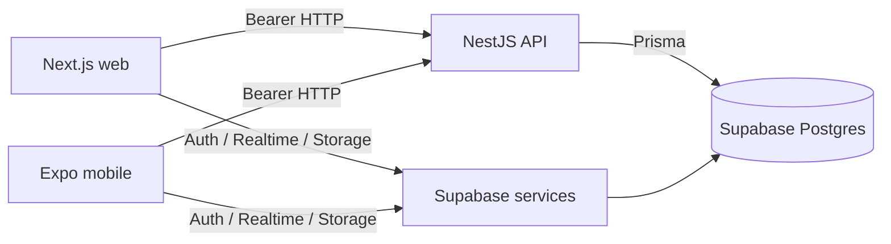
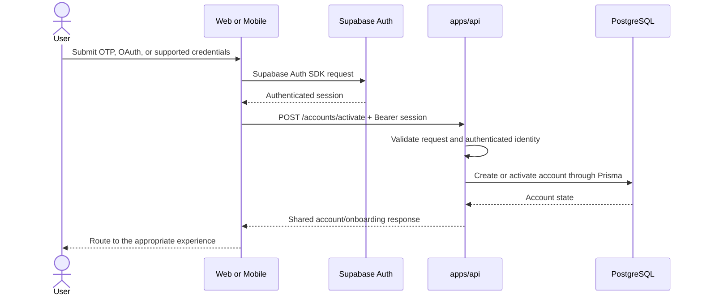
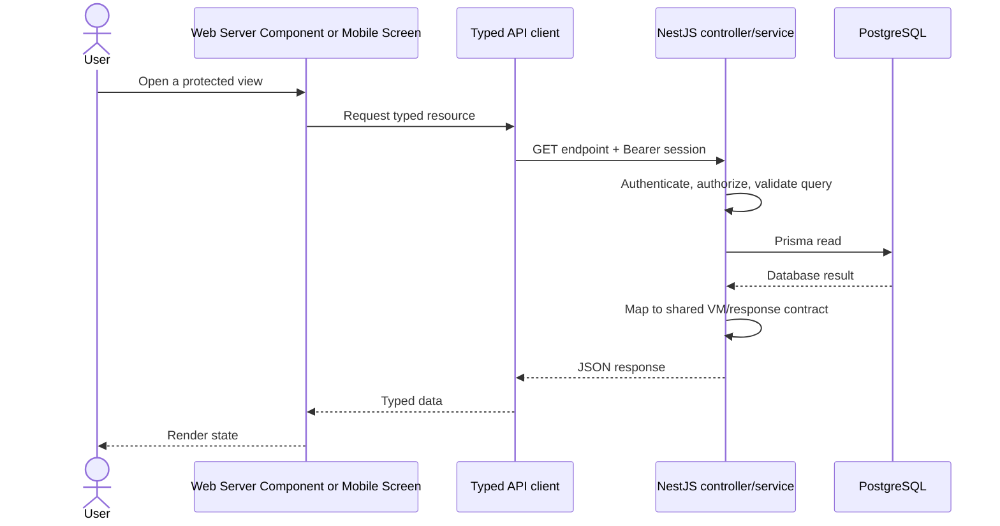
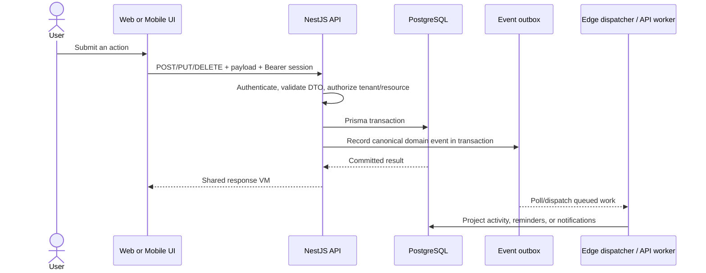
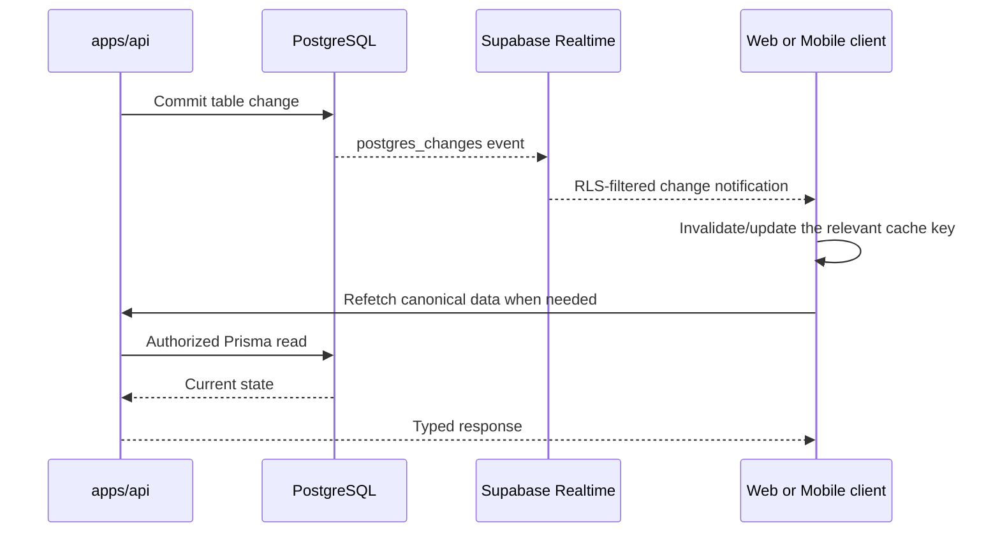
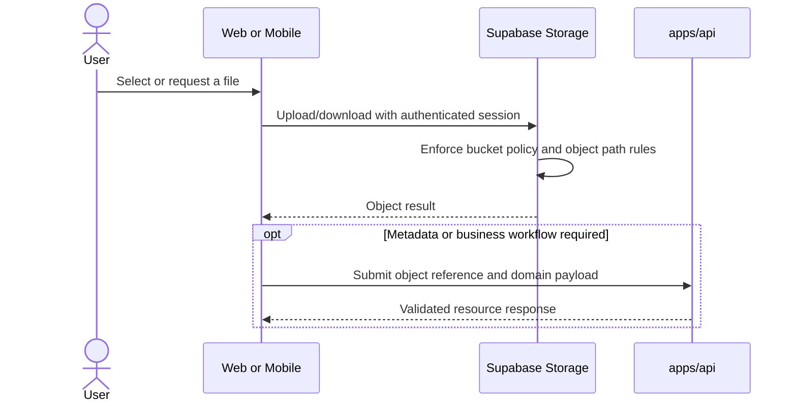

# Architecture Control Flows

## Purpose

Show the required cross-system paths for authentication, data access, mutations, Realtime, and files.

## Intended Audience

Engineers tracing or designing behavior across web, mobile, API, and Supabase.

## Last Updated

2026-08-14

## Related Docs

- [Architecture Overview](overview.md)
- [Database Guide](database.md)
- [Feature Diagrams](feature-diagrams.md)
- [Best Practices](../standards/best-practices.md)

## Boundary Summary

`apps/web` and `apps/mobile` are frontend-only. They use Supabase directly for Auth, Realtime, and Storage. Every table read or write, validation rule, privileged action, and business decision goes through `apps/api`.



## Authentication And Account Activation



Web stores the Supabase session through the SSR cookie integration. Mobile persists its session through the app's secure-storage adapter. Neither client activates an account by writing a table directly.

## Authenticated Read



- Web creates the client with `createApiClient(supabase)`.
- Mobile uses `apiGet` and stable React Query keys.
- UI components consume shared VMs or purpose-built response types, never raw database rows.
- API authorization is required even though database RLS remains enabled as defense in depth.

## Validated Mutation And Domain Event



Mutations must be retry-safe where the product can submit them more than once. Event producers write the outbox through the approved event helper and do not write derived activity-feed tables directly.

## Realtime Invalidation And Refetch



Realtime is a notification channel, not a license for frontend table queries. Always unsubscribe during component cleanup and use targeted cache invalidation to avoid unnecessary refetches.

## Storage Upload Or Download



Direct Storage access is permitted only under RLS-backed bucket policies. Elevated file operations and all table metadata changes belong in the API.

## Shared Contract Pipeline

```text
Supabase migration
  -> apps/api/prisma/schema.prisma
  -> API controller DTO + service
  -> packages/shared-types VM/payload when shared across apps
  -> web/mobile typed API adapter
  -> app or shared UI component
```

For a new data-backed feature, review and test every affected step. Cross-app types belong in `packages/shared-types`; app-specific transport details stay in the owning app.
