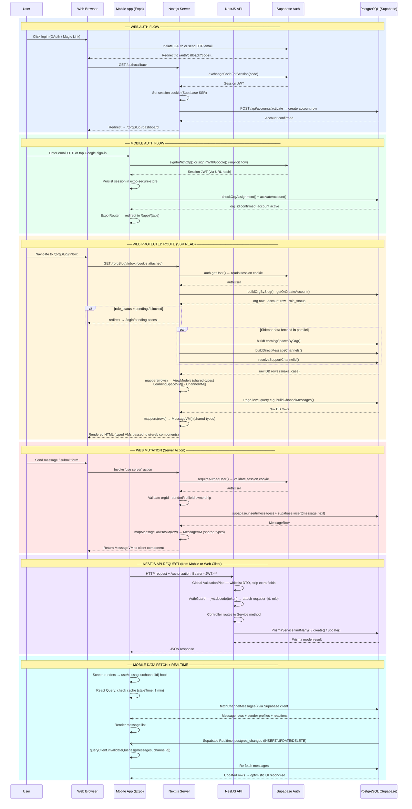
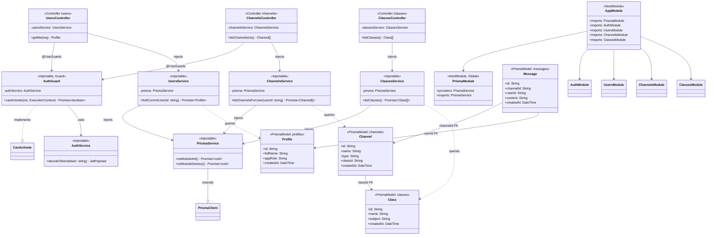
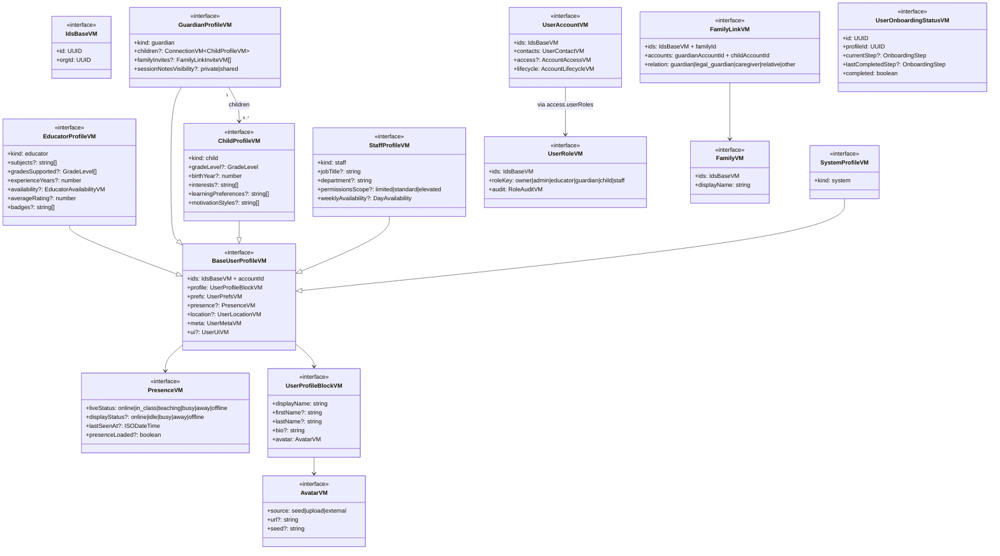
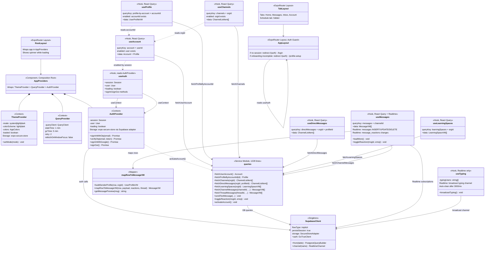

# Architecture Control Flow — Swimlane Diagram

## Purpose

Reference swimlane view of the most important cross-system request and data flows.

## Intended Audience

Engineers tracing behavior across web, mobile, API, and Supabase boundaries.

## Last Updated

2026-03-23

## Related Docs

- [Documentation Hub](../README.md)
- [Architecture Overview](overview.md)
- [Diagrams](diagrams.md)

Six major flows across the Web (Next.js), Mobile (Expo), API (NestJS), Supabase Auth, and PostgreSQL layers.



## Flow Descriptions

### 1. Web Auth Flow

Browser triggers OAuth or Magic Link → Supabase issues tokens and redirects to `/auth/callback` → Next.js exchanges the auth code for a session via `exchangeCodeForSession` → sets a server-side cookie (Supabase SSR pattern) → calls `/api/accounts/activate` to create or activate the account row in Postgres → redirects the user to `/{orgSlug}/dashboard`.

Key files: [apps/web/app/(auth)/auth/callback/page.tsx](<../../apps/web/app/(auth)/auth/callback/page.tsx>) · [apps/web/app/api/accounts/activate/route.ts](../../apps/web/app/api/accounts/activate/route.ts) · [apps/web/lib/supabase/server.ts](../../apps/web/lib/supabase/server.ts)

---

### 2. Mobile Auth Flow

`AuthProvider` in Expo calls `signInWithOtp` (email code) or `signInWithGoogle` (implicit OAuth flow — no PKCE to avoid React Native race conditions) → Supabase returns a session JWT via URL hash → session is stored in `expo-secure-store` → `checkOrgAssignment` validates the user has an assigned org → `activateAccount` marks the account active → Expo Router redirects to `/(app)/(tabs)`.

Key files: [apps/mobile/src/providers/auth-provider.tsx](../../apps/mobile/src/providers/auth-provider.tsx) · [apps/mobile/src/lib/supabase/client.ts](../../apps/mobile/src/lib/supabase/client.ts)

---

### 3. Web Protected Route (SSR Read)

Every request to `/{orgSlug}/*` passes through `[orgSlug]/layout.tsx`:

1. `createSupabaseServerClient()` reads the session cookie
2. `requireAuthedUser()` calls `auth.getUser()` — redirects to `/login` if unauthenticated
3. Validates org slug, fetches account, checks `role_status` (pending/blocked → redirect)
4. Fetches sidebar data in **parallel**: `buildLearningSpacesByOrg`, `buildDirectMessageChannels`, `resolveSupportChannelId`
5. Raw DB rows (snake_case) are transformed via **mapper functions** into typed **ViewModels** (`LearningSpaceVM[]`, `ChannelVM[]`) defined in `packages/shared-types`
6. Page Server Component runs its own `buildX()` queries and maps rows → VMs
7. Typed VMs are passed as props to `packages/ui-web` components for rendering

Key files: [apps/web/app/(app)/[orgSlug]/layout.tsx](<../../apps/web/app/(app)/[orgSlug]/layout.tsx>) · [apps/web/lib/sidebar/buildSidebarBaseData.ts](../../apps/web/lib/sidebar/buildSidebarBaseData.ts) · [apps/web/lib/auth/requireAuthedUser.ts](../../apps/web/lib/auth/requireAuthedUser.ts)

---

### 4. Web Mutation (Server Action)

Client components invoke `'use server'` functions in `app/actions/`. Each action:

1. Re-creates the server Supabase client (reads fresh session cookie)
2. Calls `requireAuthedUser()` to validate auth
3. Checks ownership (orgId, profileId) before writing
4. Writes directly to Supabase (insert + payload table, with manual rollback on error)
5. Maps the returned row to a VM via `shared-types` mappers and returns it to the client

Key files: [apps/web/app/actions/messages.ts](../../apps/web/app/actions/messages.ts) · [apps/web/lib/auth/admin-actions.ts](../../apps/web/lib/auth/admin-actions.ts)

---

### 5. NestJS API Request

The NestJS API (`apps/api`) handles HTTP requests from Mobile (and optionally Web clients) carrying `Authorization: Bearer <JWT>`:

1. **Global `ValidationPipe`** — whitelists DTO fields, strips unknowns, coerces types; throws `400` on violation
2. **`AuthGuard`** — `jwt.decode(token)` extracts `sub` (user UUID) and `user_metadata.app_role`; attaches `req.user`; throws `401` if missing or malformed
3. **Controller** delegates to **Service** which calls **`PrismaService`** for DB access
4. Response serialized as JSON

Modules: `AuthModule` · `UsersModule` · `ChannelsModule` · `ClassesModule`

Key files: [apps/api/src/main.ts](../../apps/api/src/main.ts) · [apps/api/src/modules/auth/auth.guard.ts](../../apps/api/src/modules/auth/auth.guard.ts) · [apps/api/src/prisma/prisma.service.ts](../../apps/api/src/prisma/prisma.service.ts)

---

### 6. Mobile Data Fetch + Realtime

Screens consume custom React Query hooks (`useMessages`, `useChannels`, `useAccount`):

- Queries are **`enabled: !!user`** to prevent execution before auth loads
- Default `staleTime: 1 min`, `gcTime: 5 min`, `retry: 2`
- Supabase client fetches rows directly (no NestJS hop for reads)
- A **Supabase Realtime** subscription on `postgres_changes` fires `queryClient.invalidateQueries()` on `INSERT`/`UPDATE`/`DELETE` events → triggers a background re-fetch
- Mutations (e.g. reactions) use **optimistic updates** with cache rollback on error

Key files: [apps/mobile/src/lib/api/queries.ts](../../apps/mobile/src/lib/api/queries.ts) · [apps/mobile/src/providers/query-provider.tsx](../../apps/mobile/src/providers/query-provider.tsx)

---

## Data Contract: Row → ViewModel Pipeline

All data flowing from Postgres to UI passes through the `packages/shared-types` transform pipeline:

```
PostgreSQL row (snake_case)
  └─▶  apps/web/lib/<entity>/queries/     raw Supabase query
  └─▶  apps/web/lib/<entity>/mappers/     row → VM translation
  └─▶  apps/web/lib/<entity>/builders/    compose/aggregate multiple VMs
  └─▶  packages/shared-types/src/vm/      typed ViewModel (camelCase)
  └─▶  packages/ui-web/src/components/    component receives typed VM prop
```

VMs are the single source of truth for UI data contracts — shared between `apps/web`, `apps/mobile`, and `packages/ui-web`. API payloads (in `packages/shared-types/src/payloads/`) are kept separate from VMs.

---

## Class Diagrams

Five class diagrams covering each app and the shared-types package. Each diagram is intentionally scoped — showing the most structurally significant classes, methods, and relationships rather than every field.

---

### 1. `apps/api` — NestJS Module & Class Structure

Shows the NestJS dependency-injection graph, guard chain, and Prisma data models.



---

### 2. `packages/shared-types` — User & Account Domain

Shows the `UserProfileVM` inheritance hierarchy and the account/family/role types.



---

### 3. `packages/shared-types` — Content & Messaging Domain

Shows the `MessageVM` discriminated union, attachment hierarchy, and the `ChannelVM` → `LearningSpaceVM` composition chain.

```mermaid
classDiagram
    class BaseAttachmentVM {
        <<interface>>
        +type: image|file|design-file
        +url: string
        +name: string
    }
    class ImageAttachmentVM {
        +type: image
        +width?: number
        +height?: number
    }
    class FileAttachmentVM {
        +type: file
        +size?: number
        +mimeType?: string
    }
    class DesignFileAttachmentVM {
        +type: design-file
        +tool: figma|sketch|adobe-xd|canva|other
        +thumbnail?: string
    }
    ImageAttachmentVM --|> BaseAttachmentVM
    FileAttachmentVM --|> BaseAttachmentVM
    DesignFileAttachmentVM --|> BaseAttachmentVM

    class ReactionVM {
        <<interface>>
        +emoji: string
        +count: number
        +reactedByMe?: boolean
    }

    class ThreadVM {
        <<interface>>
        +ids: IdsBaseVM
        +parent: messageId + snippet
        +stats: messageCount + lastReplyAt
        +participants: UserProfileVM[]
        +readState?: ThreadReadStateVM
    }

    class BaseMessageVM {
        <<interface>>
        +ids: IdsBaseVM
        +core: MessageCoreVM
        +social: MessageSocialVM
        +state?: MessageStateVM
    }
    BaseMessageVM --> ReactionVM : via social.reactions
    BaseMessageVM --> ThreadVM : via social.thread

    class TextMessageVM {
        +core.type: text
        +content.text: string
    }
    class ImageMessageVM {
        +core.type: image
        +attachment: ImageAttachmentVM
    }
    class FileMessageVM {
        +core.type: file
        +attachment: FileAttachmentVM
    }
    class PaymentReminderMessageVM {
        +core.type: payment-reminder
        +payment: amount + currency + dueAt + status
    }
    class SessionSummaryMessageVM {
        +core.type: session-summary
        +session: title + summary + highlights + nextSteps
    }
    class LessonAssignmentMessageVM {
        +core.type: lesson-assignment
        +assignment: title + dueAt + subject + attachments
    }

    TextMessageVM --|> BaseMessageVM
    ImageMessageVM --|> BaseMessageVM
    FileMessageVM --|> BaseMessageVM
    PaymentReminderMessageVM --|> BaseMessageVM
    SessionSummaryMessageVM --|> BaseMessageVM
    LessonAssignmentMessageVM --|> BaseMessageVM

    note for BaseMessageVM "Union also includes:\nDesignFileUpdateMessageVM\nEventReminderMessageVM\nFeedbackRequestMessageVM\nProgressUpdateMessageVM\nSessionBookingMessageVM\nSessionCompleteMessageVM\nHomeworkSubmissionMessageVM\nLinkPreviewMessageVM\nAudioRecordingMessageVM"

    class ChannelVM {
        <<interface>>
        +ids: IdsBaseVM
        +basics: ChannelBasicsVM
        +lifecycle: ChannelLifecycleVM
        +postingPolicy: ChannelPostingPolicyVM
        +collections: ChannelCollectionsVM
        +ui?: ChannelUiDefaultsVM
        +dm?: ChannelDmVM
    }
    ChannelVM "1" --> "0..*" BaseMessageVM : collections.messages
    ChannelVM "1" --> "0..*" ReactionVM : via messages
    ChannelVM --> ThreadVM : via messages

    class ClassScheduleVM {
        <<interface>>
        +ids: IdsBaseVM
        +title: string
        +startAt: ISODateTime
        +endAt: ISODateTime
        +status: scheduled|cancelled|completed|rescheduled
        +recurrence?: RecurrenceVM
        +participants: ClassScheduleParticipantVM[]
        +audit: EventAuditInfoVM
    }

    class LearningSpaceVM {
        <<interface>>
        +ids: IdsBaseVM
        +basics: LearningSpaceBasicsVM
        +channels: LearningSpaceChannelsVM
        +schedule?: LearningSpaceScheduleVM
        +resources?: LearningSpaceResourcesVM
        +lifecycle: LearningSpaceLifecycleVM
        +participants: UserProfileVM[]
    }
    LearningSpaceVM "1" --> "1..*" ChannelVM : primaryChannel + relatedChannels
    LearningSpaceVM --> ClassScheduleVM : schedule series

    class SidebarLeftDataVM {
        <<interface>>
        +user: SidebarUserVM
        +navigation: SidebarPrimaryNavVM
        +collections: SidebarCollectionsVM
        +organizations?: SidebarOrganizationSwitchItemVM[]
    }
    SidebarLeftDataVM "1" --> "0..*" LearningSpaceVM : collections.learningSpaces
    SidebarLeftDataVM "1" --> "0..*" ChannelVM : collections.directMessages

    class ActivityFeedVM {
        <<interface>>
        +activeTab: all|classes|payment|system
        +tabs: ActivityFeedTabVM[]
        +sections: ActivityFeedSectionVM[]
        +unreadCount?: number
    }
    ActivityFeedVM "1" --> "0..*" BaseMessageVM : via activity items
```



---

### 4. `apps/mobile` — Provider, Hook & Data Layer

Shows the provider composition tree, React Query hooks with their dependency chain, and the Supabase client integration.



---

### 5. `apps/web` — Auth Service, Supabase Clients & Builder/Mapper Stack

Shows the three Supabase client factories, the `AuthAdminService` class, the auth guard helper, and the layered query/mapper/builder pattern used for all data fetching.

```mermaid
classDiagram
    class createSupabaseBrowserClient {
        <<Factory, lib/supabase/client.ts>>
        Reads: NEXT_PUBLIC_SUPABASE_URL
        Reads: NEXT_PUBLIC_SUPABASE_PUBLISHABLE_DEFAULT_KEY
        Returns: SupabaseClient (browser session)
    }

    class createSupabaseServerClient {
        <<Factory, lib/supabase/server.ts>>
        Reads session from: Next.js cookies()
        Returns: SupabaseClient (SSR session)
    }

    class createSupabaseServiceClient {
        <<Factory, lib/supabase/service.ts>>
        Reads: SUPABASE_SERVICE_ROLE_KEY
        persistSession: false
        Returns: SupabaseClient (admin privileges)
    }

    class AuthAdminService {
        <<Class, lib/auth/admin.ts>>
        -client: SupabaseClient (service role)
        +create(options?) AuthAdminService
        +createUser(attrs) Promise
        +updateUser(id, attrs) Promise
        +deleteUser(id) Promise
        +generateLink(params) Promise
        +listMFAFactors(userId) Promise
    }
    AuthAdminService --> createSupabaseServiceClient : uses service client

    class requireAuthedUser {
        <<Function, lib/auth/requireAuthedUser.ts>>
        +requireAuthedUser(supabase) User
        if no session: redirect to /login
    }
    requireAuthedUser --> createSupabaseServerClient : calls auth.getUser()

    class adminActions {
        <<Server Actions, lib/auth/admin-actions.ts>>
        +createUserAction(payload)
        +updateUserAction(id, payload)
        +deleteUserAction(id)
        +generateInviteLinkAction(params)
        Calls revalidatePath after each action
    }
    adminActions --> AuthAdminService : creates instance

    class QueryLayer {
        <<Functions, lib/entity/queries/>>
        +getMessagesByChannelId(supabase, orgId, channelId) MessageRow[]
        +getChannelsByOrgId(supabase, orgId) ChannelRow[]
        +getLearningSpacesByOrgId(supabase, orgId) LearningSpaceRow[]
        +getUserProfileById(supabase, profileId) ProfileRow
    }
    QueryLayer --> createSupabaseServerClient : runs queries

    class MapperLayer {
        <<Functions, lib/entity/mappers/>>
        +mapMessageRowToVM(row, input) MessageVM
        +mapLearningSpaceRowToVM(row, input) LearningSpaceVM
        +mapChannelRowToVM(row, input) ChannelVM
        +mapUserProfileRowToVM(row) UserProfileVM
    }

    class BuilderLayer {
        <<Functions, lib/entity/builders/>>
        +buildSidebarBaseData(supabase, orgId, accountId) SidebarBaseData
        +buildLearningSpacesByOrg(supabase, orgId) LearningSpaceVM[]
        +buildDirectMessageChannels(supabase, orgId) ChannelVM[]
        +buildChannelMessages(supabase, channelId) MessageVM[]
        +buildMessageById(supabase, orgId, messageId) MessageVM
    }
    BuilderLayer --> QueryLayer : orchestrates queries
    BuilderLayer --> MapperLayer : transforms rows to VMs

    class ServerActions {
        <<Server Actions, app/actions/>>
        +sendTextMessageAction(input) MessageVM
        +createChannelAction(payload) ChannelVM
        +updateProfileAction(data) UserProfileVM
        Validates: requireAuthedUser() on every call
        Manual rollback on multi-step insert failure
    }
    ServerActions --> createSupabaseServerClient : validates + writes
    ServerActions --> MapperLayer : maps returned rows

    class OrgSlugLayout {
        <<Next.js Layout, app/(app)/[orgSlug]/layout.tsx>>
        +requireAuthedUser(supabase)
        +buildOrgBySlug(supabase, orgSlug)
        +getOrCreateAccount(supabase, context)
        +validateRoleStatus() redirect if pending/blocked
        +buildSidebarBaseData(supabase, orgId, accountId)
        Renders: SidebarShell + children
    }
    OrgSlugLayout --> requireAuthedUser : guards all routes
    OrgSlugLayout --> BuilderLayer : builds sidebar data
    OrgSlugLayout --> createSupabaseServerClient : session from cookie
```


