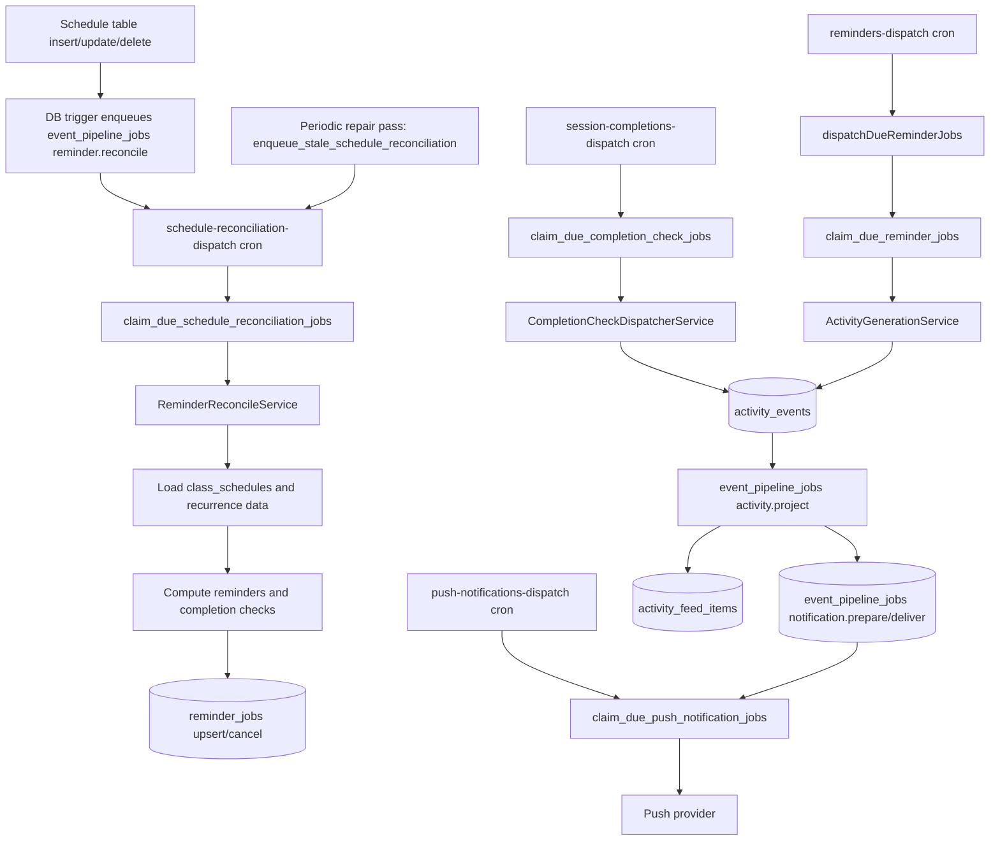

# Reminders Cron Ops (Supabase Edge Function -> API)

## Purpose

Operational runbook for the reminders dispatch pipeline.

## Intended Audience

Engineers operating or debugging scheduled reminder delivery.

## Last Updated

2026-04-20

## Related Docs

- [Documentation Hub](../README.md)
- [Deployment](deployment.md)

This sets up a Supabase scheduled Edge Function that calls:

- `POST /internal/schedule-reconciliation/dispatch` to create/update pre-class
  reminder and completion-check jobs from class schedules.
- `POST /internal/reminders/dispatch` for pre-class reminders.
- `POST /internal/session-completions/dispatch` for completion checks.
- `POST /internal/push-notifications/dispatch` for push delivery.

Each endpoint has its own per-minute Edge Function cron and claim budget. The
queues remain in `reminder_jobs` and `event_pipeline_jobs`, preserving existing
job IDs, retry history, and dispatch logs. Schedule reconciliation keeps using
the existing `event_pipeline_jobs` `reminder.reconcile` rows and the schedule-table
DB triggers; only its claim path and cron are dedicated. It is excluded from the
general Events worker so an Events backlog can no longer delay creating jobs.

The API endpoint performs lease-based due-job claiming and dispatching.

Current class-session timing behavior:

- `session.reminder` jobs: 12 hours and 15 minutes before session start.
- `session.completion_check` jobs: 10 minutes after session end. Dispatch creates
  one `class_session_completions` row per recipient before publishing the activity.
- Pending completion rows expire three days after the effective session end and
  are then auto-confirmed by `run_class_session_completion_expiry_sweep()`.

The near reminder is fifteen minutes before session start (it began as a
30-minute reminder, then five minutes). Deploy the API before applying
`20260908150000_fifteen_minute_class_reminders.sql`: it cancels queued
five-minute jobs and queues schedule reconciliation to create fifteen-minute
jobs. Already sent reminders remain in history; a delivery already in progress
can finish using its original timing. The 12-hour reminder still uses the class
timezone's 9am–6pm delivery window; the fifteen-minute reminder has no daytime
clamp.

The same migration adds a staleness guard to the reminder claim RPCs
(`claim_due_reminder_jobs` / `claim_due_org_reminder_jobs`). Schedule
reconciliation still owns the durable cleanup, but it runs on its own cron tick;
the guard closes the sub-minute window where a due `session.reminder` job could
otherwise fire before reconciliation cancels it. A job is not claimed when its
schedule is `cancelled`/`completed`/`rescheduled` or gone, its learning space is
archived, its one-off start moved in place, or — for the exact occurrence it
targets — a recurrence exception cancelled it or an override moved its start
time. Jobs with no source schedule keep the previous behavior. Completion-check
claims are unchanged: that worker re-resolves state at dispatch and can defer a
moved session.

Fifteen-minute class reminders send Expo push messages with `priority: 'high'`.
The API chooses this from the source reminder event's fifteen-minute offset at
delivery time, so queued deliveries also use it after API deployment. Other
notifications retain their default delivery priority. This requires no additional
migration or mobile build and does not change notification preferences or iOS
interruption levels.

The admin completed-sessions report (`/i/admin/attendance/sessions`) includes
occurrences with at least one confirmed or auto-confirmed recipient, limited by
session end time to the rolling past three calendar months in UTC. Month filters
can narrow that interval; they cannot load older data or future sessions.
The API enforces the interval even with analytics disabled.

The teacher and parent breakdowns show manual confirmations / that person's total
completed occurrences in the filtered results, as a percentage. People with zero
confirmations remain visible. Automatic confirmations, pending responses, and
disputes contribute to the denominator but not the manual-confirmation numerator.
The table shows only tutors and parents, with their response status and individual
rating below their name; staff and child confirmations are not listed there.
Recipient records are supplemented with the current schedule roster and family
links when a tutor or parent has no response record.

The existing `admin-session-attendance-analytics` flag still controls the dashboard.
`flag-exempt: maintenance of existing attendance reporting date limits, confirmation
accuracy, and table presentation` covers the shared table and API corrections.
Deploy the API before the web app to include pending tutors and individual ratings.

Reminder reconciliation and dispatch are split on purpose:



Classroom and schedule UI updates no longer synchronously depend on reminder
compilation. If reminder compilation, activity generation, projection, or
notification delivery is unavailable, the primary class update should still
complete; reminder/feed/push side effects can be replayed or repaired separately.

## Reminder Reconciliation Details

Schedule writes do not call reminder compile endpoints. Database triggers on all
class schedule tables enqueue one durable `reminder.reconcile` pipeline job per
schedule:

- `class_schedules`
- `class_schedule_participants`
- `class_schedule_recurrence`
- `class_schedule_recurrence_exceptions`
- `class_schedule_recurrence_overrides`

The dedicated schedule-reconciliation worker claims rows through
`claim_due_schedule_reconciliation_jobs` (org-scoped manual runs use
`claim_due_org_schedule_reconciliation_jobs`) and calls
`ReminderReconcileService.reconcileNextReminderJobForSchedule()`. The general
Events worker (`claim_due_event_pipeline_jobs`) explicitly excludes
`reminder.reconcile`, so a projection/notification backlog can no longer delay
creating reminder or completion jobs.

Reconciliation loads the latest schedule, recurrence, exception, override,
participant, and learning-space archive state; then it keeps the next occurrence's
pre-class reminders and independently creates completion checks for occurrences in
the next 30 days, with a three-day lookback. Completion checks do not wait for
reminder delivery or an earlier occurrence's completion dispatch. Active jobs are
canceled when their occurrence or schedule is no longer eligible.

After each scheduled (non-manual) run the worker also runs a bounded repair pass,
`enqueue_stale_schedule_reconciliation(p_limit)`. It asks the database for
eligible `class_session` schedules that have no active reminder/completion jobs, or
whose rolling completion window has drifted more than a week from the 30-day
horizon, and re-enqueues their `reminder.reconcile` job (deduped on
`schedule:<id>`). It never claims or dispatches. This replenishes the scheduling
window for schedules that are never edited and recovers from a lost trigger event.
Manual org-scoped admin runs skip this pass, matching the other workers.

## 1. Required API env (`apps/api`)

In your API deployment, set:

- `INTERNAL_REMINDERS_TOKEN=<long-random-secret>`
- `INTERNAL_EVENTS_TOKEN=<long-random-secret>`
  (used by the unified event pipeline dispatcher)
- `SUPABASE_URL=<https://<project-ref>.supabase.co>`
- `SUPABASE_SERVICE_ROLE_KEY=<service-role-key>`
- `POSTHOG_API_KEY=<optional-posthog-key>`
- `POSTHOG_HOST=https://us.i.posthog.com`

The same `INTERNAL_REMINDERS_TOKEN` and `INTERNAL_EVENTS_TOKEN` values must be
configured in both `apps/api` and the Supabase Edge Function secrets.

## 2. Required function env (Supabase)

Set these Supabase secrets for the `events-dispatch` and `reminders-dispatch`
functions:

- `SUPABASE_URL=https://<project-ref>.supabase.co`
- `SUPABASE_SERVICE_ROLE_KEY=<service-role-key>` (used by the daily channel read-state repair function)
- `REMINDERS_DISPATCH_URL=https://<your-api-domain>/internal/reminders/dispatch`
- `EVENTS_DISPATCH_URL=https://<your-api-domain>/internal/events/dispatch`
- `INTERNAL_REMINDERS_TOKEN=<same-value-as-apps-api>`
- `INTERNAL_EVENTS_TOKEN=<same-value-as-apps-api>`

Optional:

- `EVENTS_DISPATCH_LIMIT=100`
- `EVENTS_DISPATCH_LEASE_SECONDS=120`
- `EVENTS_DISPATCH_LEASE_OWNER=supabase-edge-cron`
- `REMINDERS_DISPATCH_LIMIT=100`
- `REMINDERS_DISPATCH_LEASE_SECONDS=120`
- `REMINDERS_DISPATCH_LEASE_OWNER=supabase-edge-cron`
- `SCHEDULE_RECONCILIATION_DISPATCH_LIMIT=100`
- `SCHEDULE_RECONCILIATION_DISPATCH_LEASE_SECONDS=120`

The `schedule-reconciliation-dispatch` bridge derives its API origin from
`EVENTS_DISPATCH_URL` and authenticates with `INTERNAL_EVENTS_TOKEN`, so existing
deployment secrets already cover it.

The Edge Functions are intentionally thin HTTP bridges. They must not read
`class_schedules` or expand recurrence. Schedule reads happen in `apps/api` after
the dedicated schedule-reconciliation dispatcher claims due `reminder.reconcile`
jobs via `claim_due_schedule_reconciliation_jobs`; reminder sending only claims
due `reminder_jobs` via `claim_due_reminder_jobs`.

## 3. Deploy the Edge Function

```bash
supabase functions deploy --use-api --jobs 4
```

The old `reminders-reconcile-dispatch` bridge has been removed. Schedule-table
reconciliation runs through the dedicated `schedule-reconciliation-dispatch`
Edge Function and `event_pipeline_jobs` with `job_kind='reminder.reconcile'`.
Deploy `schedule-reconciliation-dispatch` together with the other workers so the
separated queue has its worker available; queued jobs stay durable during the gap.

If you deploy to a linked remote project, ensure `supabase link --project-ref <ref>` is already done.

## API service health checks

`apps/api/railway.toml` configures Railway deployment health checks to hit:

- `GET /healthz`

Ensure your Railway service uses `apps/api` as the service root so this config is applied.

## 4. Configure cron jobs

Cron schedules are repo-managed by `public.configure_edge_function_cron()` from the latest Supabase migrations, including the unified event pipeline migration.

Apply migrations to the target environment, then configure the jobs with that environment's own Supabase URL:

```sql
select public.configure_edge_function_cron('https://<project-ref>.supabase.co');
```

Preview branches created by `.github/workflows/ci.yml` run this automatically after branch migrations, function secrets, and function deployment.

## 5. Validate

1. Invoke function manually once from dashboard.
2. Verify `cron.job` contains `edge-function-events-dispatch`,
   `edge-function-reminders-dispatch`, `edge-function-session-completions-dispatch`,
   `edge-function-push-notifications-dispatch`, and
   `edge-function-schedule-reconciliation-dispatch`.
   `edge-function-channel-read-state-repair` should also exist as the daily
   maintenance cron.
3. Verify API logs show requests to `/internal/events/dispatch`,
   `/internal/schedule-reconciliation/dispatch`, and `/internal/reminders/dispatch`.
4. Verify response payload has counters like `claimed/succeeded/failed`.
5. Verify DB updates:
   - `event_pipeline_jobs` `reminder.reconcile` status transitions
   - `reminder_jobs.status` transitions
   - `activity_events` created for reminder/feedback events
   - `activity_feed_items` and notification delivery jobs created by projection.

## 6. Independent Dispatch Workers

| Edge Function                      | API endpoint                                 | Claim RPC                                | Work                                                                                   |
| ---------------------------------- | -------------------------------------------- | ---------------------------------------- | -------------------------------------------------------------------------------------- |
| `schedule-reconciliation-dispatch` | `/internal/schedule-reconciliation/dispatch` | `claim_due_schedule_reconciliation_jobs` | `reminder.reconcile` only — create/update reminder & completion jobs                   |
| `reminders-dispatch`               | `/internal/reminders/dispatch`               | `claim_due_reminder_jobs`                | `session.reminder` only                                                                |
| `session-completions-dispatch`     | `/internal/session-completions/dispatch`     | `claim_due_completion_check_jobs`        | `session.completion_check` only                                                        |
| `events-dispatch`                  | `/internal/events/dispatch`                  | `claim_due_event_pipeline_jobs`          | Generation, projection, preparation, non-push delivery (excludes `reminder.reconcile`) |
| `push-notifications-dispatch`      | `/internal/push-notifications/dispatch`      | `claim_due_push_notification_jobs`       | `notification.deliver` with `deliveryChannel=push` only                                |

The completion bridge derives its API origin from `REMINDERS_DISPATCH_URL` and
uses `INTERNAL_REMINDERS_TOKEN`. The push and schedule-reconciliation bridges
derive their origin from `EVENTS_DISPATCH_URL` and use `INTERNAL_EVENTS_TOKEN`.
Existing deployment secrets therefore cover all new workers. Optional independent
settings are `SESSION_COMPLETIONS_DISPATCH_LIMIT`,
`SESSION_COMPLETIONS_DISPATCH_LEASE_SECONDS`, `PUSH_NOTIFICATIONS_DISPATCH_LIMIT`,
`PUSH_NOTIFICATIONS_DISPATCH_LEASE_SECONDS`,
`SCHEDULE_RECONCILIATION_DISPATCH_LIMIT`, and
`SCHEDULE_RECONCILIATION_DISPATCH_LEASE_SECONDS`. Defaults are 100 jobs and 120
seconds. All claim RPCs are service-role-only.

The scheduled schedule-reconciliation worker also runs the bounded
`enqueue_stale_schedule_reconciliation` repair pass after each run (see _Reminder
Reconciliation Details_). Completion prompts still need the Events worker for their
in-app projection, but creating and dispatching reconcile jobs no longer waits on
Events. Completion/feedback push delivery remains disabled.

Completion checks run ten minutes after the effective session end. They create
per-recipient completion rows and events; teachers get individual checks for each
occurrence, while guardians may receive a batch. The job succeeds only after its
activity publication and projection enqueue have completed. Publication failures
enter the job's retry path. A moved end time returns the job to pending at the new
end plus ten minutes, with a deferred reason in `reminder_dispatch_logs`.
Canceled occurrences and deliberately suppressed publication have explicit skip
reasons. Missing schedule identity or recipients is a failure, not success.

The completion worker also repairs legacy successful jobs with no
`completion_reconciled_at` within the existing three-day dispatch lookback. Newly
successful jobs record that marker immediately. Recovery of a deferred legacy
job keeps it pending instead of marking the missing notification repaired.

Push jobs have a stable event/recipient/channel identity. Re-running projection
or preparation reuses an existing delivery, including historical keys that used
a minute bucket. It preserves active leases, retry attempts and terminal results;
it does not automatically resend a succeeded delivery. A deliberate replay should
inspect and retry the existing failed/dead-letter job. Preferences and recipient
eligibility still apply independently of worker scheduling.

Both queues reclaim expired leases. Retryable failures use exponential backoff
from 15 seconds up to ten minutes, with eight attempts by default. Delivery is
at least once: a worker interruption after a provider accepts a push but before
job acknowledgement can still cause a retry. Queue success alone is not proof of
notification display on a device; inspect provider ticket/receipt results.

### Deployment and validation

Deploy the API with both new endpoints before activating the migration and Edge
Functions. The forward migration separates claims and enqueues reconciliation for
existing eligible schedules. It updates existing configured cron jobs; fresh
setups call `configure_edge_function_cron()` after function deployment. Both preview
and production CI perform this call and fail deployment if either new cron is
missing, inactive, not scheduled every minute, or targets the wrong project URL.
The function is idempotent: rerunning a deployment replaces each named cron instead
of adding duplicates. Deploy all
Edge Functions together so a separated queue has its worker available. Queued jobs
remain durable during the rollout gap.

Verify all five per-minute cron jobs exist, call their endpoints, and inspect
`claimed/succeeded/skipped/failed` counters plus `reminder_dispatch_logs` and
`event_pipeline_logs`. A scheduled `schedule-reconciliation-dispatch` run also
returns a `reconciliationRepair.requeued` counter. Check three consecutive class
occurrences produce three teacher completion events and no completion-check push
delivery jobs. Run the SQL regressions with `supabase test db` on a disposable
local database after migrations. The test fixtures roll back.

`flag-exempt: maintenance of existing completion-check and notification delivery`
applies to this worker separation and the corresponding existing admin tools.

### Admin tools

Open `/<orgSlug>/admin/tools` to run each worker independently. **Schedule
Reconciliation** creates/updates pre-class reminder and completion jobs from class
schedules. **Session Completion Checks** processes due completion jobs; **Push
Notifications** delivers queued pushes. **Reminders Dispatch** handles pre-class
reminders, and **Events Dispatch** handles activity projection and notification
preparation.

Manual runs only claim work for the selected organization. The API verifies the
session and requires an owner, admin, or staff account in that organization.
The web client calls `POST /admin/tools/dispatch` using the user's session; internal
worker secrets and database access stay in the API. The forward migrations
`20260908123000_admin_dispatch_org_scope.sql` and
`20260908140000_independent_schedule_reconciliation_worker.sql` install
service-role-only claim functions for these organization-scoped runs
(`claim_due_org_schedule_reconciliation_jobs` among them). Apply them and deploy
the API before deploying the updated web tools.

Each card shows its latest result and counters. A run with failed or dead-letter
jobs shows an error even when the HTTP request succeeds. To follow a completion
through manually, run completion checks, then run events dispatch until projection
and preparation finish. Completion checks appear in the app; they do not send push
notifications. Use push dispatch to test pre-class reminders and other eligible events. Jobs enqueued by a batch are
available to a subsequent run. A zero claim count can mean jobs are not due, are
waiting for retry backoff, or already have an active lease.

Manual dispatch does not change cron schedules or run the global completion
recovery, schedule-reconciliation repair, and maintenance scans; the scheduled
workers retain those scans.
Read-state repair is also limited to the selected organization. Reset & Reconcile
deletes its non-successful reminder and completion jobs and rebuilds eligible work;
it preserves successful jobs and is not a push replay action.

Class completion and feedback requests do not send push notifications. This covers
`session.completion_check.sent`, `session.completion_check.batch.sent`, and the legacy
`session.feedback_request.sent` event. The API excludes push even when saved
preferences enable it, and rechecks queued deliveries so previously queued pushes
are suppressed after deployment. Completion jobs, in-app feed items, and eligible
email delivery continue. Five-minute reminder pushes retain high delivery priority.
No queue migration or mobile update is required for this policy change; a push
already handed to the provider cannot be recalled.

## 7. Operational defaults

- Keep schedule interval at 1 minute.
- Keep `limit` conservative (`100` to start).
- Use alerting if no successful invocation > 5 minutes.
- Monitor lease duration against batch processing time; delivery retries are at least once.
- 1-minute cron cadence is expected so 12h/5m reminders and +10m completion checks fire on time.

## 8. Dispatch URL Sanity Check

After the API-owned migration, reminders and notifications should both target `apps/api`:

- `REMINDERS_DISPATCH_URL=https://<your-api-domain>/internal/reminders/dispatch`
- `EVENTS_DISPATCH_URL=https://<your-api-domain>/internal/events/dispatch`

The legacy web endpoint (`/api/internal/reminders/dispatch`) should not be used anymore.

Notification-producing reminder flows are API-owned. Web and mobile may choose the acting profile context for a user, but only `apps/api` authorizes that profile selection before reminder activity, activity projection, and downstream notification dispatch proceed.
