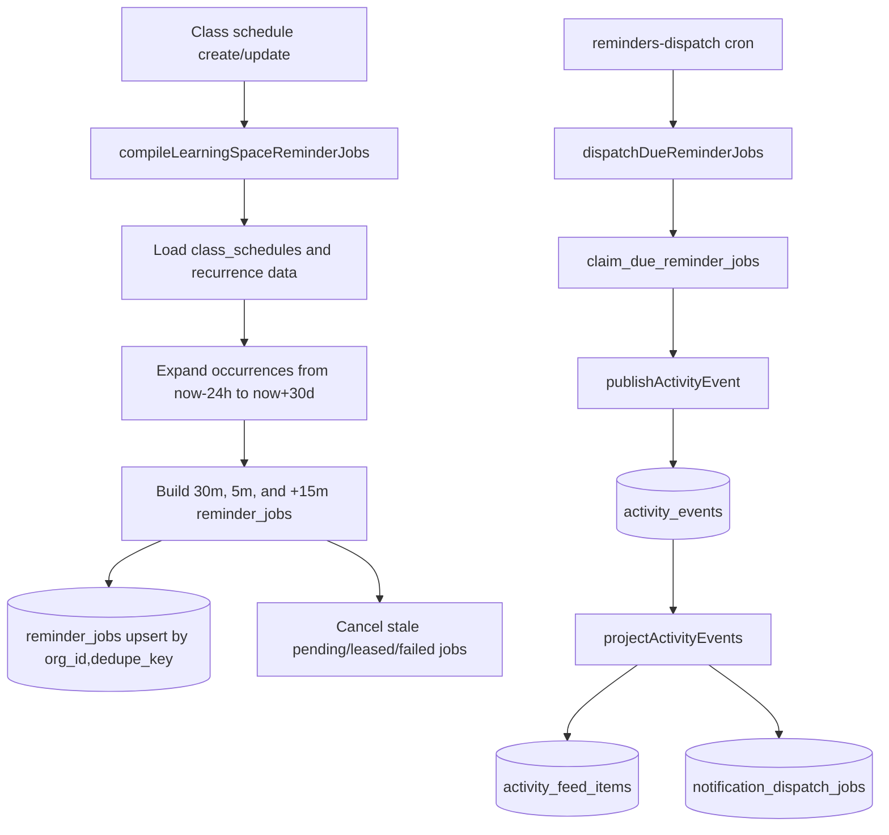

# Reminders Cron Ops (Supabase Edge Function -> API)

## Purpose

Operational runbook for the reminders dispatch pipeline.

## Intended Audience

Engineers operating or debugging scheduled reminder delivery.

## Last Updated

2026-04-20

## Related Docs

- [Documentation Hub](../README.md)
- [Deployment](deployment.md)

This sets up a Supabase scheduled Edge Function that calls:

- `POST /internal/reminders/dispatch` on the API service.

The API endpoint performs lease-based due-job claiming and dispatching.

Current class-session timing behavior:

- `session.reminder` jobs: 30 minutes and 5 minutes before session start.
- `session.feedback_request` jobs: 15 minutes after session end
  (falls back to 15 minutes after start if end time is invalid).

Reminder compilation and dispatch are split on purpose:



Classroom and schedule UI updates no longer synchronously depend on reminder
compilation. If reminder compilation or activity publishing is unavailable, the
primary class update should still complete; reminder/feed/push side effects can
be replayed or repaired separately.

## Reminder Compilation Details

`compileLearningSpaceReminderJobs()` runs behind
`POST /reminders/learning-space/compile` and is authorized by the caller's
Supabase bearer token. The API verifies that the token resolves to an auth user
with a non-deleted `accounts` row in the requested org.

Execution:

1. Load all non-deleted `class_schedules` for the org where `source_kind='class_session'`.
2. Attach archive metadata from `learning_spaces` so archived classes can be filtered.
3. Filter to the requested `learningSpaceId`.
4. Expand recurring events across `now - 24h` through `now + 30d`.
5. Drop canceled occurrences and occurrences after a classroom archive cutoff.
6. For each occurrence with a channel:
   - Build `session.reminder` rows for 30 minutes and 5 minutes before `start_at`.
   - Skip reminder rows whose `run_at` is already in the past.
   - Build one `session.feedback_request` row for 15 minutes after `end_at`.
   - If `end_at` is invalid, use 15 minutes after `start_at`.
   - Include payload metadata such as `channelId`, `learningSpaceId`, `scheduleId`, `occurrenceStart`, timezone, title/summary, route kind, and members.
7. Build deterministic dedupe keys from org, learning space/channel, occurrence start, and reminder offset/job kind.
8. Preserve already `succeeded` jobs by not re-upserting the same dedupe key.
9. Upsert pending rows into `reminder_jobs` with `status='pending'`, `max_attempts=8`, no lease, and no `next_attempt_at`.
10. Cancel stale `pending`, `leased`, or `failed` reminder jobs for the learning space when their dedupe keys are no longer produced by the current schedule state.

`cancelLearningSpaceReminderJobs()` marks pending/leased/failed jobs for a
learning space as `canceled`. It does not affect jobs that already succeeded.

## 1. Required API env (`apps/api`)

In your API deployment, set:

- `INTERNAL_REMINDERS_TOKEN_API=<long-random-secret>`
  (API also accepts legacy `INTERNAL_REMINDERS_TOKEN` when `INTERNAL_REMINDERS_TOKEN_API` is not set)
- `SUPABASE_URL=<https://<project-ref>.supabase.co>`
- `SUPABASE_SERVICE_ROLE_KEY=<service-role-key>`
- `POSTHOG_API_KEY=<optional-posthog-key>`
- `POSTHOG_HOST=https://us.i.posthog.com`

`INTERNAL_REMINDERS_TOKEN_API` must match the secret configured in Supabase function env below.

## 2. Required function env (Supabase)

Set these Supabase secrets for the `reminders-dispatch` function:

- `REMINDERS_DISPATCH_URL=https://<your-api-domain>/internal/reminders/dispatch`
- `INTERNAL_REMINDERS_TOKEN=<same-value-as-INTERNAL_REMINDERS_TOKEN_API>`

Optional:

- `REMINDERS_DISPATCH_LIMIT=100`
- `REMINDERS_DISPATCH_LEASE_SECONDS=120`
- `REMINDERS_DISPATCH_LEASE_OWNER=supabase-edge-cron`

The Edge Function is intentionally a thin HTTP bridge. It must not read
`class_schedules` or expand recurrence on the minute cron. Schedule reads happen when
learning-space schedules are created or updated, where the app compiles future rows into
`reminder_jobs`. The cron path only calls the API dispatcher, which claims due rows via
`claim_due_reminder_jobs`.

## 3. Deploy the Edge Function

```bash
supabase functions deploy reminders-dispatch
```

If you deploy to a linked remote project, ensure `supabase link --project-ref <ref>` is already done.

## API service health checks

`apps/api/railway.toml` configures Railway deployment health checks to hit:

- `GET /healthz`

Ensure your Railway service uses `apps/api` as the service root so this config is applied.

## 4. Configure cron jobs

Cron schedules are repo-managed by `public.configure_edge_function_cron()` from:

- `supabase/migrations/20260417000000_edge_function_cron.sql`

Apply migrations to the target environment, then configure the jobs with that environment's own Supabase URL:

```sql
select public.configure_edge_function_cron('https://<project-ref>.supabase.co');
```

Preview branches created by `.github/workflows/ci.yml` run this automatically after branch migrations, function secrets, and function deployment.

## 5. Validate

1. Invoke function manually once from dashboard.
2. Verify `cron.job` contains `edge-function-reminders-dispatch`.
3. Verify API logs show requests to `/internal/reminders/dispatch`.
4. Verify response payload has counters like `claimed/succeeded/failed`.
5. Verify DB updates:
   - `reminder_jobs.status` transitions
   - `activity_events` created for reminder/feedback events
   - `activity_feed_items` and `notification_dispatch_jobs` created by projection.

## 6. Reminder Dispatch Details

`dispatchDueReminderJobs()` is called by `POST /internal/reminders/dispatch`.
The endpoint is protected by `INTERNAL_REMINDERS_TOKEN_API` or the legacy
`INTERNAL_REMINDERS_TOKEN`.

Execution:

1. Claim due work with `claim_due_reminder_jobs(p_limit, p_lease_owner, p_lease_seconds)`.
2. The RPC leases eligible `pending` or `failed` rows whose `run_at`/`next_attempt_at` is due and whose previous lease expired.
3. For each claimed job, load payload metadata and resolve the org system profile.
4. If the source classroom is archived before the job's `run_at`, mark the job `canceled`, clear lease fields, and write a `reminder_dispatch_logs` row with `idempotent_hit`.
5. Map job type to activity event:
   - `session.reminder` -> `session.reminder.sent`
   - `session.feedback_request` -> `session.feedback_request.sent`
6. Publish the activity event with `sourceKind='system'`, learning-space/channel scope, payload schedule metadata, and dedupe key `<reminder_jobs.dedupe_key>:activity`.
7. Projection turns that event into feed rows and notification jobs through the normal activity pipeline.
8. If the activity event is created, mark the reminder job `succeeded`, set `dispatched_at`, clear lease/error fields, and write a successful `reminder_dispatch_logs` row with the `activity_event_id`.
9. If processing throws, increment `attempt_count`, set `failed` with `next_attempt_at` for retryable errors, or `dead_letter` when non-retryable/max attempts are reached.

Reminder retry behavior uses exponential backoff from 15 seconds capped at 10
minutes, with `max_attempts=8` by default. Dispatch counters are captured to
analytics as `claimed`, `succeeded`, `skipped`, `failed`, and `deadLettered`.

## 7. Operational defaults

- Keep schedule interval at 1 minute.
- Keep `limit` conservative (`100` to start).
- Use alerting if no successful invocation > 5 minutes.
- Because jobs are lease-claimed and idempotent, overlapping ticks are safe.
- 1-minute cron cadence is expected so 30m/5m reminders and +15m feedback fire on time.

## 8. Dispatch URL Sanity Check

After the API-owned migration, reminders and notifications should both target `apps/api`:

- `REMINDERS_DISPATCH_URL=https://<your-api-domain>/internal/reminders/dispatch`
- `NOTIFICATIONS_DISPATCH_URL=https://<your-api-domain>/internal/notifications/dispatch`
- `ACTIVITY_PROJECTOR_DISPATCH_URL=https://<your-api-domain>/internal/activity-feed/project`

The legacy web endpoint (`/api/internal/reminders/dispatch`) should not be used anymore.

Notification-producing reminder flows are API-owned. Web and mobile may choose the acting profile context for a user, but only `apps/api` authorizes that profile selection before reminder activity, activity projection, and downstream notification dispatch proceed.
