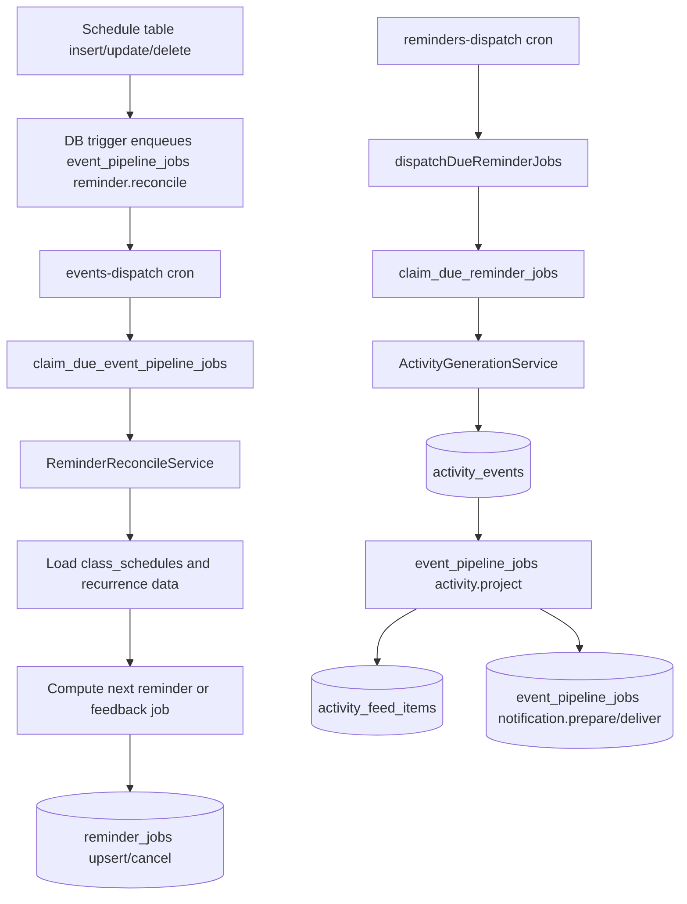

# Reminders Cron Ops (Supabase Edge Function -> API)

## Purpose

Operational runbook for the reminders dispatch pipeline.

## Intended Audience

Engineers operating or debugging scheduled reminder delivery.

## Last Updated

2026-04-20

## Related Docs

- [Documentation Hub](../README.md)
- [Deployment](deployment.md)

This sets up a Supabase scheduled Edge Function that calls:

- `POST /internal/reminders/dispatch` on the API service.

The API endpoint performs lease-based due-job claiming and dispatching.

Current class-session timing behavior:

- `session.reminder` jobs: 30 minutes and 5 minutes before session start.
- `session.feedback_request` jobs: 15 minutes after session end
  (falls back to 15 minutes after start if end time is invalid).

Reminder reconciliation and dispatch are split on purpose:



Classroom and schedule UI updates no longer synchronously depend on reminder
compilation. If reminder compilation, activity generation, projection, or
notification delivery is unavailable, the primary class update should still
complete; reminder/feed/push side effects can be replayed or repaired separately.

## Reminder Reconciliation Details

Schedule writes do not call reminder compile endpoints. Database triggers on all
class schedule tables enqueue one durable `reminder.reconcile` pipeline job per
schedule:

- `class_schedules`
- `class_schedule_participants`
- `class_schedule_recurrence`
- `class_schedule_recurrence_exceptions`
- `class_schedule_recurrence_overrides`

The unified event dispatcher claims rows through `claim_due_event_pipeline_jobs` and
calls `ReminderReconcileService.reconcileNextReminderJobForSchedule()`.
Reconciliation loads the latest schedule, recurrence, exception, override,
participant, and learning-space archive state; then it keeps exactly the next
pending reminder/feedback job for that schedule or cancels active jobs when the
schedule no longer exists or is no longer eligible.

## 1. Required API env (`apps/api`)

In your API deployment, set:

- `INTERNAL_REMINDERS_TOKEN=<long-random-secret>`
- `INTERNAL_EVENTS_TOKEN=<long-random-secret>`
  (used by the unified event pipeline dispatcher)
- `SUPABASE_URL=<https://<project-ref>.supabase.co>`
- `SUPABASE_SERVICE_ROLE_KEY=<service-role-key>`
- `POSTHOG_API_KEY=<optional-posthog-key>`
- `POSTHOG_HOST=https://us.i.posthog.com`

The same `INTERNAL_REMINDERS_TOKEN` and `INTERNAL_EVENTS_TOKEN` values must be
configured in both `apps/api` and the Supabase Edge Function secrets.

## 2. Required function env (Supabase)

Set these Supabase secrets for the `events-dispatch` and `reminders-dispatch`
functions:

- `SUPABASE_URL=https://<project-ref>.supabase.co`
- `SUPABASE_SERVICE_ROLE_KEY=<service-role-key>` (used by the daily channel read-state repair function)
- `REMINDERS_DISPATCH_URL=https://<your-api-domain>/internal/reminders/dispatch`
- `EVENTS_DISPATCH_URL=https://<your-api-domain>/internal/events/dispatch`
- `INTERNAL_REMINDERS_TOKEN=<same-value-as-apps-api>`
- `INTERNAL_EVENTS_TOKEN=<same-value-as-apps-api>`

Optional:

- `EVENTS_DISPATCH_LIMIT=100`
- `EVENTS_DISPATCH_LEASE_SECONDS=120`
- `EVENTS_DISPATCH_LEASE_OWNER=supabase-edge-cron`
- `REMINDERS_DISPATCH_LIMIT=100`
- `REMINDERS_DISPATCH_LEASE_SECONDS=120`
- `REMINDERS_DISPATCH_LEASE_OWNER=supabase-edge-cron`

The Edge Functions are intentionally thin HTTP bridges. They must not read
`class_schedules` or expand recurrence. Schedule reads happen in `apps/api` after
the unified event dispatcher claims due `reminder.reconcile` jobs; reminder sending
only claims due `reminder_jobs` via `claim_due_reminder_jobs`.

## 3. Deploy the Edge Function

```bash
supabase functions deploy --use-api --jobs 4
```

The old `reminders-reconcile-dispatch` bridge has been removed. Schedule-table
reconciliation now runs through `events-dispatch` and `event_pipeline_jobs` with
`job_kind='reminder.reconcile'`.

If you deploy to a linked remote project, ensure `supabase link --project-ref <ref>` is already done.

## API service health checks

`apps/api/railway.toml` configures Railway deployment health checks to hit:

- `GET /healthz`

Ensure your Railway service uses `apps/api` as the service root so this config is applied.

## 4. Configure cron jobs

Cron schedules are repo-managed by `public.configure_edge_function_cron()` from the latest Supabase migrations, including the unified event pipeline migration.

Apply migrations to the target environment, then configure the jobs with that environment's own Supabase URL:

```sql
select public.configure_edge_function_cron('https://<project-ref>.supabase.co');
```

Preview branches created by `.github/workflows/ci.yml` run this automatically after branch migrations, function secrets, and function deployment.

## 5. Validate

1. Invoke function manually once from dashboard.
2. Verify `cron.job` contains `edge-function-events-dispatch` and
   `edge-function-reminders-dispatch`.
   `edge-function-channel-read-state-repair` should also exist as the daily
   maintenance cron.
3. Verify API logs show requests to `/internal/events/dispatch` and
   `/internal/reminders/dispatch`.
4. Verify response payload has counters like `claimed/succeeded/failed`.
5. Verify DB updates:
   - `event_pipeline_jobs` `reminder.reconcile` status transitions
   - `reminder_jobs.status` transitions
   - `reminder_dispatch_logs` rows explaining succeeded, skipped, failed, or dead-lettered jobs.

## 6. Reminder Dispatch Details

`dispatchDueReminderJobs()` is called by `POST /internal/reminders/dispatch`.
The endpoint is protected by `INTERNAL_REMINDERS_TOKEN`.

Execution:

1. Claim due work with `claim_due_reminder_jobs(p_limit, p_lease_owner, p_lease_seconds)`.
2. The RPC leases eligible `pending` or `failed` rows whose `run_at`/`next_attempt_at` is due and whose previous lease expired.
3. For each claimed job, load payload metadata.
4. If the source classroom is archived before the job's `run_at`, mark the job `canceled`, clear lease fields, and write a `reminder_dispatch_logs` row with `idempotent_hit`.
5. Reminder and feedback-request jobs no longer create activity events or feed rows.
6. Mark the reminder job `succeeded`, set `dispatched_at`, clear lease/error fields, and write a successful `reminder_dispatch_logs` row with `activity_event_skipped`.
7. If processing throws, increment `attempt_count`, set `failed` with `next_attempt_at` for retryable errors, or `dead_letter` when non-retryable/max attempts are reached.

Reminder retry behavior uses exponential backoff from 15 seconds capped at 10
minutes, with `max_attempts=8` by default. Dispatch counters are captured to
analytics as `claimed`, `succeeded`, `skipped`, `failed`, and `deadLettered`.

## 7. Operational defaults

- Keep schedule interval at 1 minute.
- Keep `limit` conservative (`100` to start).
- Use alerting if no successful invocation > 5 minutes.
- Because jobs are lease-claimed and idempotent, overlapping ticks are safe.
- 1-minute cron cadence is expected so 30m/5m reminders and +15m feedback fire on time.

## 8. Dispatch URL Sanity Check

After the API-owned migration, reminders and notifications should both target `apps/api`:

- `REMINDERS_DISPATCH_URL=https://<your-api-domain>/internal/reminders/dispatch`
- `EVENTS_DISPATCH_URL=https://<your-api-domain>/internal/events/dispatch`

The legacy web endpoint (`/api/internal/reminders/dispatch`) should not be used anymore.

Notification-producing reminder flows are API-owned. Web and mobile may choose the acting profile context for a user, but only `apps/api` authorizes that profile selection before reminder activity, activity projection, and downstream notification dispatch proceed.
